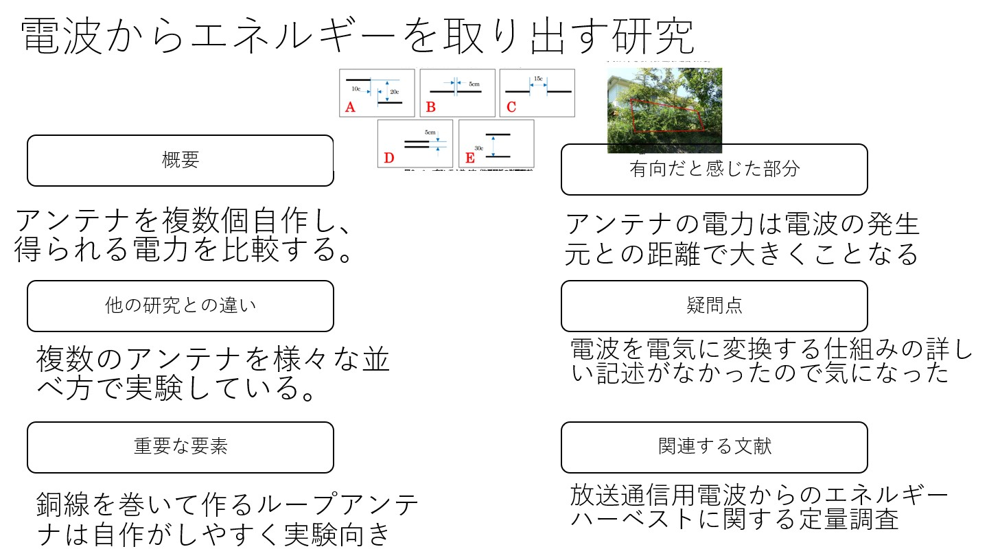
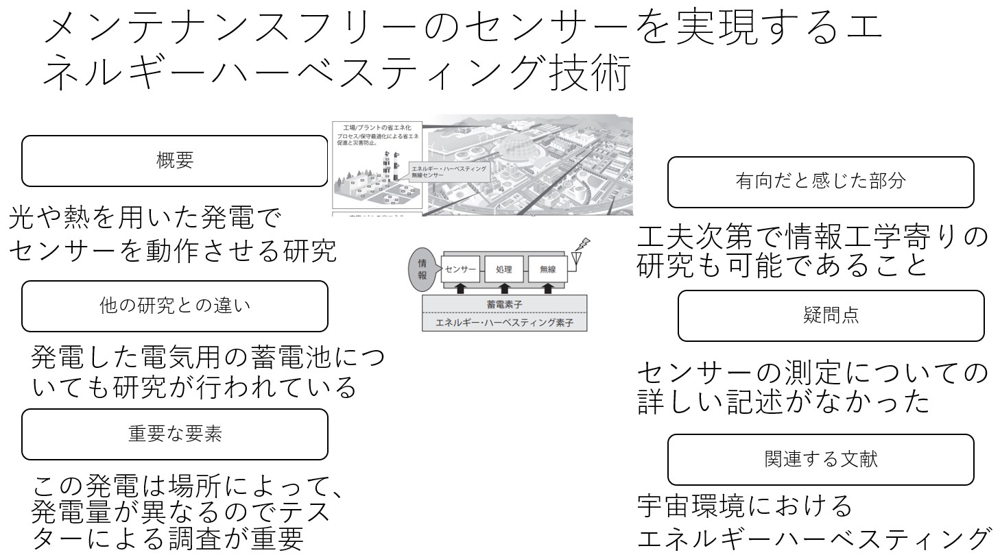
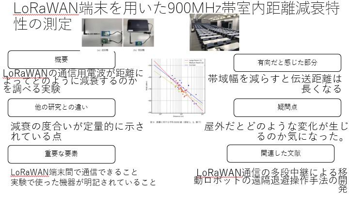
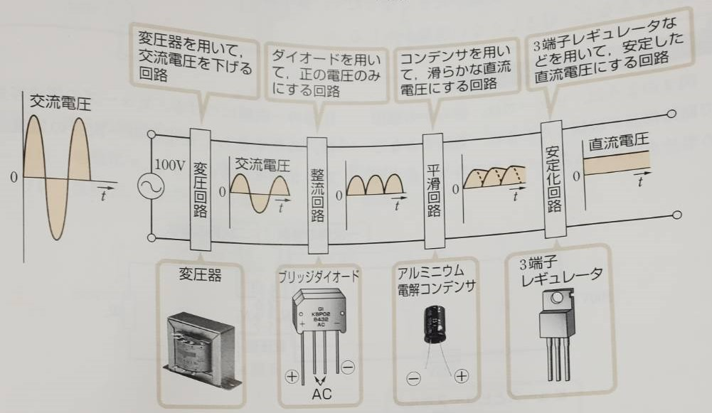
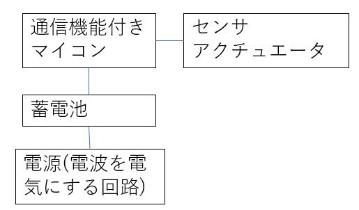
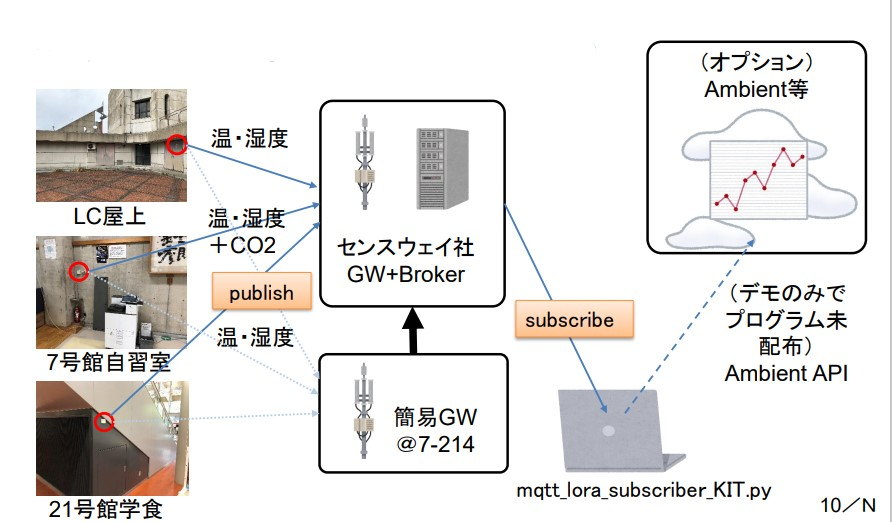

# 研究ワークシート1 (コンセプト)

## テーマ名
  - IoT機器の非電源化

## 領域・キーワード
  - 4から5つ記載すること
  - IoT、電子回路、通信、組み込みシステム

## 動向調査

領域・キーワードの中から代表的な学術・企業内研究の事例、先端製品（オープンソース含む）を3個以上記載すること。可能な限り、落合メソッドを用いて照会すること。
- [落合メソッドの照会](http://lafrenze.hatenablog.com/entry/2015/08/04/120205)
- 電波からエネルギーを取り出す研究(https://gakusyu.shizuoka-c.ed.jp/science/sonota/ronnbunshu/102017.pdf)
- 
- エネルギーハーベスティングを用いたセンサ(https://www.fujitsu.com/downloads/JP/archive/imgjp/jmag/vol64-5/paper14.pdf)
- 
- LoRaWAN端末を用いた900MHz帯室内距離減衰特性の測定(https://ken.ieice.org/ken/paper/2019061991NO/)
- 

## シーズ・ニーズ
動向調査での問題点、解決すべき課題、トレードオフの解消、改善(新規性＆アイデア)、付加価値について記載

- 問題点
  - IoT機器の設置場所は電源に左右される
- 解決すべき課題
  - 電池を使えばコンセント等が無い場所でもIoT機器を動かせるが、稼働時間が制限される。
- トレードオフの解消
  - 設置場所で発電を行うことで設置場所や稼働時間の制限を無くす。
- 改善(新規性&アイデア)
  - ラジオではなくACDC変換器をベースにした回路構成、発電用の電波にFMラジオのものを使用する。
- 付加価値

## 対象
シーズ・ニーズは誰にとって何がうれしいか（対象者は現在困っているがシーズが実現されると解決するはず）
  - IoT機器を屋外で長時間利用する人。
  - 設置場所の選定や電池交換の手間が省けてIoT機器が扱いやすくなる。

## 指標
  - うれしさを高めるためには何をどれだけ向上させる必要があるか（できるだけ定量的に、状態を変える場合は定性的でも可）
  - 発電量 5V1A以上
  - 消費電力の少なさ 3~5V 数100mA
  - 通信できる距離 200m~1000m
  - 拡張性(ゆとり)

## レビュー
第３者にしくみを簡単に理解させるための図を3つ記載する
- システム全体の画像
- 
- 回路構成
- 
- 電波を電気に変える仕組み
- 

