# 進捗報告書

報告書番号 | 氏名   | 期間         | 報告日
----- | ---- | ---------- | ---
03    | HosokawaAoi | 4/26 ~ 5/10 | 5/10

## 活動概要

- やったこと
  - 前回の実験で気になった部分の検証
  - 整流した電気を直流の電気にする実験
  - 今後使う技術に詳しい先生を探す

### 前回の実験で気になった部分の検証
  - 整流用のダイオードを別の物で試してみる
  - 整流時に流れる逆方向の電気を消す
  - 塗装剥いでない空き缶と塗装剥いだ空き缶の比較 
 

- 整流用のダイオードを別の物で試してみる
  - ダイオードに電気を流すある程度の電圧が必要となる。
  - その電圧が少ない小信号用のダイオードの方が効率的な整流回路を作成できると考え、回路を作って波形を調べた。
  - 回路の画像
  - 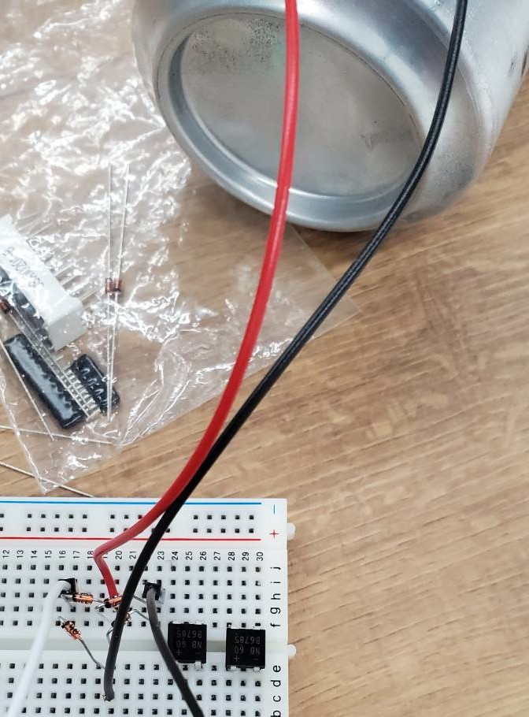
  - 元の整流回路の波形
  - 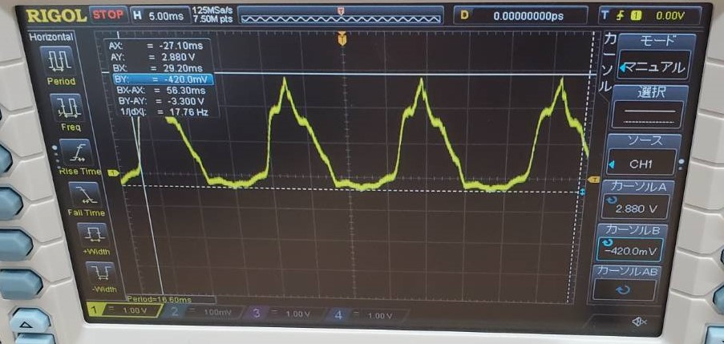
  - 電圧 最大値 2.880V 最小値 -420.0mV
  - 新しい整流回路の波形
  - 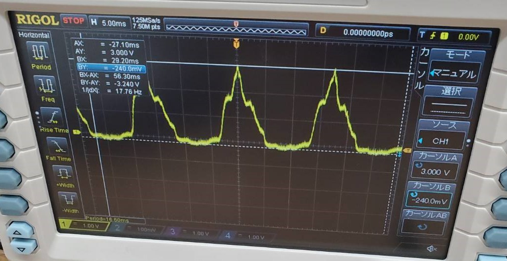
  - 電圧 最大値 3.000V 最小値 -240.0mV
  - 特に波形や電圧に差は生じず、 元のダイオードと似た結果が得られた。

- 整流時に流れる逆方向の電気を消す
  - 整流用のダイオードとは別のダイオードを用いて波形を調べたが、マイナス方向への電気は消えなかった。
  - 整流回路に小信号ダイオードを接続した回路
  - 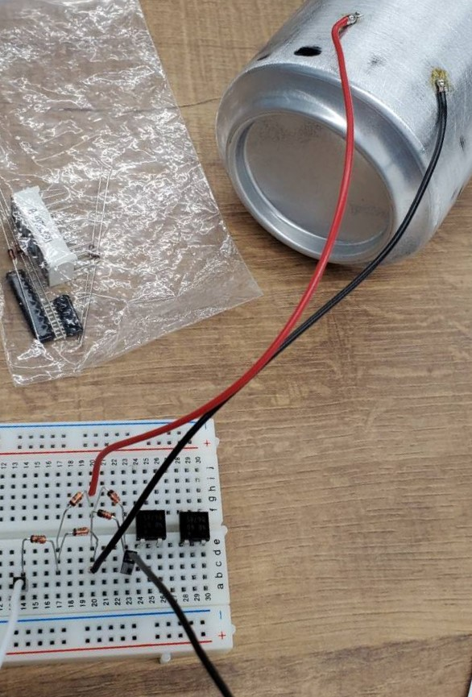
  - 整流回路に小信号ダイオードを接続した回路の波形
  - 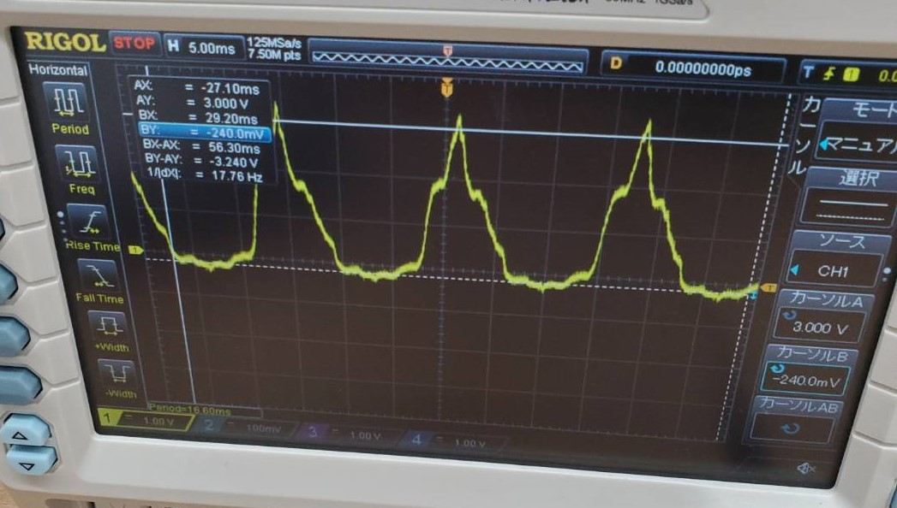
  - 電圧 最大値 3.000V 最小値 -240.0mV
  - 整流回路にブリッジダイオードを接続した回路
  - 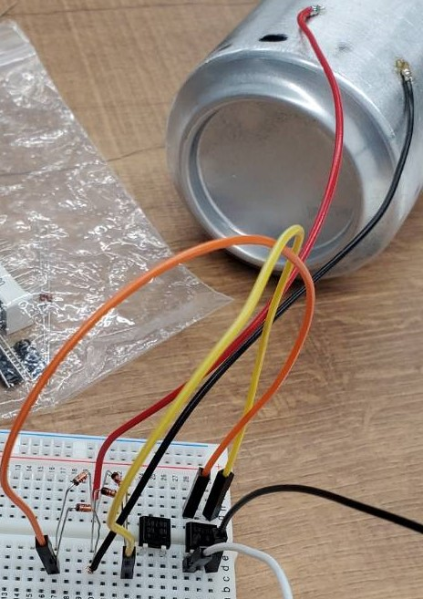
  - 整流回路にブリッジイオードを接続した回路の波形
  - 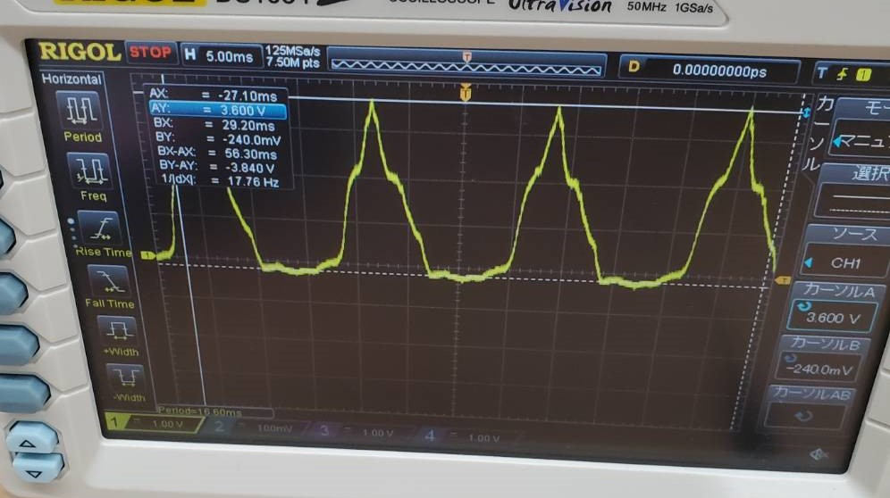
  - 電圧 最大値 3.600V 最小値 -240.0mV
  - ダイオードに関係の無い部分でノイズが生じているか、逆方向への電圧が高すぎる可能性がある。(要検証)
  - 整流回路にアンテナを接続しない状態で波形を確認したところ、マイナス方向の電気が確認された。これが原因の可能性が高い。
  - 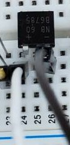
  - 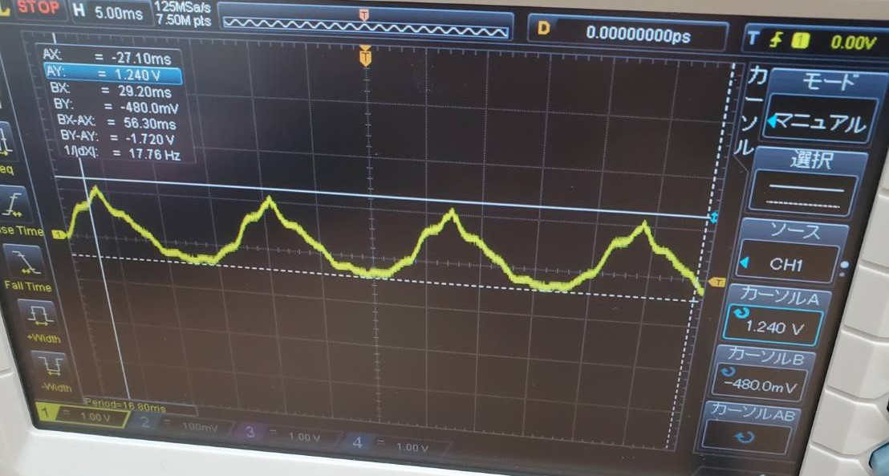
  - 電圧 最大値 1.240V 最小値 -480.0mV

- 塗装剥いでない空き缶と塗装剥いだ空き缶の比較
  - 塗装を剥いだ空き缶と剥いでいない空き缶でテスターの導通チェックを行ったところ、塗装を剥いだ空き缶のみ導通した。
  - そのため塗装を剥ぐことはアンテナ作りで必須だと分かった。

### 整流した電気を直流の電気にする実験
  - コンデンサの比較
  - 電圧の測定
  - 電流の測定 
 

- コンデンサの比較
  - 20pF
  - 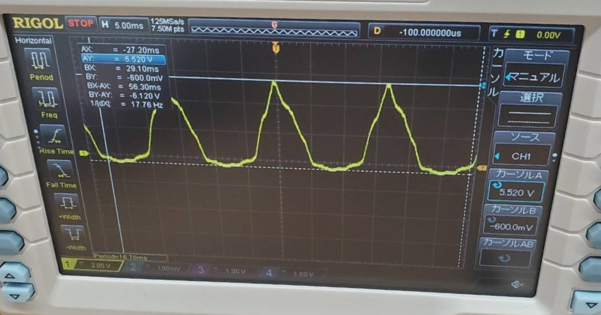
  - 100pf
  - 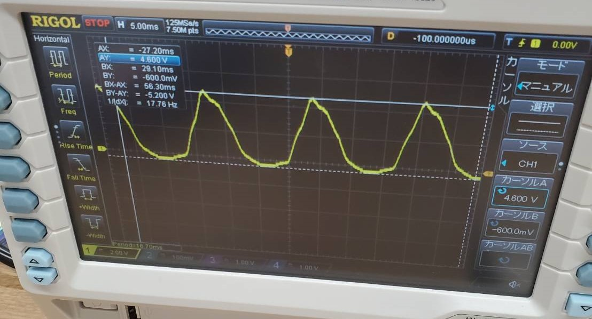
  - 1000pf(1nF)
  - 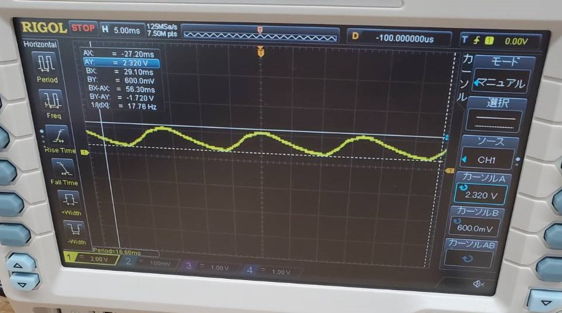
  - 10nf
  - 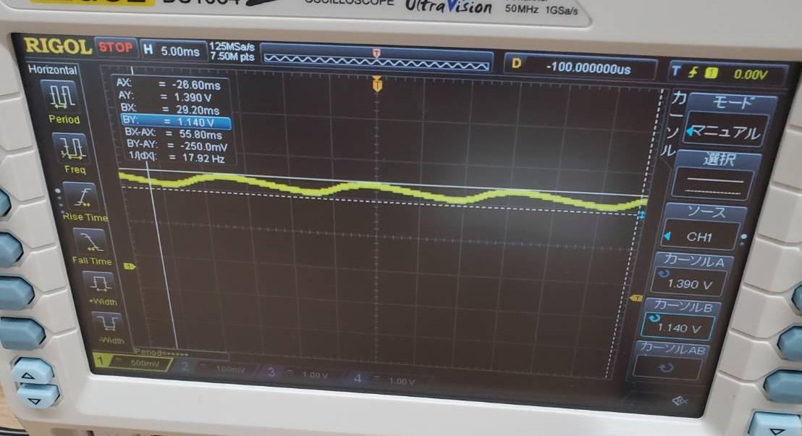
  - 100nF
  - 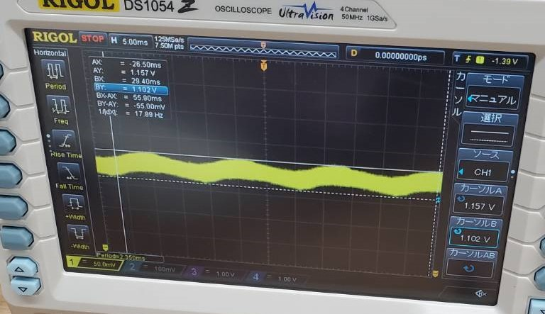
  - 1000nF(1μF)
  - 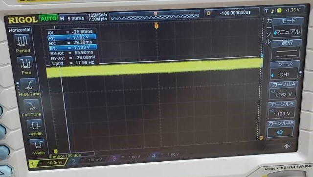
  - 電圧の最大値、最小値およびその差の比較
  - 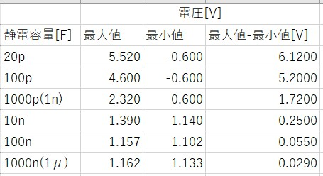
- 電圧の測定
  - 1V程度の電圧を取り出すことに成功し、テスターでも出力を確認できた。
  - 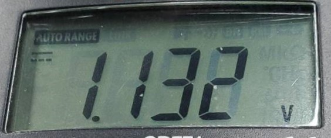
  - オシロスコープとテスターを同時接続すると電圧が低下した。
  - 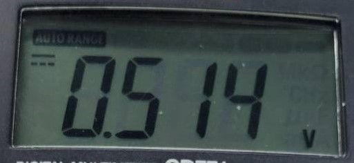
  - 最大値と最小値の差も少なく安定している。
  - 安定化回路は3.3Vを出力させるものが最小なので、更なる電圧の増加が必要。

- 電流の測定
  - 電流を測定しようとすると、急激に電圧が減少し、電流が調べられなかった。
  - コンデンサ内の電気が全て放出されたためだと考えられる。
  -　もう少し出力を増やしてから再度実験する。

- ダイオード単体による整流
  - ブリッジダイオードの代わりに小信号用のダイオードで整流した。
  - 整流はブリッジダイオードと同様に行えたが、平滑が行えなかった。
  - 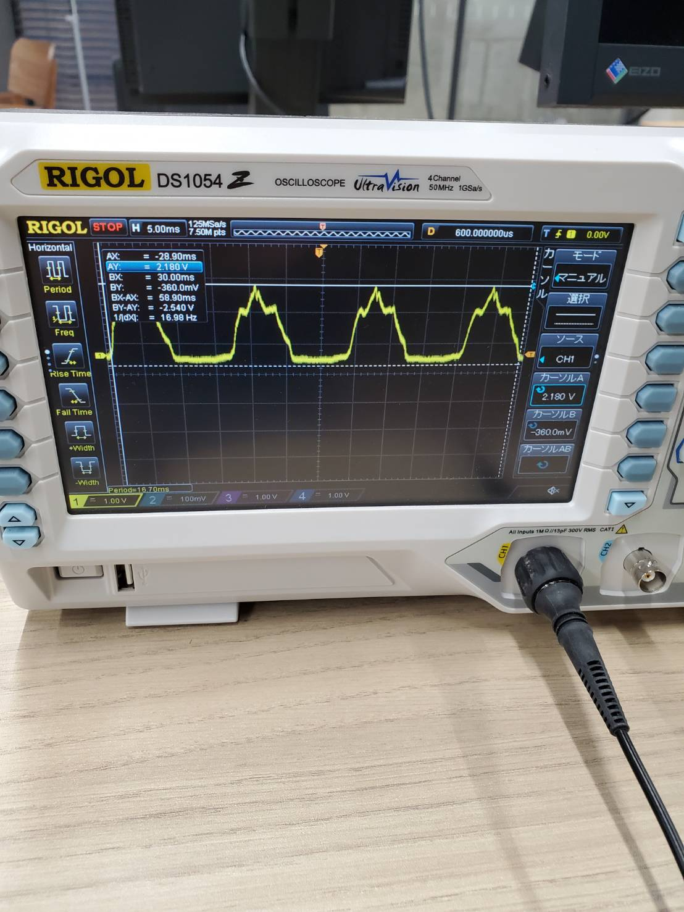
  - 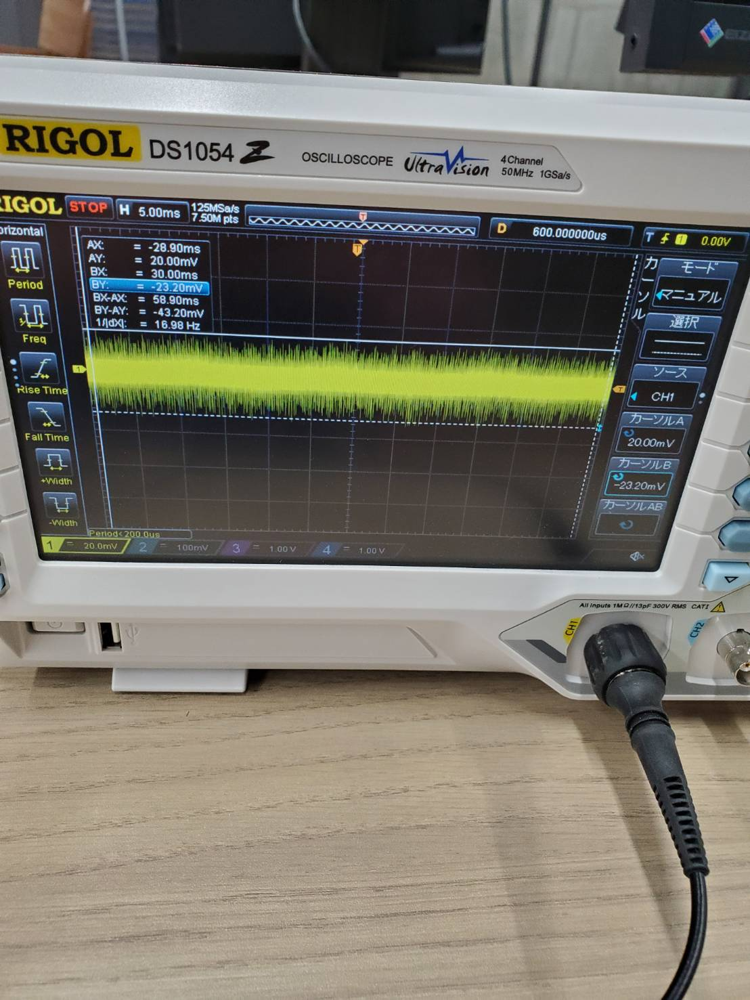
  - 別のダイオードも探すことにする。
  - 電波によって得られる整流前の一方向の電気をxし、整流後の電気をy、ダイオードで減少する電圧をaとする。
  - 半波整流 y=x-a
  - 全波整流 y=2x-4a
  - 状況によっては半波整流が効率的になることもある
  - 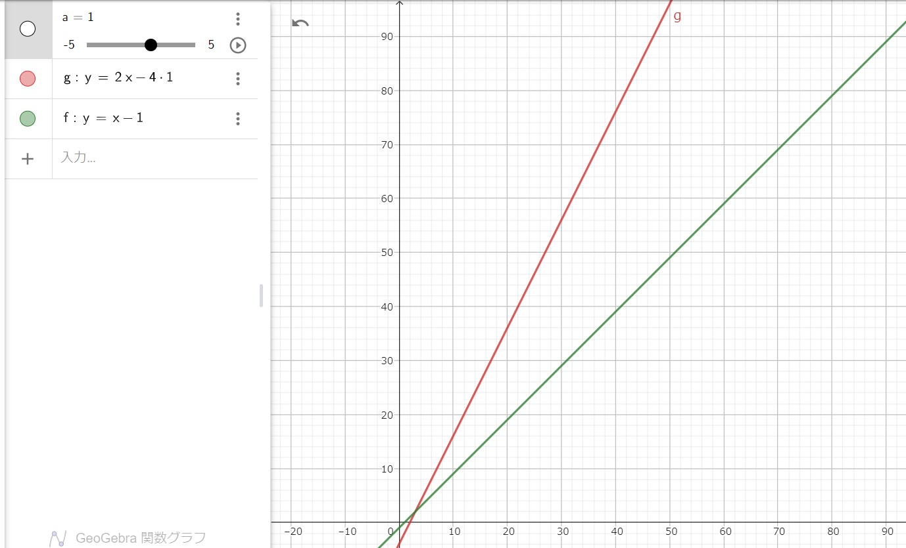
  - 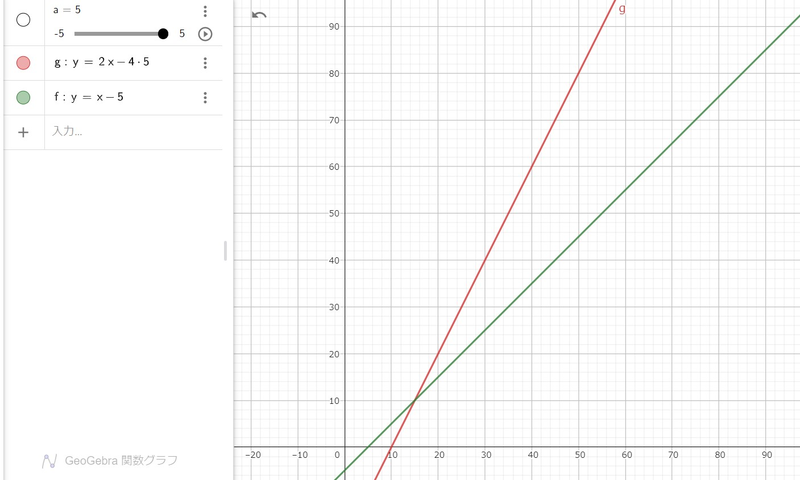

### 今後使う技術に詳しい先生を探す
- LoraWAN 向井 石橋(EP)
- 電子回路 まだ
- 現状では先生とのコンタクトは取っていないので聞きたいことがまとまり次第連絡する。

## 活動予定

- 研究活動 
  
           

- 振り返り事項

## 研究室に来る日程と時間帯

月             | 火             | 水             | 木             | 金             | 土
------------- | ------------- | ------------- | ------------- | ------------- | -------------
10:00 ~ 12:00 | 10:00 ~ 12:00 | 10:00 ~ 12:00 | 10:00 ~ 12:00 | 10:00 ~ 12:00 | 10:00 ~ 12:00
