# 進捗報告書

報告書番号 | 氏名   | 期間         | 報告日
----- | ---- | ---------- | ---
09    | HosokawaAoi | 5/24 ~ 5/31 | 5/31

## 活動概要

- やったこと
  - 部品の購入
  - オシロスコープの影響の調査
  - 検波回路の設計
  
 

### 部品の購入と実験

- 今回買ったもの
  - ショットキーバリアダイオード*4
  - 表面実装ショットキーバリアダイオード*5 

- 買ったものの概要
  - 整流時に消費される電力が少ないダイオード。
  - 整流回路の無駄を減らすために購入した。
  - 表面実装とはチップ形状のこと。
  - 表面実装の方が扱いは面倒だが、消費電力が少ないので合わせて購入した。

- 実験内容
  - 従来の整流回路との整流時の波形の比較
  - 平滑後の出力の比較
 
- 実験結果
  - 後述するオシロスコープの影響の調査により結果が信頼できるものではなくなったので省略する。

 

### オシロスコープの影響の調査
- 再実験
  - 以前に測定する部分に抵抗を挿入していないこと指摘されたので、これまで測定を行った回路に抵抗(30Ω)を挿入して測定したところ、全く異なる結果が出力された。
  - アンテナから得た電気
  - 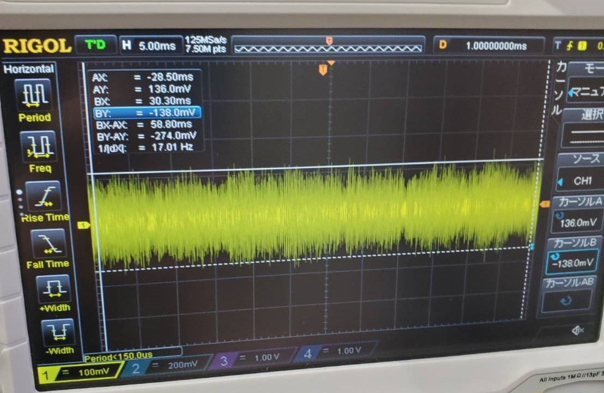
  - +-130mV程度
  - 抵抗接続後
  - 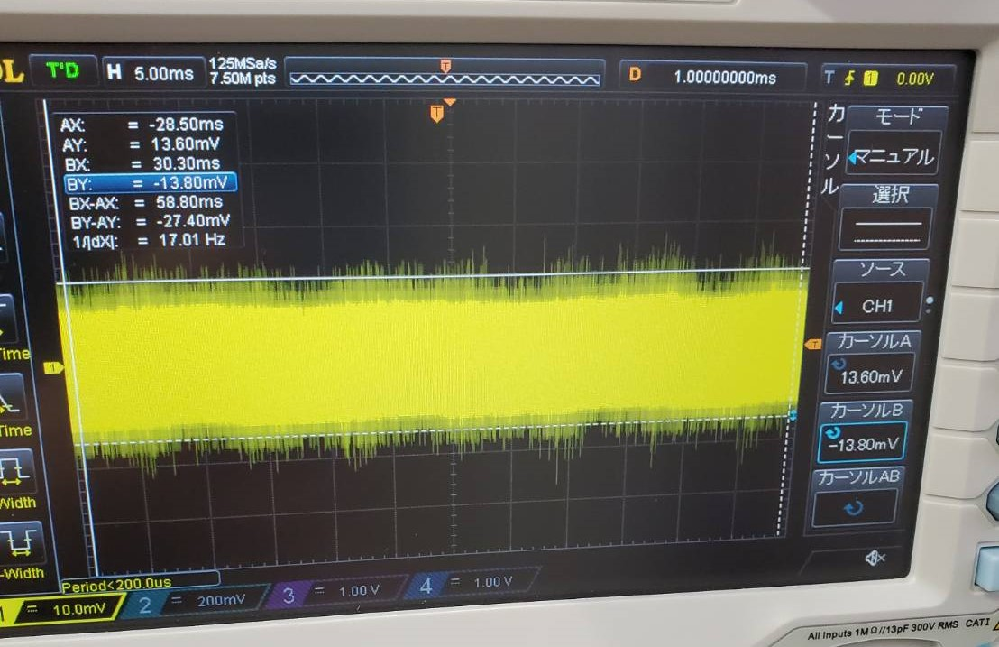
  - +-13mv程度
  - 整流回路から得た電気
  - 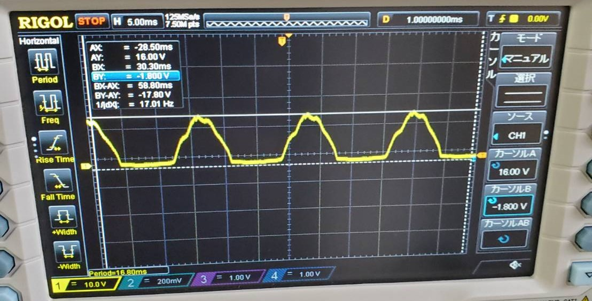
  - 最大16V 最小-1.8V
  - 抵抗接続後
  - 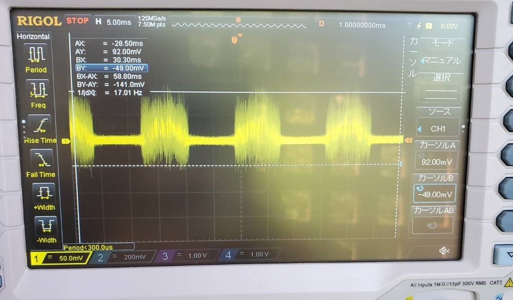
  - 最大92mV 最小 -49mV
  - 平滑回路から得た電気
  - 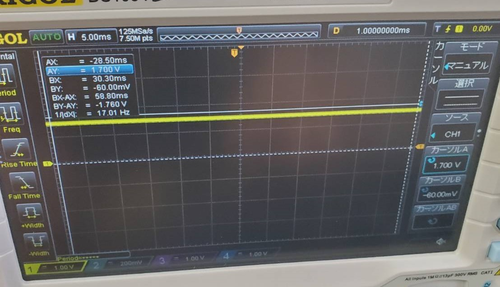
  - 1.7V
  - 抵抗接続後
  - 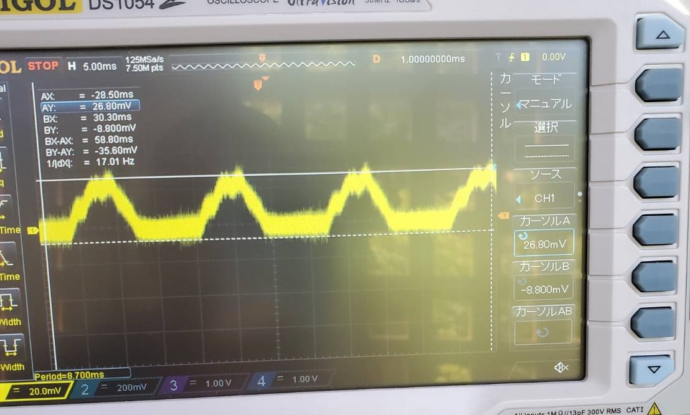
  - 最大26.8mV 最小 -8.8mV
  - 出力はかなり少ないものであることが分かった。
  - 先行研究(https://gakusyu.shizuoka-c.ed.jp/science/sonota/ronnbunshu/102017.pdf)の結果と比較してみるとこちらが正しい結果だと考えられる。
 
- LED発光の原因調査
  - 3週前の実験よりLEDが作成した回路で発光することが確認されたが、この結果にもオシロスコープの影響があると考え、調査を行った。
  - 回路構成を変えてみたところ、整流回路とオシロスコープを接続したものにLEDを繋ぐだけでもLEDの発光が確認できた。
  - 
  - 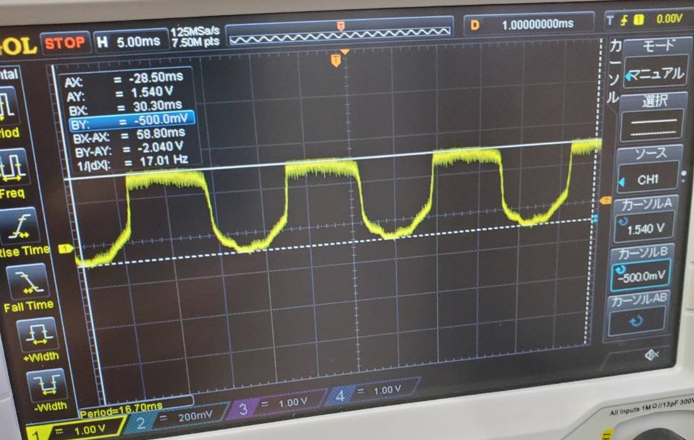
  - 最大1.54V 最小-0.5V
  - この状態でオシロスコープの電源を切るとLEDが消えたので、今までのLEDの発光はオシロスコープの電気から生じたものだと分かった。
  - 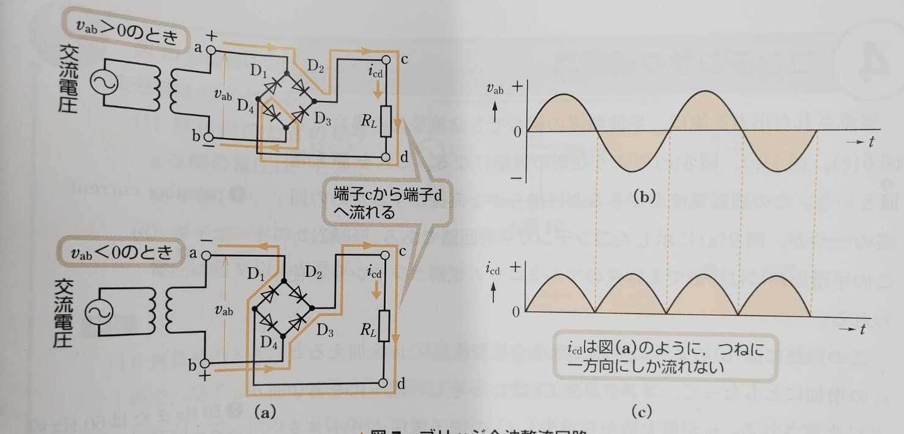
  - しかしアンテナを接続するとLEDの明るさが増し、出力も80mV程増えたことからアンテナからの影響も皆無ではないと考えられる。(単純に抵抗になっているだけの可能性もある)
  - 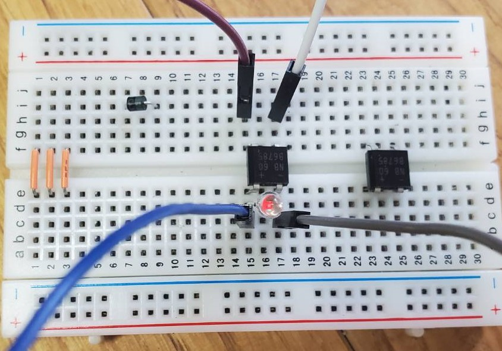
  - 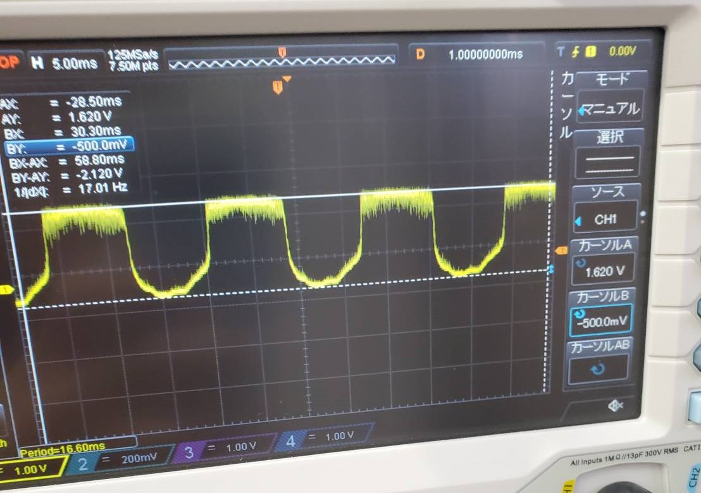
  - 最大1.62V 最小-0.5V

- 改善方法
  - 調査により入力となるアンテナからの電気が少ないことが分かった。 
  - また実験の準備段階で、複数のアンテナを接続する際に、途中からアンテナの数と得られる電気が比例しないことが分かっている。
  - そのためアンテナの数を増やすのではなく、アンテナの質を上げることで問題を解決する。
  - アンテナの素材に錆びにくさでアルミより優秀な銅を用いたり、アンテナのサイズを波長(電波の秒速/周波数=299792458/76.3*10^6≒3.92メートル)を意識した設計にする。
 

### 検波回路の設計
- 検波回路とは
  - ラジオやテレビの電波は送りたい情報の電波を搬送用の電波に合成して伝えられる。
  - アンテナが受けた電波の内必要な電波のみを取り出す回路。
  - 電波の種類によって検波のやり方は異なる。
  - 

- FM用検波回路
  - 近くのラジオ局で使われているFM波は周波数変調と言う方法で電波を作っている。
  - これは基準する周波数から音声信号に合わせて周波数を増減させるものである。
  - 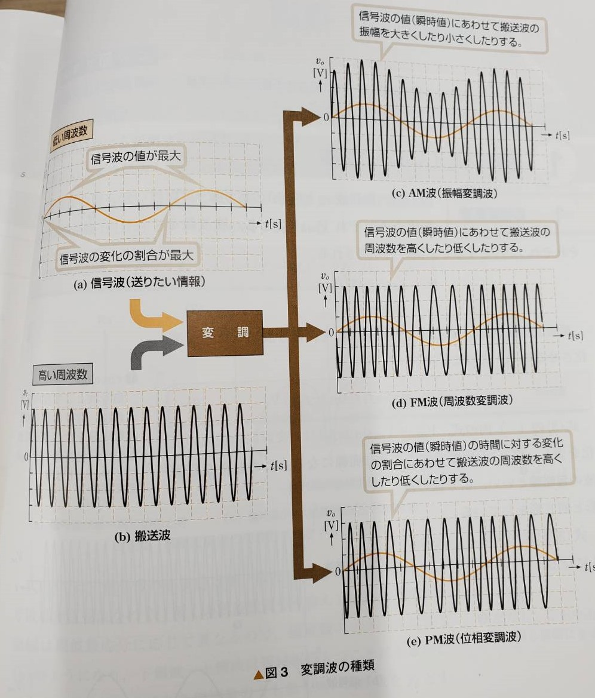
  - そのため特定の周波数でのみ抵抗値が変化する共振回路を用いて、周波数の変化を電圧の変化に変換している。
  - 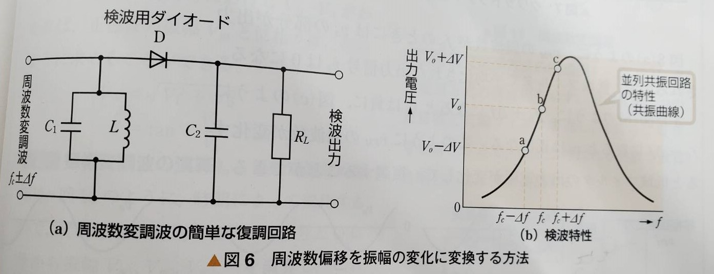
  - 今回は音声信号を取り出すのは目的ではないので、回路の設定を若干変化させる。

- 共振回路
  - 交流ではコイル(インダクタ)は周波数に比例して、コンデンサは周波数に反比例して抵抗値が変化する
  - これらの素子を並列か直列に接続した状態で、特定の周波数になると共振し、合成抵抗が並列なら最大、直列なら最小になる。
  - 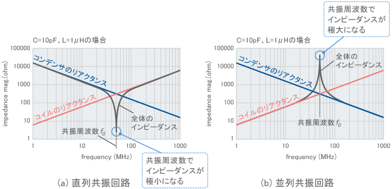
  - (画像出典:https://www.google.com/url?sa=i&url=https%3A%2F%2Fwww.murata.com%2Fja-jp%2Fproducts%2Femc%2Femifil%2Flibrary%2Fknowhow%2Fbasic%2Fchapter03-p1&psig=AOvVaw1jcyZGIDp9fXt-3SbZ3VJS&ust=1685506314794000&source=images&cd=vfe&ved=0CBMQjhxqFwoTCJisoryWnP8CFQAAAAAdAAAAABAH)
  - FM用検波回路では並列の共振回路が使用され、指定した周波数の時に抵抗値を上げて、並列に接続された回路に多くの電流が流れるようにしている(分流)。
  - 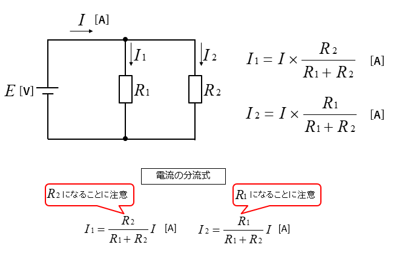
  - (画像出典:https://www.google.com/url?sa=i&url=https%3A%2F%2Fhegtel.com%2Fpartial-current.html&psig=AOvVaw1QGaBgXGcHQUk1W34fcEYL&ust=1685506496370000&source=images&cd=vfe&ved=0CBEQjRxqFwoTCJDhpZKXnP8CFQAAAAAdAAAAABBd)

- 回路の設計
  - 電波による発電を重視するために、使用するFM波の中心周波数で最も共振する回路を作成する。
  - 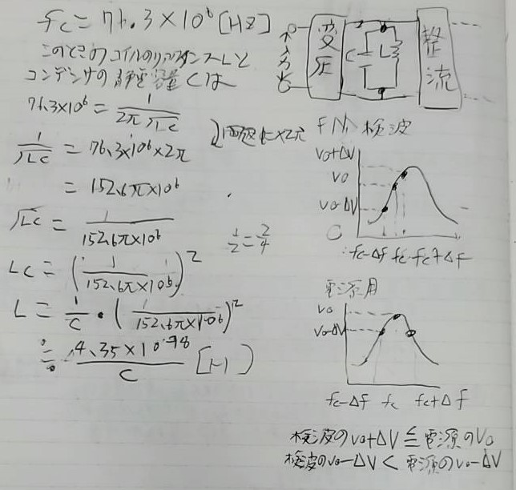
  - 詳しい計算は省くが、縦軸をコイルのリアクタンス、横軸をコンデンサの静電容量とした時次のグラフに沿った組み合わせならば共振回路を作成できる。
  - 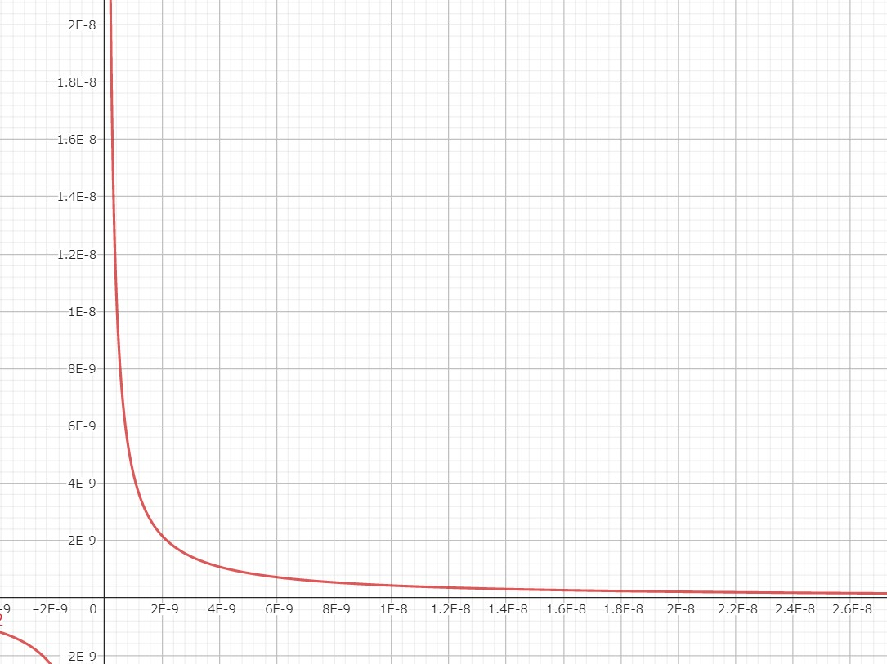
  - コンデンサは静電容量が固定のものでも一応共振回路は作成できるが、微調整ができる可変容量コンデンサの使用が好ましい。
  - マルツパーツではこの部品は販売されていなかったので、私物のラジオから部品を取ろうとしたが、検波回路がIC化されており、使用できそうになかった。
  - -
  - 細かい設計が終わり次第、可変容量コンデンサは通販で注文する必要がある。
  

 

　

## 活動予定
- 現状の整理
  - 電波をマイコンの電源にしたい。
  - 5V1Aを安定して出力する電源を作成する。
  - 電流は置いておいて、まず一定の電圧を出力し続ける回路を作成する。
  - 電波を直流に変換できたが、電圧を安定させるための安定化回路が動作しない。(前回の課題)
  - 実はそれ以外の回路も正しく動いてなかった。(現状の課題)

- 課題への対策
  - 無駄な電圧を電流に変圧回路で変換する。(終了)
  - 整流回路を変える。(回路作成のみ終了)
  - アンテナの数や種類を変える。(次やること)

- コンセプトシートをそろそろ完成させる。

- 研究活動 
- 振り返り事項

## 研究室に来る日程と時間帯

月             | 火             | 水             | 木             | 金             | 土
------------- | ------------- | ------------- | ------------- | ------------- | -------------
10:00 ~ 12:00 | 10:00 ~ 12:00 | 10:00 ~ 12:00 | 10:00 ~ 12:00 | 10:00 ~ 12:00 | 10:00 ~ 12:00
