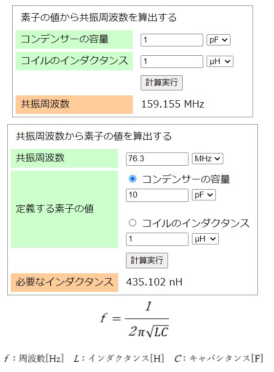
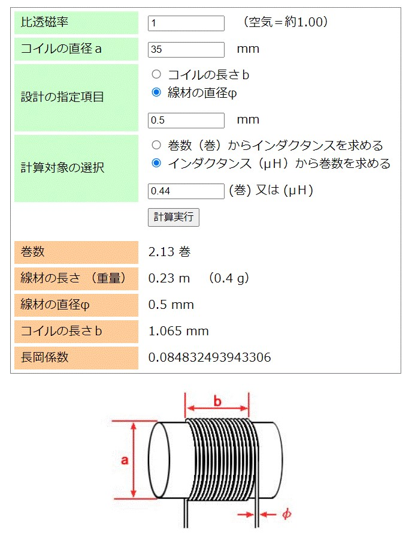
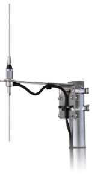
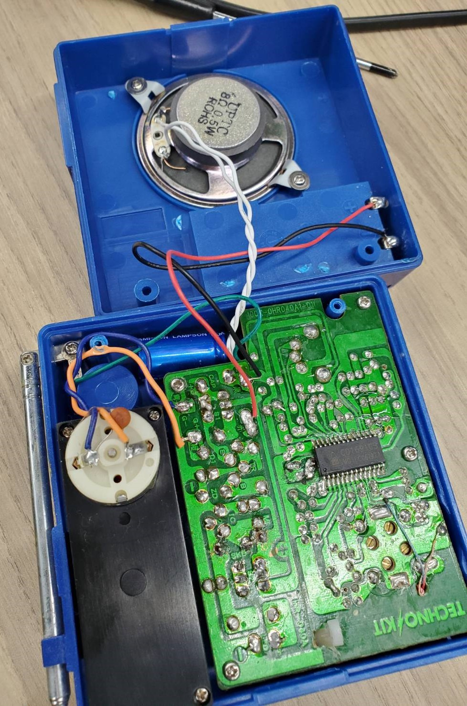

# 進捗報告書

報告書番号 | 氏名   | 期間         | 報告日
----- | ---- | ---------- | ---
10    | HosokawaAoi | 5/24 ~ 5/31 | 5/31

## 活動概要

- やったこと
  - 部品の購入
  - アンテナの設計
  - コンセプトシート作成
 

### 部品の購入

- 今回買ったもの
  - 銅線 500g
  - 可変容量コンデンサ(5種類) 

- 買ったものの概要
  - アンテナや共振回路のコイルの素材用のコイルと静電容量を変化させられるコンデンサ。
  - 前回は可変容量コンデンサは販売されてないと述べたが、商品名が違っただけで販売されていた。
  - 一方でコイルに関しては要求する性能のものが用意できなかったので、計算を行うサイト(https://crystal-set.com/calc/frequency_resonance_lc.php)を参考に自作する。
  - 
  - 

 

### アンテナの設計
  - 何パターンかのアンテナを作成し、どれがコスト的、空間的に効率が良いのかを調べる。
  - アンテナには幾つかのパターンがあるが、自作しやすそうなものを数パターン作成する。
  - 利得:電波から電気を得る効率のよさ
  - 指向性:どの方向から飛んできた電波を受け取りやすいか
  - ループアンテナは0.5mm(279m)線それ以外は2mm(7m)線を使う。
  - 以下優先順に作成したいアンテナを記述する。
 

- ループアンテナ(1回巻き)
  - 銅線を円周が1波長(3.92m)になる円状に1回巻いて作るアンテナ
  - 無指向性
  - 利得が高く、ダイポールアンテナよりは対応する周波数の幅が広い。
  - 
  - 画像出典:https://www.circuitdesign.jp/technical/antenna-s/#%E3%82%A2%E3%83%B3%E3%83%86%E3%83%8A%E3%81%AE%E6%8C%87%E5%90%91%E6%80%A7

- ループアンテナ(複数巻き)
  - 円の円周が1波長(3.92m)よりも十分小さい円状に複数回巻いて作るアンテナ
  - ラジオの電波を電気に変える他の研究において何度か用いられている。
  - 実験では巻き数3通り、半径3通りの計9通りの組み合わせを試す予定
  
- ダイポールアンテナ
  - 1/4波長(0.98m)の長さの銅線を直線状に2つ接続して作るアンテナ
  - 構造がシンプルだが、利得を最大にするには微調整が必須
  - 
  - 画像出典:https://www.circuitdesign.jp/technical/antenna-s/#%E3%82%A2%E3%83%B3%E3%83%86%E3%83%8A%E3%81%AE%E6%8C%87%E5%90%91%E6%80%A7
 
- ラジオ用アンテナ
  - 私物のラジオのものを分解して利用する。
  - 分類的にはホイップアンテナと言うものになる。
  - 

 

### コンセプトシートの作成
  - 一旦全ての欄を埋めることはできた。
  - https://github.com/nakalab/progress2023/blob/HosokawaAoi/HosokawaAoi/Concept_thema.md
  - https://github.com/nakalab/progress2023/blob/HosokawaAoi/HosokawaAoi/Design_Evaluate.md
  - 一部気になる箇所があるので修正する。

 

## 活動予定
- 現状の整理
  - 電波をマイコンの電源にしたい。
  - 5V1Aを安定して出力する電源を作成する。
  - 電流は置いておいて、まず一定の電圧を出力し続ける回路を作成する。
  - 電波を直流に変換できたが、電圧を安定させるための安定化回路が動作しない。(前回の課題)
  - 実はそれ以外の回路も正しく動いてなかった。(現状の課題)

- 課題への対策
  - 無駄な電圧を電流に変圧回路で変換する。(終了)
  - 整流回路を変える。(回路作成のみ終了)
  - アンテナの数や種類を変える。(次週作成開始)

- 研究活動 
- 振り返り事項

## 研究室に来る日程と時間帯

月             | 火             | 水             | 木             | 金             | 土
------------- | ------------- | ------------- | ------------- | ------------- | -------------
10:00 ~ 12:00 | 10:00 ~ 12:00 | 10:00 ~ 12:00 | 10:00 ~ 12:00 | 10:00 ~ 12:00 | 10:00 ~ 12:00
