# 進捗報告書

報告書番号 | 氏名   | 期間         | 報告日
----- | ---- | ---------- | ---
16    | HosokawaAoi | 9/20 ~ 9/27 | 9/27

### 先行研究
  - 電波からエネルギーを取り出す研究(https://gakusyu.shizuoka-c.ed.jp/science/sonota/ronnbunshu/102017.pdf)

## 活動概要

- やったこと
  - 電子部品の購入
  - 買ったものの動作確認
  - 充電用回路の改造
  
 

### 電子部品の購入
- 買ったもの
  - 充電用回路:バッテリへの充電を行う回路。入力電圧が3.7Vから6Vである程度の電圧の変化に対応できそうな点から採用した。
  - 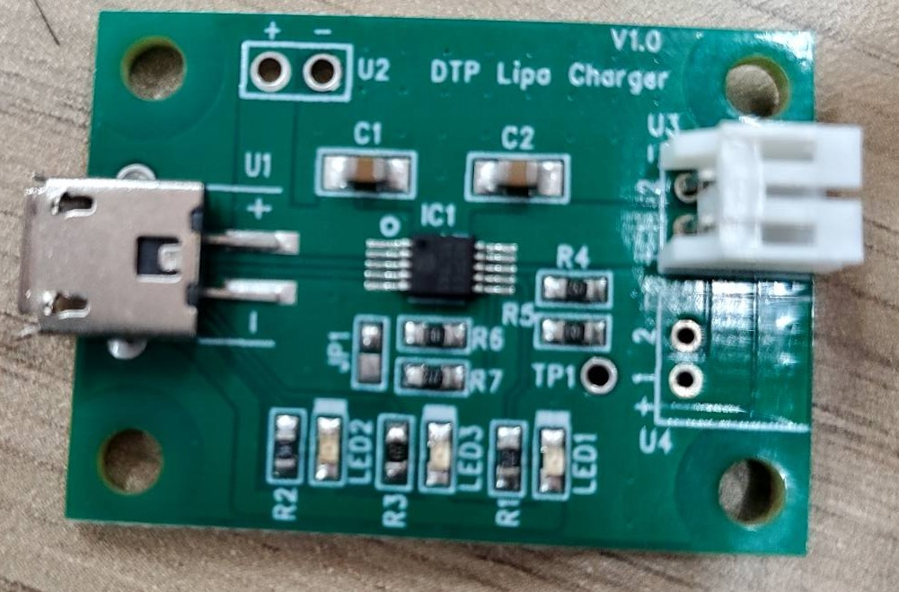
  - バッテリ:充電用回路に対応したリポバッテリ
  - 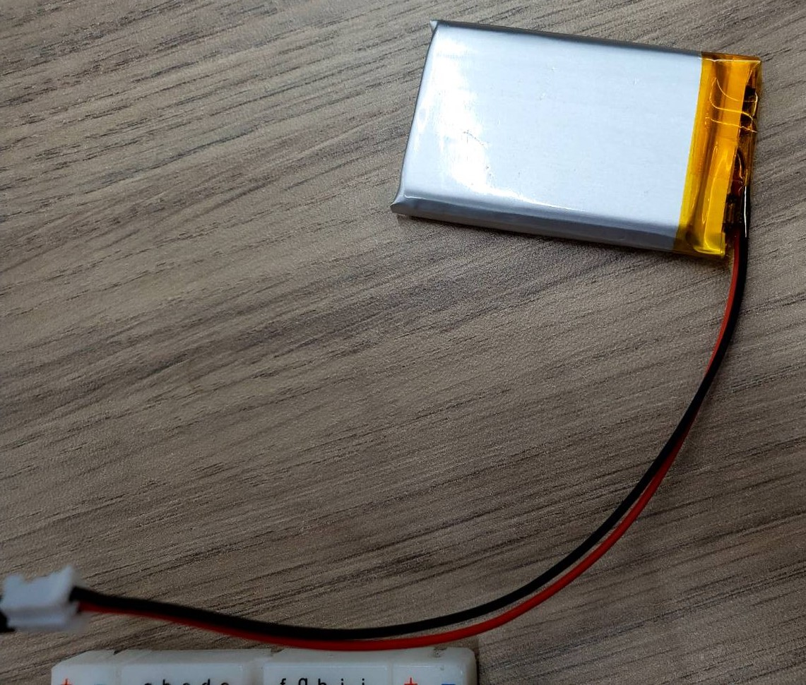
  - ソーラパネル:電波による発電と太陽光発電で対象実験を行うために購入した。出力は充電用回路に対応している。
  - 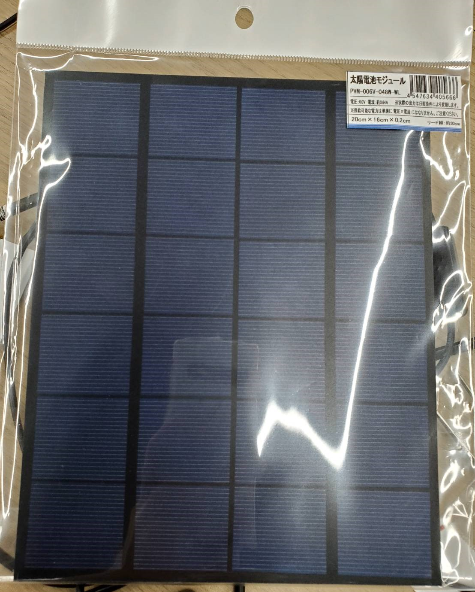

- 今後買いたいもの
 - マイコン系の部品:作る電子機器の構成が決まっていないので保留
 - バッテリの残量測定器:一応売ってはいたが、4セグメントLEDによる残量表示なので分かりにくいものしかなかった。
 - 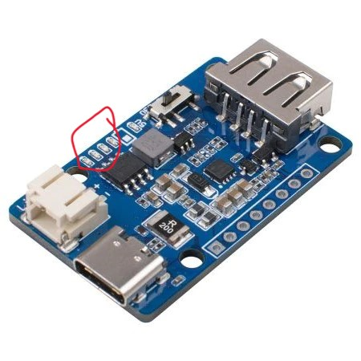

 
  
### 買ったものの動作確認

- 充電用回路とバッテリ
  - PCから充電用回路へ電気を供給し、バッテリへの充電を行った。
  - 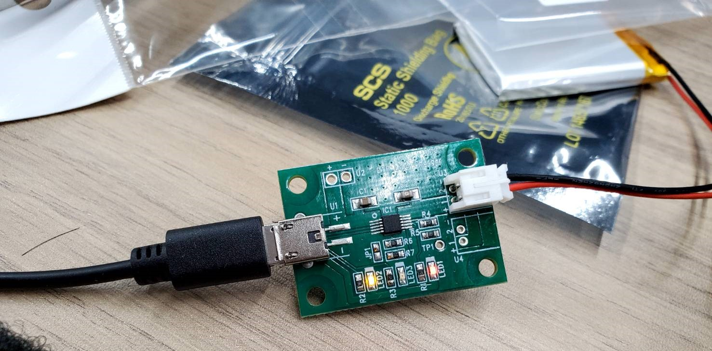
  - 基板LEDの赤が電源入力中、黄色が充電中、充電が終わると緑のLEDが点灯するらしい。
  - 充電したバッテリをLEDに接続すると発光した。
  - 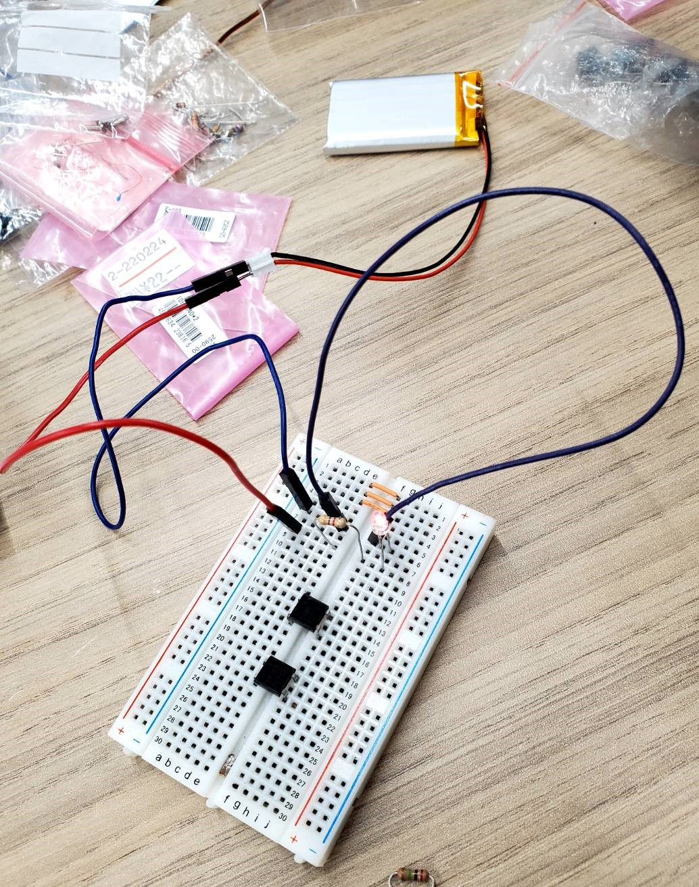

- ソーラパネル
  - 日当たりの良い場所でソーラパネルとLEDを接続すると発光した。
  - 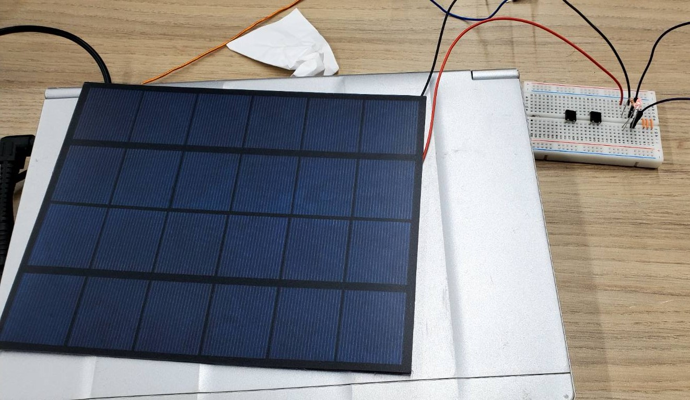

 

### 充電用回路の改造
  - 充電用回路の入力側の端子を銅線二本で充電できるように改造する。
  - 回路に使われていない入力端子があったのでここを利用する。
  - 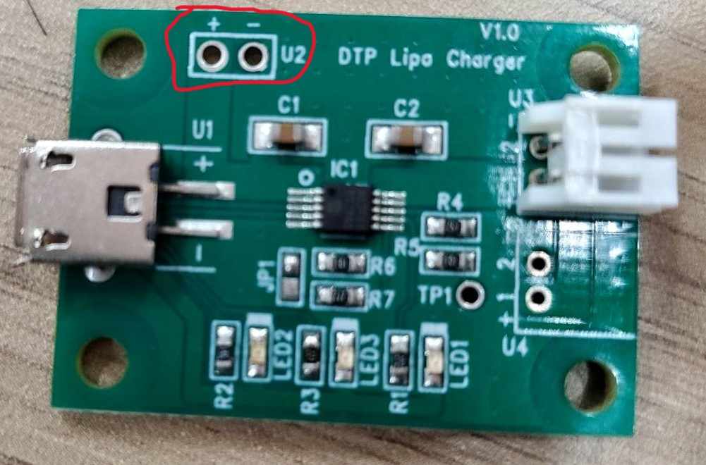
  - 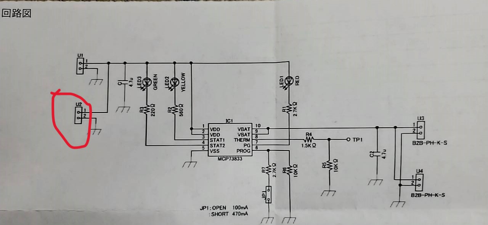
  - 銅線を接続しやすくするコネクタを追加した。
  - 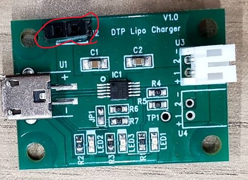
  - ソーラパネルを接続したところ、充電中のLEDが発光した。
  - 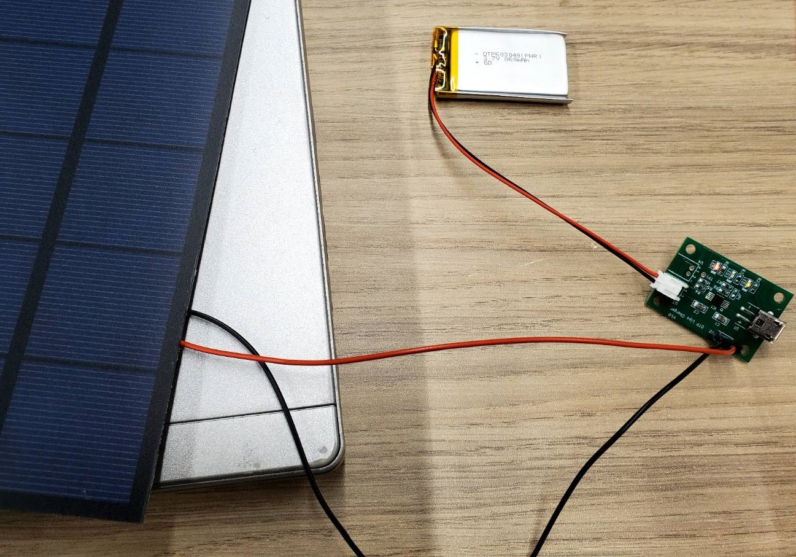
  - ただしまだ電気が残っている状態で充電したので、充電できているのかは不明。
  - バッテリを空にできるものが欲しい。

 
 

## 活動予定
- 現状の整理
  - 電波をマイコンの電源にしたい。
  - 電流は不安定だが電圧は安定した値の出る電源ができた。
  - 発電した電気を充電できる回路を作成する

- これからやること
  
  - バッテリの残量を確認できるものとバッテリをすぐに空にできるものを購入する。
  - 太陽光発電でバッテリを充電する。
  - 電波による発電でバッテリを充電を充電する。
  - 作る電子機器の内容を考える。

- 研究活動 
- 振り返り事項

## 研究室に来る日程と時間帯

月             | 火             | 水             | 木             | 金             | 土
------------- | ------------- | ------------- | ------------- | ------------- | -------------
10:00 ~ 12:00 | 10:00 ~ 12:00 | 10:00 ~ 12:00 | 10:00 ~ 12:00 | 10:00 ~ 12:00 | 10:00 ~ 12:00
