# 進捗報告書

報告書番号 | 氏名   | 期間         | 報告日
----- | ---- | ---------- | ---
20    | HosokawaAoi | 10/19 ~ 11/1 | 11/1

### 先行研究
  - 電波からエネルギーを取り出す研究(https://gakusyu.shizuoka-c.ed.jp/science/sonota/ronnbunshu/102017.pdf)

## 活動概要

- やったこと
  - バッテリの充電実験(4度目)
  - 作る電子機器の構想
  - マイコンの動作確認
  
 

### バッテリの充電実験
- 実験内容
  - バッテリチェッカが届いたので、どれだけ充電できているのかを調べる。
  - 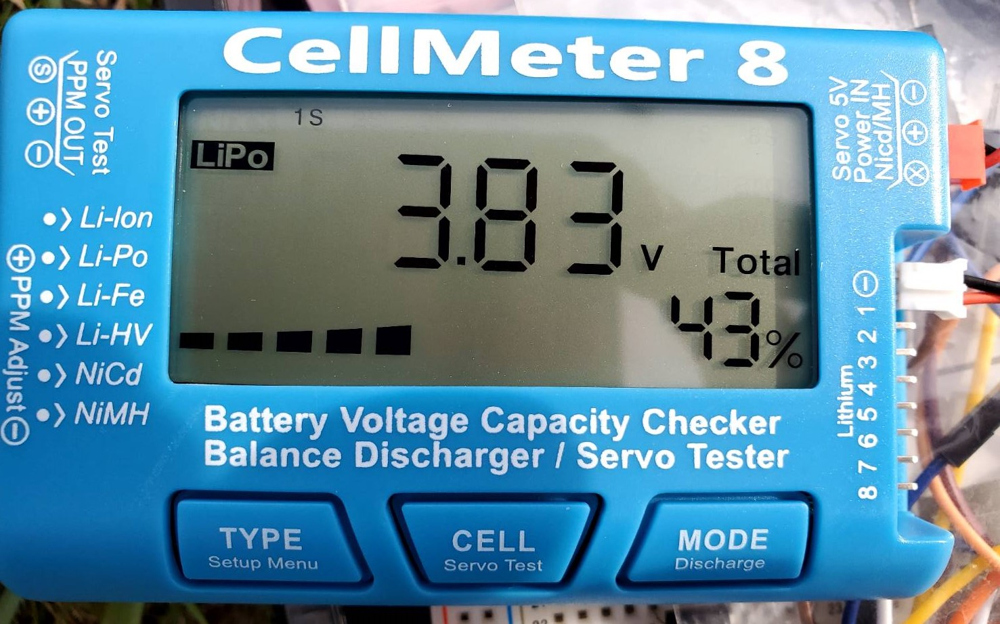
  - 日当たりのよい場所(日向)、太陽光パネルでの充電で充電中にならないレベルの日当たりの悪い場所(日陰)の2箇所で太陽光パネルとアンテナでそれぞれ30分間充電し、バッテリの残量がどれだけ増えたのかを確認する。
  - 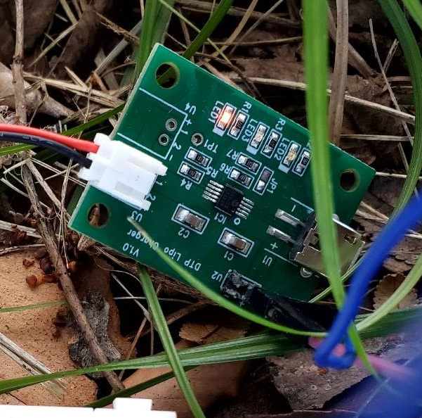
  - 明るさを揃えるために実験は2日に分けて行い、晴れの日の14時半から太陽光→電波の順で行う。(1日目は日向、2日目は日陰) 
  - 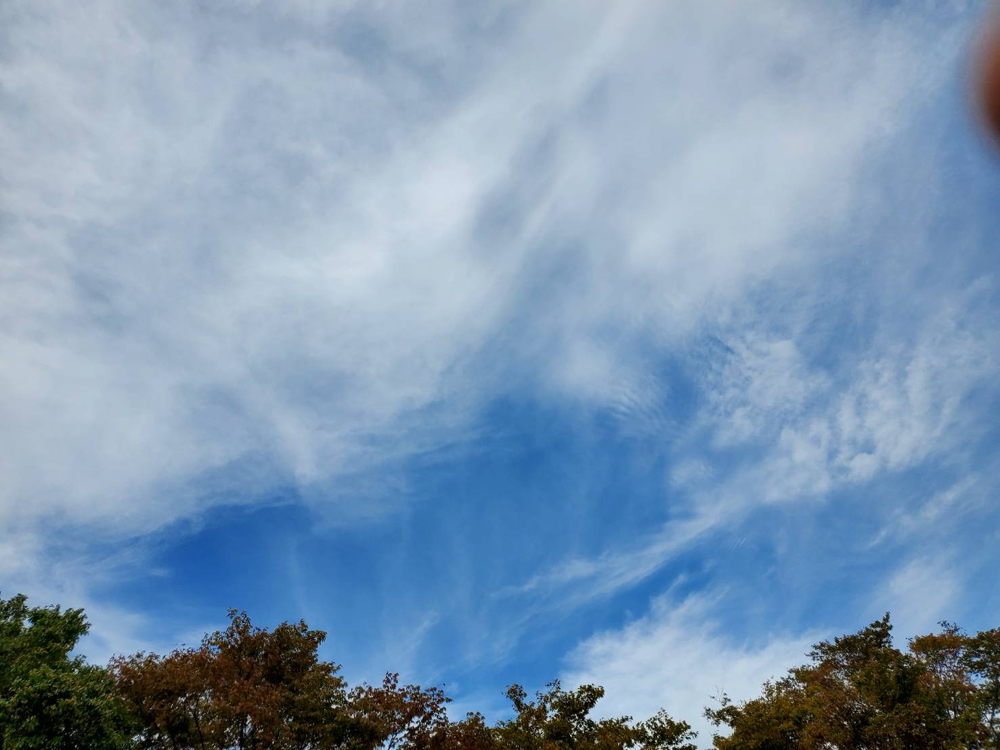
  - 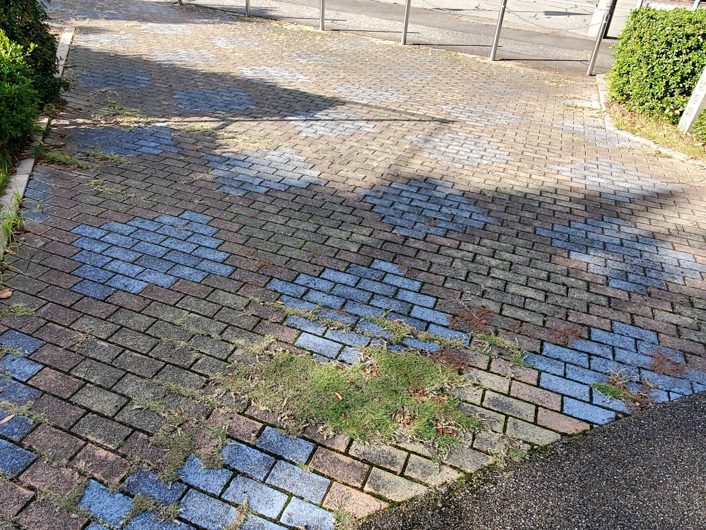
  - 
  - 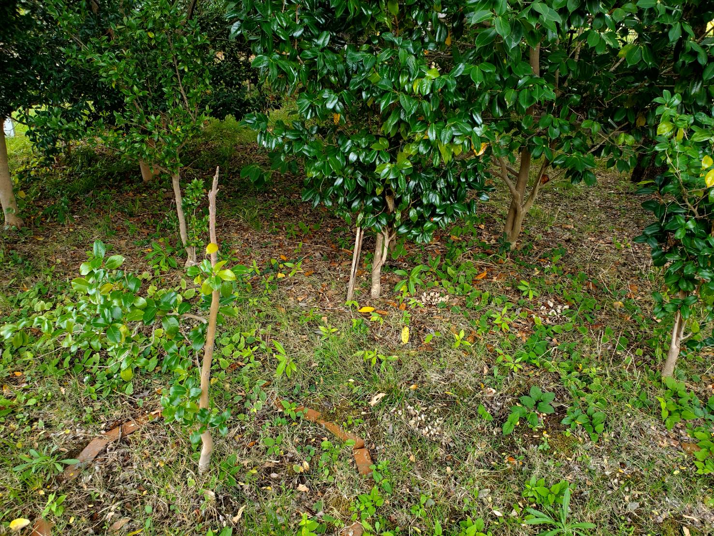
  - なるべく日向と日陰で電波の発生元との直線距離が変わらないようにした。(32歩)

- 実験結果
  - 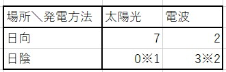
  - ※1 バッテリチェッカ接続時の一瞬だけ1%増えたがすぐに戻った。接続時の揺らぎか接続中に1%減った可能性があるが、電波による発電よりは確実に少なかった。
  - ※2 バッテリチェッカは小数点以下を表示しないので増えた量が同じ可能性がある例:0+2.5=3.5、0.5+2.5=4.0 
  - 日向では太陽光パネルが圧倒的に充電量が高いが、日陰ではアンテナの方が充電量が高くなった。
  - またアンテナの場合は日向と日陰でもそこまで充電量に変化がなかった。
  - 今回、充電用回路の都合で太陽光パネルはノート程度の大きさのものを1枚使用しているがこれとアンテナのサイズ差は倍であり、これを考慮すると日向の差はより広がり、日陰でもアンテナよりも高い充電量になる可能性がある。
  - サイズ差=(75^2+50^2×2)/2×*16≒33.2(倍)
  - 電波による発電の平均=(3+2)=2.5(%)
  - 実験中の日向の太陽光発電と電波による発電の出力差=7/2.5=2.8(倍)
  - 昼夜を考慮した日向の太陽光発電と電波による発電の実質的な差=33.2×2.8/2≒46.5(倍) (雨天時はどちらも影響を受けるので考慮しない)
  
 
  
### 作る電子機器の構想

- 電波による発電の特徴
  - サイズの割に発電量が少ない
  - 周辺に高出力の電波が必要(先行研究の電波が100Wでそこまで出力が高くないのでAMであることが重要そう)
  - アンテナの向きが発電量に大きな影響を与える。
  - 多少障害物があっても電波の発生元が近いなら発電できる　
  - 未検証だけど太陽光よりは積雪には強そう

- 発電の特徴から考える電子機器の特徴
  - 大掛かりな動作はさせない(もしくは充電期間を設けて短時間の動作)
  - 太陽光発電との差別化のために日当たりの悪い所で動作させる。
  - 設置場所が変わる度に角度調整が必要なので、移動するもの(ソーラーカーやウェアラブルなもの)の電源にすることはできない。
  - 電池の充電をしながら、電子機器の待機電力を供給する余裕はないのでマイコンの省電力化かマイコンへの電源供給を一時的に無くす必要がある。

- 設置予定地の調査
  - 上記の特徴を踏まえて改めて設置予定地のラジオ塔の調査を行った。
  - 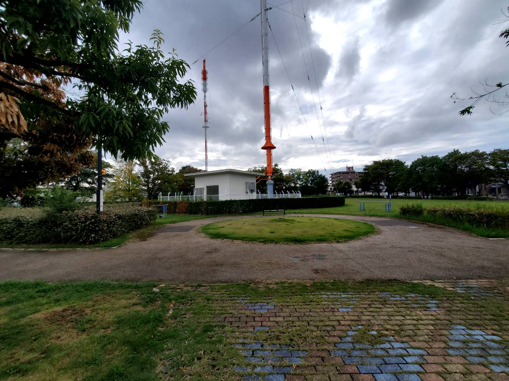
  - ラジオ塔は公園内にあるのでコンパクトで、なおかつ地面への設置は控えた方がいい。(アンテナはこれ以上小型にできない)
  - 子供がボール遊びをして電子機器が破損する可能性あり。
  - 日当たりが悪そうな場所として、ラジオ塔や遊具、ベンチ等の日陰、木が茂っている場所の周辺が挙げられる。
  - 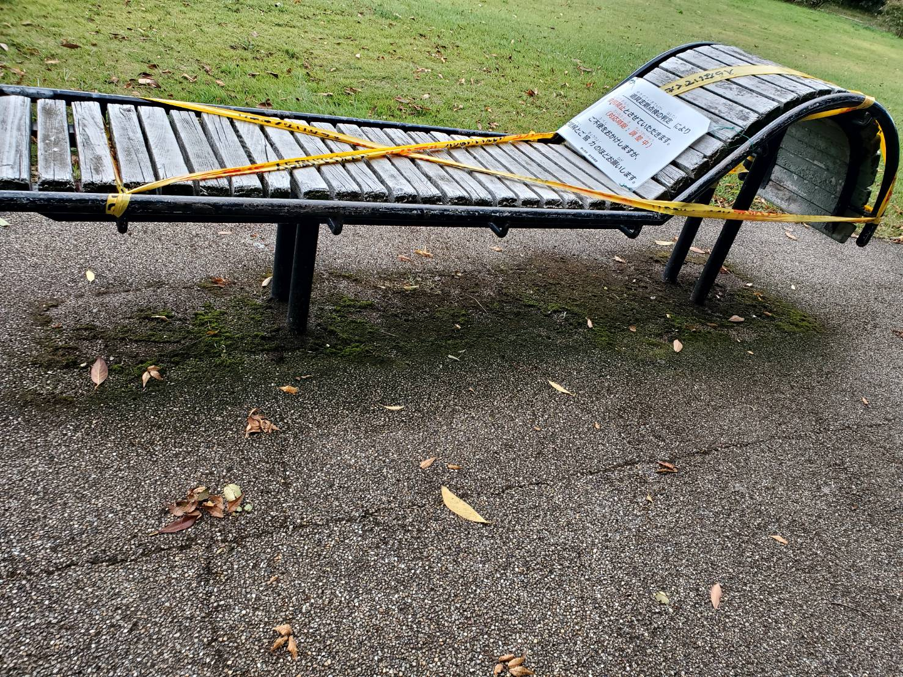
  - 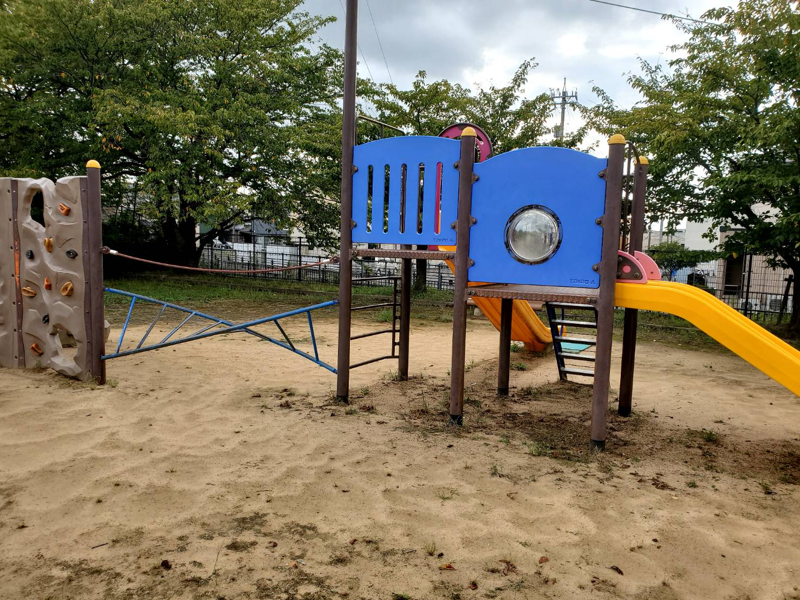
  - 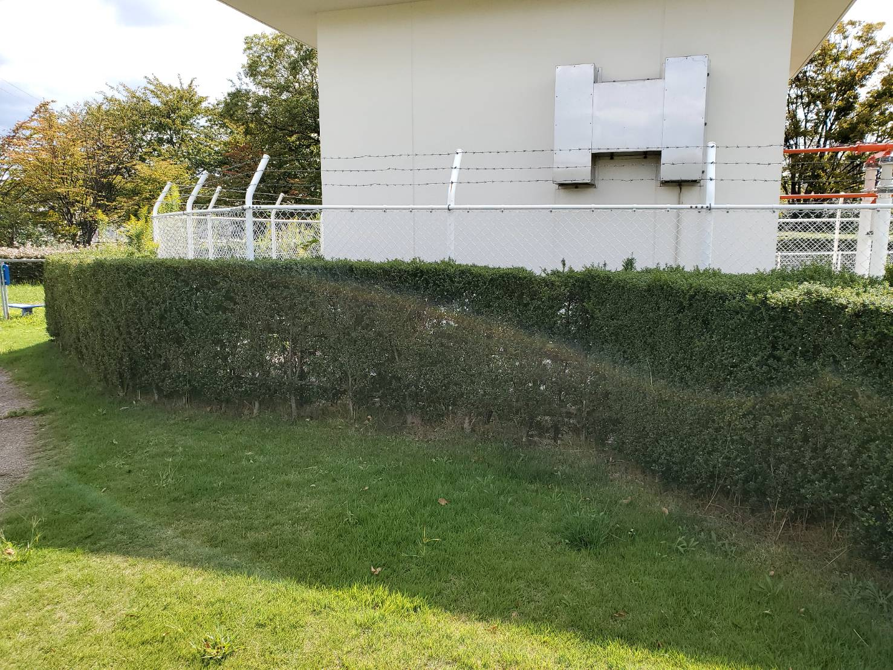
  - 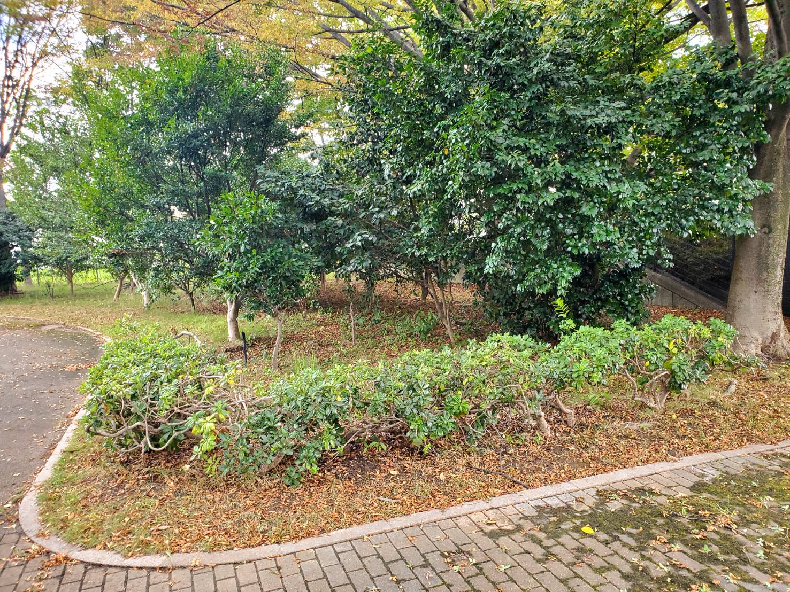
  - 遊具やベンチ等は人が使うのであまり設置したくない。(サイズ的にも入らない)

- 予定変更の希望
  - 元々作る予定だったものはIoT機器だったが、学校と発電可能なラジオ塔までの距離が2km程離れているので、実現は難しいと考えられる。 
  - lora通信は2kmの通信も可能とされているが、通信できる距離は外的要因で大きく変化する。(受け手側の性能も重要らしい)
  - 一旦IoTにこだわらずに作るものを考えたい。

- 作れそうなものの候補
  - 水やり装置
  - 温度湿度計
  - 時報
  - センサやアクチュエータを買う予算も無いので、なるべく研究室内から部品を調達できるものを作りたい。
  - 後述するマイコンについてもニッチ寄りのものなので、部品が対応しているのか詳しく調べておく。(基本はArduino?)

 

### マイコンの動作確認
  - マイコンを新規に購入する予定だったが予算的に厳しかったので、研究室内にあったSeeed Studio XIAO nRF52840と言うマイコンを使うことにした。
  - 
  - 調べたところによると少ない電力で動き、リポバッテリでの動作、充電が可能らしいので都合がいいと思う。
  - とりあえずピンをはんだ付けして、プログラムを書き込める環境を用意し、本体付属のLEDを発光させるプログラムを動作させた。
  - 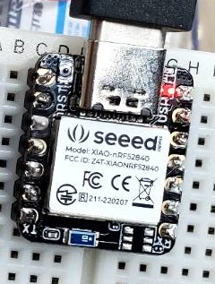
  - マイコンの裏面にバッテリからの電源供給と充電を行う端子があるので、バッテリと接続したするとPCに接続した時と同様にプログラムが動作した。
  - 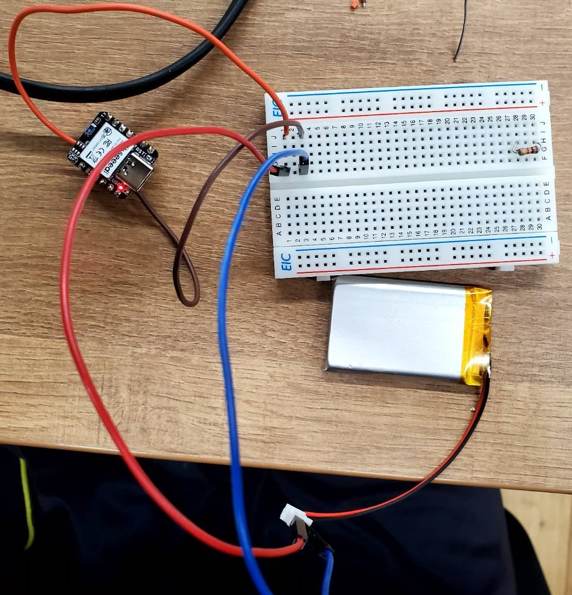

 
 

## 活動予定
- 現状の整理
  - 電波をマイコンの電源にしたい。
  - 電流は不安定だが電圧は安定した値の出る電源ができた。
  - 発電した電気を充電できる回路を作成する

- これからやること
  - バッテリの残量を確認できるものかバッテリをすぐに空にできるものを購入する。(済)
  - 太陽光発電でバッテリを充電する。(済)
  - 電波による発電でバッテリを充電を充電する。(済)
  - 作る電子機器の内容を考える。

- 研究活動 
- 振り返り事項

## 研究室に来る日程と時間帯

月             | 火             | 水             | 木             | 金             | 土
------------- | ------------- | ------------- | ------------- | ------------- | -------------
10:00 ~ 12:00 | 10:00 ~ 12:00 | 10:00 ~ 12:00 | 10:00 ~ 12:00 | 10:00 ~ 12:00 | 10:00 ~ 12:00
