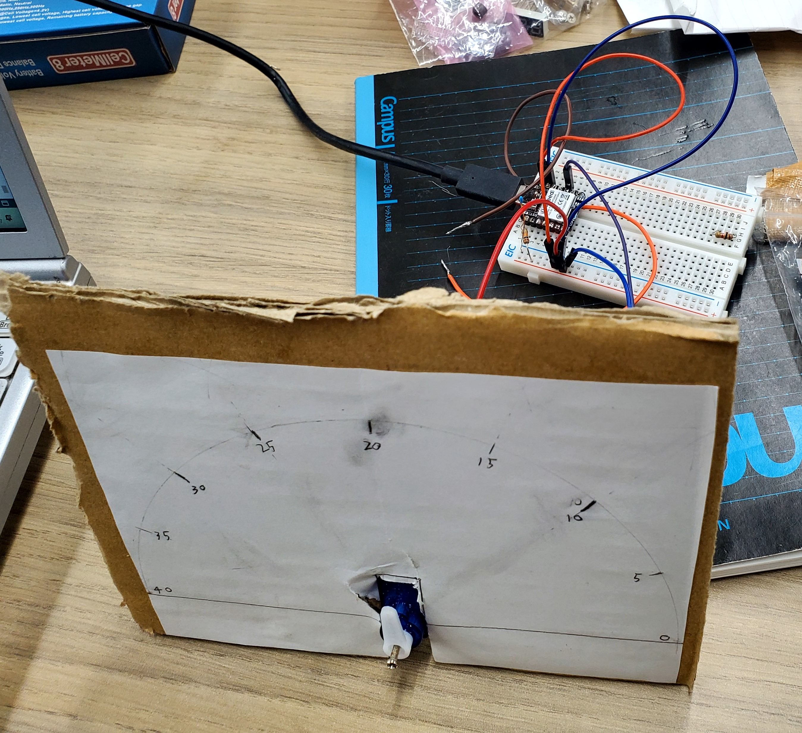
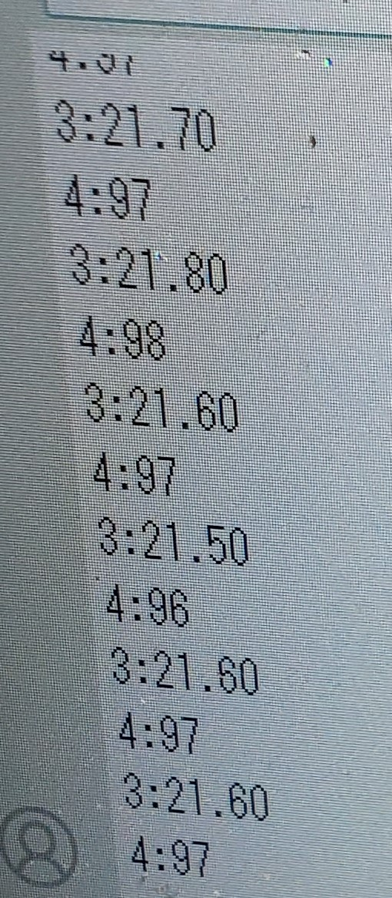

# 進捗報告書

報告書番号 | 氏名   | 期間         | 報告日
----- | ---- | ---------- | ---
21    | HosokawaAoi | 11/1 ~ 11/8 | 11/8

### 先行研究
  - 電波からエネルギーを取り出す研究(https://gakusyu.shizuoka-c.ed.jp/science/sonota/ronnbunshu/102017.pdf)

## 活動概要

- やったこと
  - 作る電子機器の構想
  - 電子機器の作成
  
 

### 作る電子機器の構想

- 以前考えた電子機器の問題点(電子機器←問題点)
  - 水やり装置←設置予定地の茂みは大体ジメジメしているから水やりがいらない。
  - 温度湿度計←非電源なら水銀式でいい
  - 時報←公園内でも普通に聞こえる
  - これらの問題点に加えて、予算や実装にかかる時間等も考慮する必要がある。

- 開き直り
  - 考えてみたが、公園の茂みに設置できることが強みになるような電子機器は思いつかなかった。
  - この研究は電源に関するもの重要なので、電子機器自体の新規性は重要ではないと考える。
  - シンプルな温度計を作って動作時やスリープモード時の消費電力からどの程度の頻度で動作できるのかを調べる。

- 温度計の仕様
  - 一定時間ごと温度センサ(サーミスタ)で温度を取得し、温度を表示する。
  - 温度を取得する時以外はスリープモードで電力消費を抑える。
  - 温度の表示にはスリープモード時でも表示できるものを用いる。
  - IoTとまでは行かないが使用しているマイコンに対応している通信機能(Bluetooth5.0、ZigBee、NFC)のいずれかでデータを送れるようにする。(できたら)
  

 
  
### 電子機器の作成
  - 手元にあったサーミスタやサーボモータを用いてそれぞれの動作確認を行った後に温度計を作成した。
  - とりあえず0~40℃の範囲で表示で温度を表示できるようにしている。
  - 20℃くらいが表示されており、携帯電話で温度を確認したところ22℃だったので大体あってる。
  - 
  - 動作確認用に一旦シリアルモニタでも温度を表示させている(3:~が温度)
  - 
  - バッテリで動作を確認したところうまく動かなかった。原因はバッテリが3.7V程度の出力なので、5V出力の端子が使えなくなったためだった。
  - 3.3V出力の端子にサーミスタとサーボモータを接続したところサーボモータは動作したが、サーミスタが5V接続時とは得られる値が異なることが分かった。しかし温度が一定の時には得られる値もほぼ一定となるので、温度の計算式やプルアップ抵抗を調節して温度を測定できるようにしたい。

 
 

## 活動予定
- 現状の整理
  - 電波をマイコンの電源にしたい。
  - 電流は不安定だが電圧は安定した値の出る電源ができた。
  - 発電した電気を充電できる回路を作成する

- これからやること
  - バッテリの残量を確認できるものかバッテリをすぐに空にできるものを購入する。(済)
  - 太陽光発電でバッテリを充電する。(済)
  - 電波による発電でバッテリを充電を充電する。(済)
  - 作る電子機器の内容を考える。(済)
  - 電子機器を作る。

- 研究活動 
- 振り返り事項

## 研究室に来る日程と時間帯

月             | 火             | 水             | 木             | 金             | 土
------------- | ------------- | ------------- | ------------- | ------------- | -------------
10:00 ~ 12:00 | 10:00 ~ 12:00 | 10:00 ~ 12:00 | 10:00 ~ 12:00 | 10:00 ~ 12:00 | 10:00 ~ 12:00
