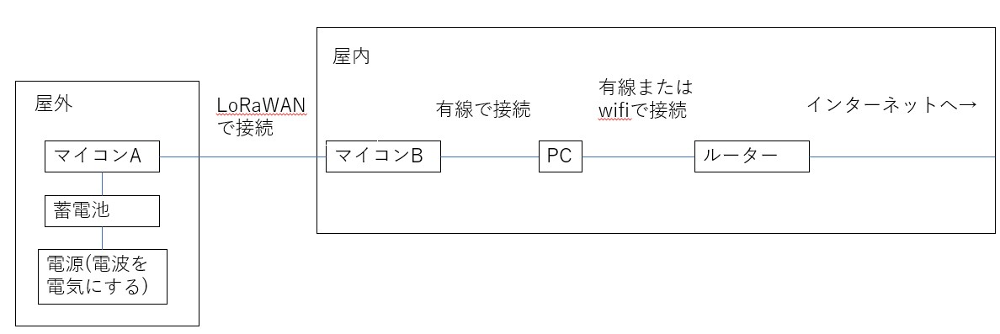

# 進捗報告書

報告書番号 | 氏名   | 期間         | 報告日
----- | ---- | ---------- | ---
03    | HosokawaAoi | 4/12 ~ 4/19 | 4/19

## 活動概要

- やること
  - 研究する内容の整理
  - 必要になるものとその値段をまとめる

- 研究する内容の整理
  - 元々は電波を電気に変える仕組みを何かに使いたかったので、それを中心にする。
  - 先行研究 https://gakusyu.shizuoka-c.ed.jp/science/sonota/ronnbunshu/102017.pdf
  - 情報工学部的要素を出すためにIoT機器の電源を電波にする。(用途は未定)
 
- 作るもの
  - 電波によって動作するマイコン(以下マイコンA)は，屋内ではコンセントから給電できるので屋外での利用を前提とする。
  - マイコン間の通信は屋内から屋外へ通信する関係で、長距離になるので、200m程度離れても通信できるLoRaWANを採用する。
  - マイコンAは屋内に存在するマイコンBとPCを経由して、間接的にインターネットに繋ぐ。
  - 電波による電源が全く使いものにならない場合には、別の電源の使用も検討する。(手動、太陽光)
 
 

- 調べること
  - 電波による発電量の増やし方
  - マイコンAの消費電力の減らし方
  - 仮にマイコンAの常時稼働ができない場合、どの程度の充電間隔で動作できるのか。
  - 完成したIoT機器や電源がどのような状況で役立つか。

- 作業手順
  - 銅線からアンテナを作る。
  - アンテナから得られた電気でＬＥＤを発光させる。(先行研究よりここまでは実現可能)
  - マイコンAがどの程度の電力で動作するか調べる。
  - アンテナから得られた電気でマイコンAを動作させる。
  - 電波の電源化に失敗するか、早く研究が終わったら別の電源を試す。
 
 
- 必要なもの
  - 最初に必要なもの
  - 途中から必要かもしれないもの

- 最初に必要なもの
  - マイコン(LoRaWANモジュール*2 Arduino) 11000円
  - 充電池 未検討 (1000~2000円)
  - 可変コンデンサ 未検討 (500~1000円)
  - コンデンサ 10pf 20個セット 400円
  - ショットキーバリアダイオード 20個セット 700円
  - 銅線 10m 800円
  - PC 自前で用意
  - 電流計、電圧計 自前で用意、学校で借りれるものを探す
  - 合計金額 12900円

- 途中から必要かもしれないもの
  - 追加の銅線 100m 6000円
  - 太陽光パネル 未検討 (2000~7000円)
  - 手動発電用のモーター 3000円
  - 合計金額 9000円

-未検討のものは最も高いものを購入する場合、全部足すと31900円

## 活動予定

- 研究活動 
  - 買うものの詳細な情報を書く。
  - 作業をどのくらいの時期に進めるのか考える。
  - 試しにLEDの発光までやってみる
           

- 振り返り事項

  - 反省事項　
  - 今後の活動　予算と活動の計画をたてる

## 研究室に来る日程と時間帯

月             | 火             | 水             | 木             | 金             | 土
------------- | ------------- | ------------- | ------------- | ------------- | -------------
10:00 ~ 12:00 | 10:00 ~ 12:00 | 10:00 ~ 12:00 | 10:00 ~ 12:00 | 10:00 ~ 12:00 | 10:00 ~ 12:00
