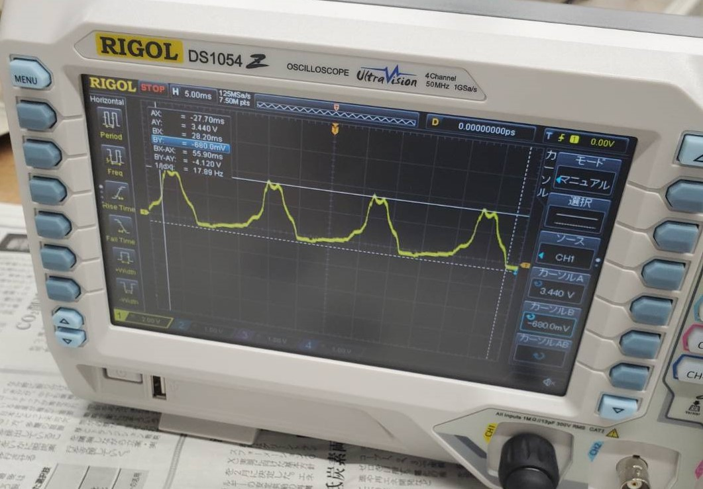

# 進捗報告書

報告書番号 | 氏名   | 期間         | 報告日
----- | ---- | ---------- | ---
04    | HosokawaAoi | 4/19 ~ 4/26 | 4/26

## 活動概要
- 研究テーマ
 - IoT機器を電波を使って非電源化する

- 先行研究
  - https://gakusyu.shizuoka-c.ed.jp/science/sonota/ronnbunshu/102017.pdf

- やったこと
  1. 現状の問題点の整理
  2. 電波から電気を取り出す練習
  3. マイコンを動かすのに必要な電圧の調査
 

- 1. 現状の問題点の整理

- 問題点 
  1. 何故IoT機器の非電源化をするのか不明瞭。
  2. 本当に電波から十分な電気を得られるのか。
  3. 非電源化によってどのようなことができるのか。

- 対策
  1. コンセントから給電できない屋外用のIoT機器を非電源化する。
  2. 簡易的な回路で直流の電気を作ってみて調べる。
  3. 取り出せた電気の量から考える。

 

- 2. 電波から電気を取り出す練習

- 回路構成の見直し
  - 電波によって得られる電気にはプラスとマイナスの2種類の方向に流れるものが存在する。
  - 今回は1方向のみに流れる直流の電気を作りたいので、整流回路と言うものを用いて電気の流れる方向を1方向に限定する。
  - 先行研究で用いられている整流回路は構成がシンプルだが、マイナス方向に流れる電気を捨てているためやや効率が悪い。
  - 
  - 
  - 今回の実験では、マイナス方向の電気をプラス方向の電気として使える全波整流回路を使用した。
  - 

- アンテナの作成
  - 簡易的なアンテナとして空き缶の塗装を落としたものを2つ使用した。
  - 以降この二つの空き缶を空き缶A、空き缶Bと呼ぶ。
  - 

- 電圧の測定
  - 電圧の測定には電圧の大きさと電気の流れる向きを調べられるオシロスコープを利用した。
  - 

- 測定結果
  - 空き缶A単体
  - 
  - 電圧 最大770.0mV 最小-730.0mV
  - 空き缶B単体
  - 
  - 電圧 最大460.0mV 最小-490.0mV
  - 空き缶A単体を整流したもの
  - 
  - 電圧 最大3.680V 最小-720.0mV
  - 空き缶B単体を整流したもの
  - 
  - 電圧 最大3.440V 最小-680.0mV
  - 空き缶Aと空き缶Bをそれぞれ整流させたものを直列接続したもの
  - 
  - 電圧 最大5.240V 最小-400.0mV

- 考察 
  - 整流した際に得られた電圧は明らかに高すぎる。
  - 何らかのノイズで測定結果が変化していると考えられるため、完全な直流の電気に変換できた際にはアナログ式の測定機器で調べることも検討する。
  - 少なくとも波形からプラス方向のみの電気を取り出すことはほぼ成功している。
  - またledを接続しても、発光はしなかった点から電流がとても少ない可能性がある。

 

- 3. マイコンを動かすのに必要な電圧の調査

- マイコンごとの動作電圧の比較
  - esp32 2.2~3.6V
  - arudino uno 7V~12V
  - Raspberry Pi 2と3 5V 
  - netvoxの製品 1.5V~3.0V、12V

- 思ったこと
  - 使いこなせるならesp32を動かすのが良さそう。
  - netvoxの製品は個人で買ったりすることは難しいので、実習の担当者に話を聞いてみる。
  -  

## 活動予定

- 研究活動 
  - 電波から直流の電気を取り出す
  - netvoxについて調べる
  - 学内と学外で通信できる方法を検討
  - ブリッジかませた時点でマイナスは出ないので原因を特定する
           

- 振り返り事項

  - 反省事項　予算と活動の計画を立てられなかった
  - 今後の活動　予算と活動の計画をたてる

## 研究室に来る日程と時間帯

月             | 火             | 水             | 木             | 金             | 土
------------- | ------------- | ------------- | ------------- | ------------- | -------------
10:00 ~ 12:00 | 10:00 ~ 12:00 | 10:00 ~ 12:00 | 10:00 ~ 12:00 | 10:00 ~ 12:00 | 10:00 ~ 12:00
