# 進捗報告書

報告書番号 | 氏名   | 期間         | 報告日
----- | ---- | ---------- | ---
03    | HosokawaAoi | 4/26 ~ 5/10 | 5/10

## 活動概要

- やったこと
  - 回路構成による電圧の変化
  - ブリッジ回路の調査
  - LEDを点灯させる

- 回路構成による電圧の変化
  - 2つのアンテナを接続する場合にどのような繋ぎ方が効率的なのかを調べるために8パターンの繋ぎ方を試した。
  - 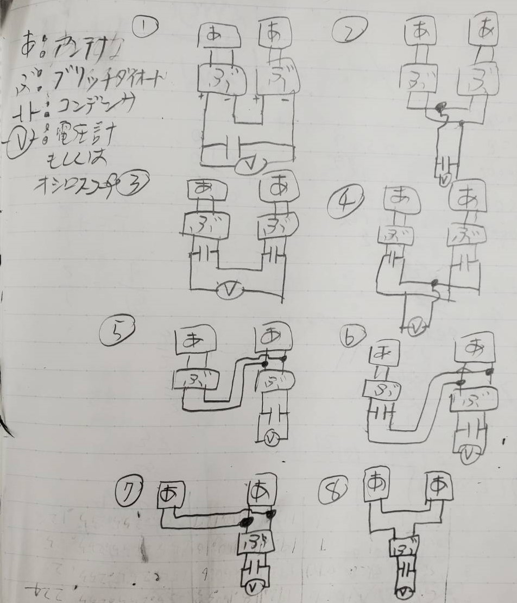
  - それぞれ電圧を測定してみたところ、⑧の繋ぎ方が部品点数も少なく、電圧も高かったので採用することにした。
  - 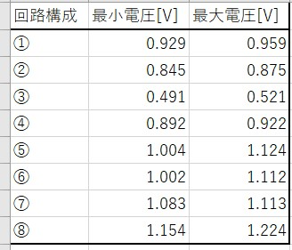
  - ダイオードは通過すると電圧が少し減るので、ダイオードが少ない方が電圧が高くなったと考えられる。
 

- 整流回路の調査
  - 整流回路はアンテナを接続していない状態で平滑化してもプラス方向に偏った出力が確認される。
  - 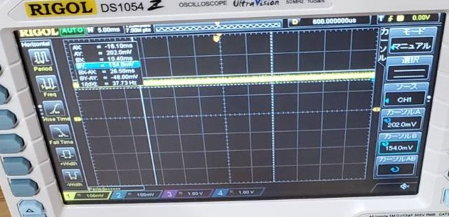
  - しかし整流回路を箱で覆うと出力が0に近づいた。
  - 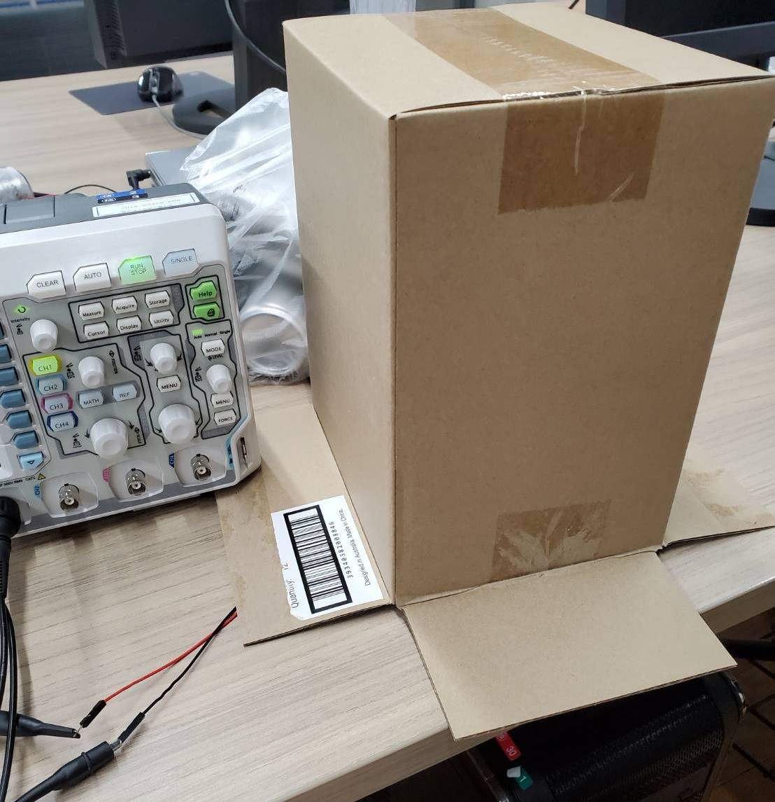
  - 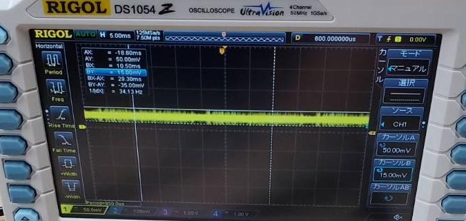
  - これは整流回路に使われている半導体は光を当てることで少し電気を作る作用があるためだと分かった。(参考動画:https://www.youtube.com/watch?v=Er8gqBIJJiw)
  - 以前の実験でもアンテナから得た電気に対し、整流後の出力が高すぎることがあったがこれが原因だと考えられる。
 
  
- LEDを点灯させる
  - 採用した回路構成を元にアンテナを増やし、LEDを発光させられるかを調べた。
  - 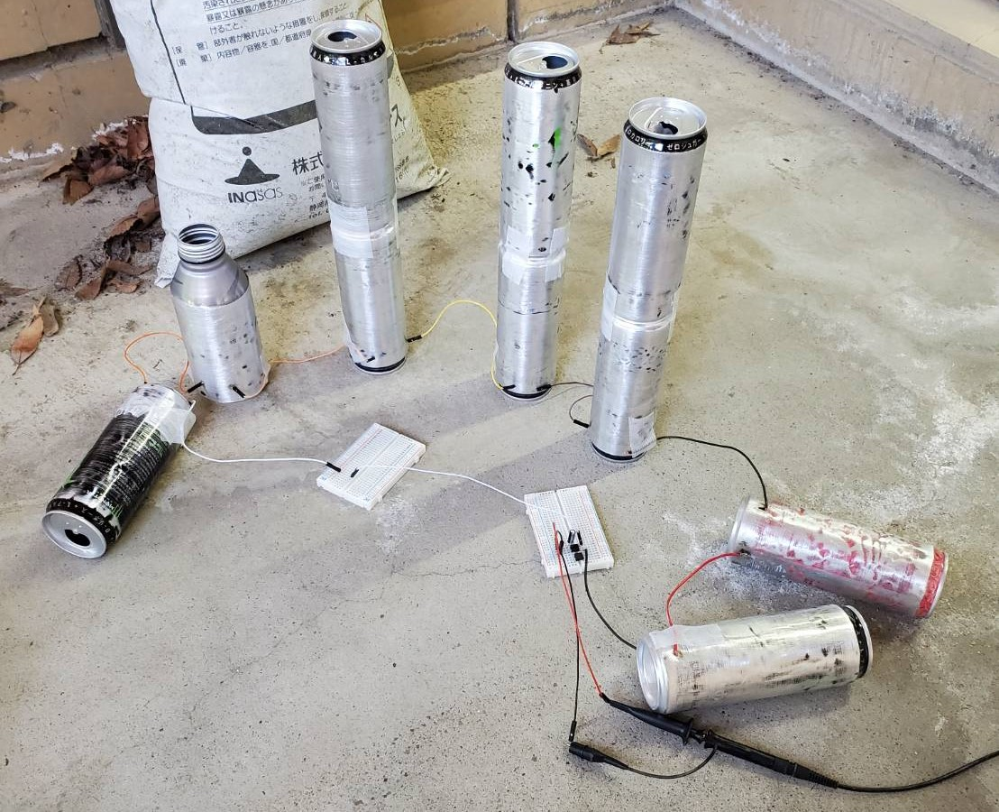
  - 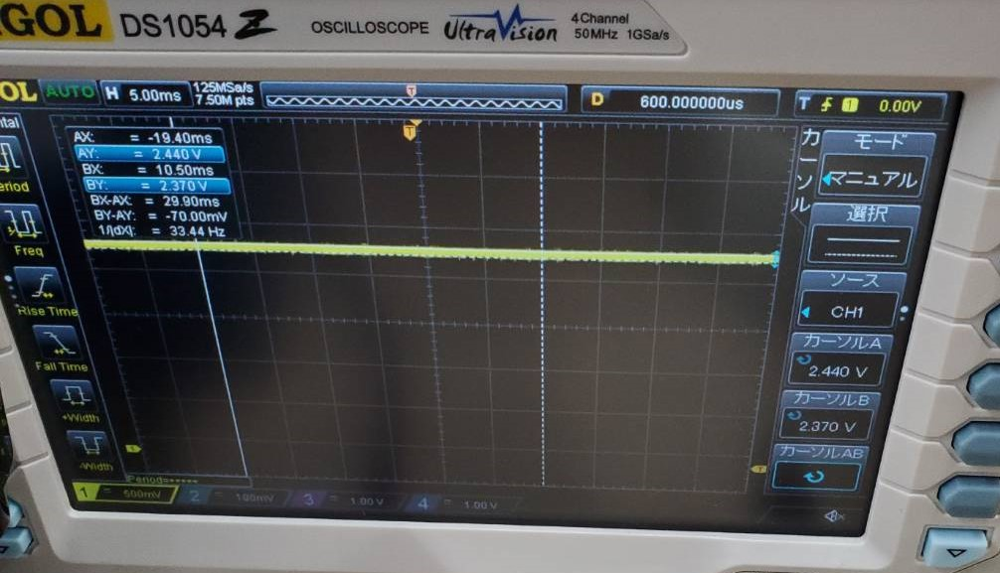
  - 屋外に配置したところ電圧がとても高くなった
  - 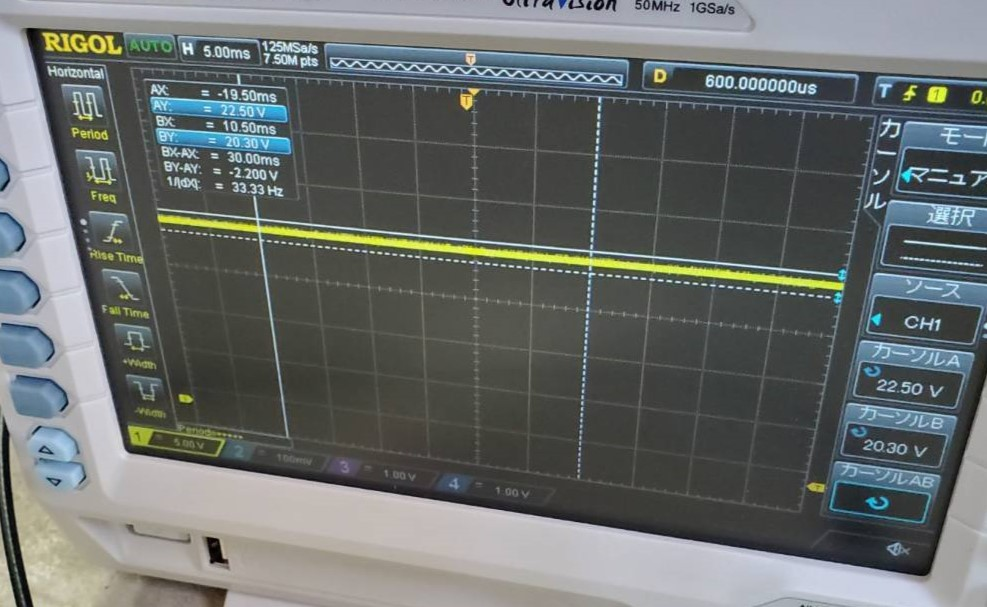
  - 屋外であればLEDを発光させられたが、回路にLEDを接続した一瞬しか光らなかった。
  - 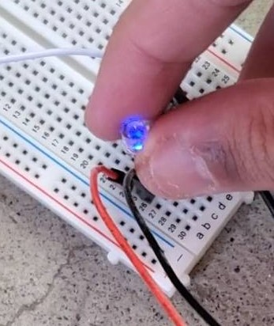
  - 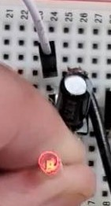
  - 電流についても調べたが、0.2μAと非常に少ない電流しか測定できなかった。
  - 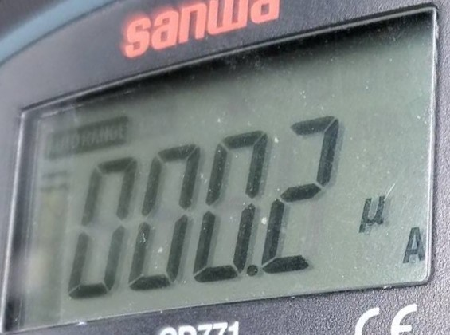
  - 測定できていないだけでLED発光時点ではLEDには数10mAは流れていると推察できる。
  - 前回の電流測定と同様にコンデンサの中身がLED接続時にすぐに無くなるのが原因だと考えられる。
  - 外でなら高い電圧が得られると分かったので安定化回路を設計してみる。
 

## 活動予定

- 研究活動 
  
           

- 振り返り事項

## 研究室に来る日程と時間帯

月             | 火             | 水             | 木             | 金             | 土
------------- | ------------- | ------------- | ------------- | ------------- | -------------
10:00 ~ 12:00 | 10:00 ~ 12:00 | 10:00 ~ 12:00 | 10:00 ~ 12:00 | 10:00 ~ 12:00 | 10:00 ~ 12:00
