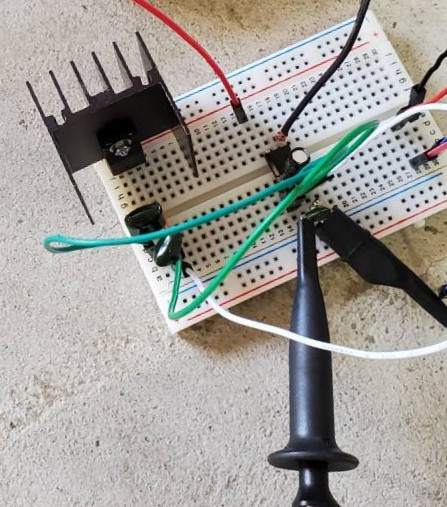
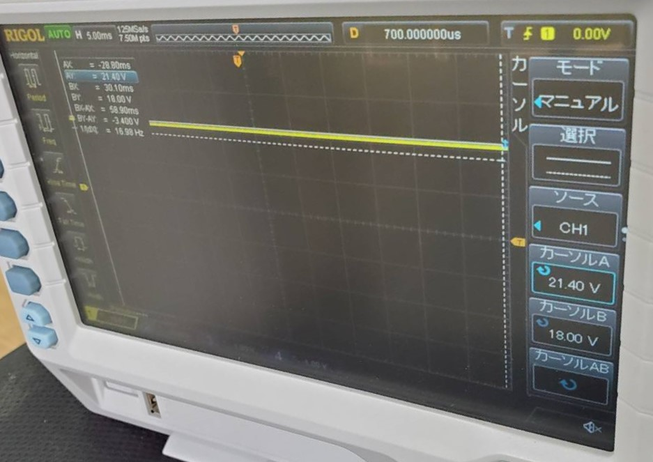
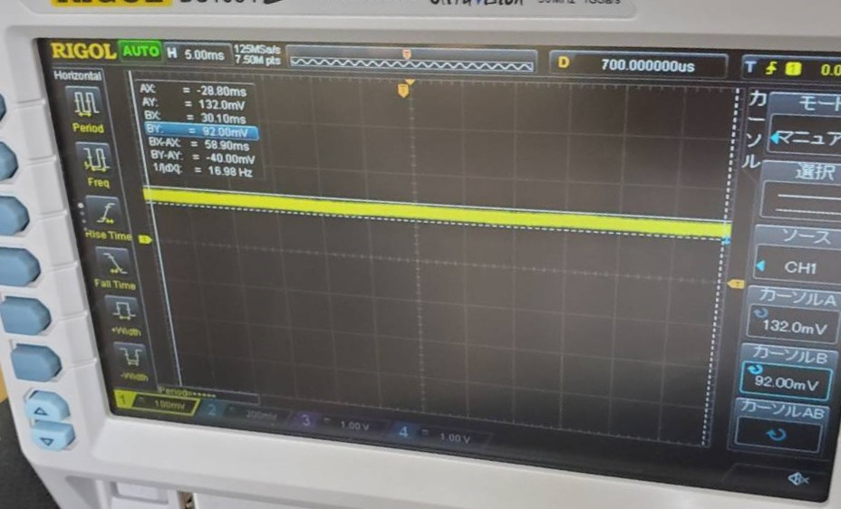
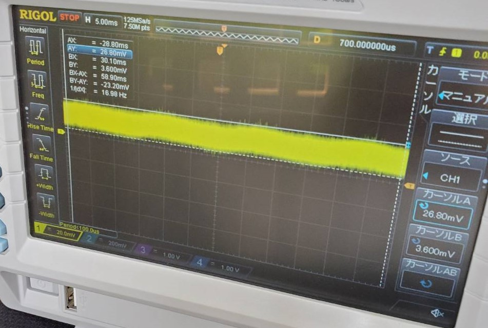

# 進捗報告書

報告書番号 | 氏名   | 期間         | 報告日
----- | ---- | ---------- | ---
07    | HosokawaAoi | 5/10 ~ 5/17 | 5/17

## 活動概要

- やったこと
  - 安定化回路の作成
  - コンセプトシートの作成

### 安定化回路の作成
- 安定化回路とは
  - 今までの回路ではプラスとマイナスの両方に流れる電気を一方向に整流し、直流に近い電流に平滑した。
  - しかしこのままでは負荷によって電圧が変化してしまうので、電源としては扱いにくい。
  - そこで三端子レギュレータと言う部品を用いて、負荷によって電圧が変化しなくなる安定化回路を作成する。
  - 安定化回路から出力される電圧は三端子レギュレータによって決定され、出力よりも2V程度高い電圧が入力には求められる。

- 回路構成と実験結果
  - 3.3Vと5Vの2種類の安定化回路を作成した。
  - 
  - 平滑後の出力
  - 
  - 安定化後の出力(3.3V)
  - 
  - 安定化後の出力(5V)
  - 
  - 実験した結果、安定化回路は想定した電圧を出力しなかった。
  - 配線やコンデンサの容量を見直したが特に効果はなかった。
  - 恐らくは三端子レギュレータで消費される電力が高く、もっと電気が必要なためだと考えられる。

- 安定化回路で正しく動作させるためのアイデア
  - 整流前に電圧を下げて電流を増やす。(変圧)
  - アンテナの増築

- 整流前に電圧を下げて電流を増やす
  - 安定化回路は入力する電圧と出力させたい電圧の差が少ない程損失が少なくなる。
  - 夢考房に交流用の変圧器があったので、借りれるかの相談をする。
  - ただしアンテナから得られる電気は普通の交流の電気とは異なるので正しく機能するかは不明。

- アンテナの増築
  - 空き缶もしくは銅線を用いてアンテナを複数作成して、得られる電気の量を増やす。
  - ある程度まとまった数を用意できたら、設置場所も変えて実験したい。
  - 最終的にマイコンの電源とする予定だが、マイコン側には複雑な設定をする予定はないので、今後はこの作業がメインになると予想される。

### コンセプトシートの作成
  - すぐに埋められる場所を書いた程度
  - 来週あたりには全部埋めておきたい

  

 
 

## 活動予定

- 研究活動 
  - アンテナの作成
  - 変圧の挑戦

- 振り返り事項
  - 忙しくてあまり実験出来なかった。

## 研究室に来る日程と時間帯

月             | 火             | 水             | 木             | 金             | 土
------------- | ------------- | ------------- | ------------- | ------------- | -------------
10:00 ~ 12:00 | 10:00 ~ 12:00 | 10:00 ~ 12:00 | 10:00 ~ 12:00 | 10:00 ~ 12:00 | 10:00 ~ 12:00
