# 進捗報告書

報告書番号 | 氏名   | 期間         | 報告日
----- | ---- | ---------- | ---
03    | HosokawaAoi | 5/17 ~ 5/24 | 5/24

## 活動概要

- やったこと
  - 変圧回路を用いた実験
  - 屋外で生じる高電圧の調査
  - アンテナの増築、改良
  - ※実験は全て屋外で行った。
 

### 変圧回路を用いた実験

- 変圧回路とは
  - 交流の電圧を変化させる回路。
  - 入力用と出力用の2種類のコイルが存在し、出力用コイルの巻き数が入力用コイルのn倍の時、電圧もn倍になる。
  - 電圧の変化に大して電流は反比例する。
  - 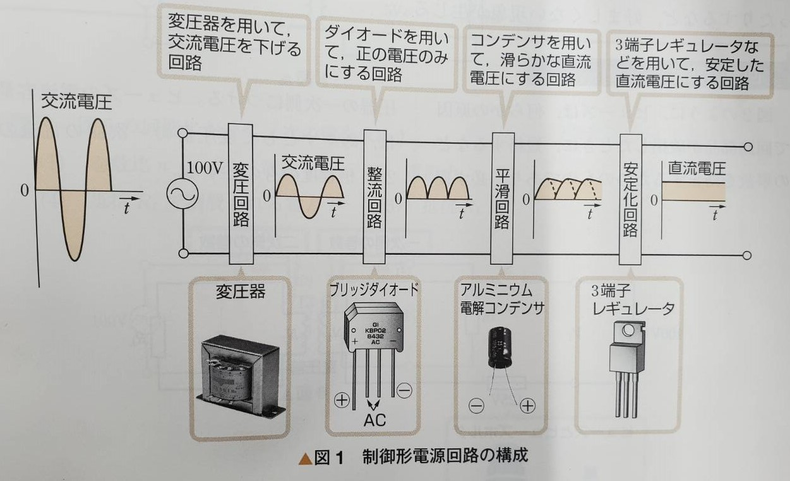
 
- アンテナから得られた電気の変圧
  - アンテナ単体
  - 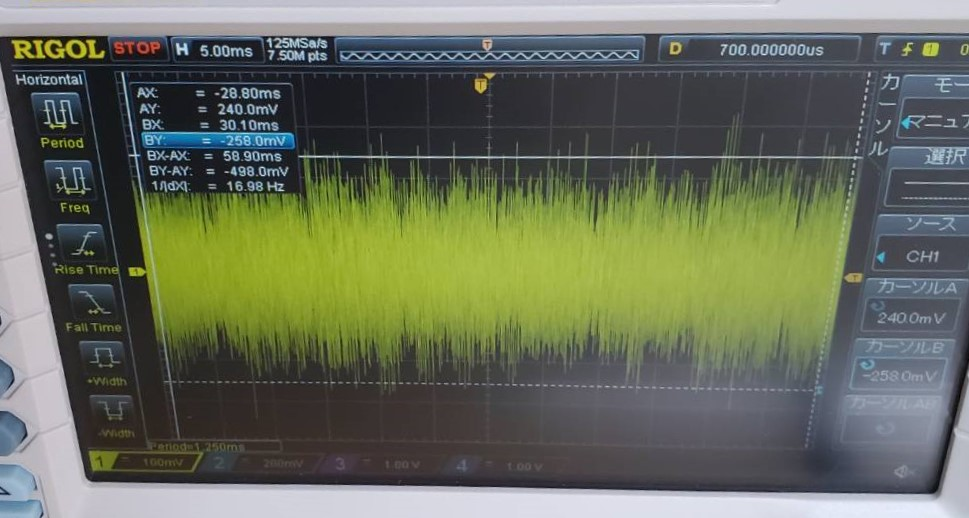
  - +-250mV程度
  - 巻き数比 100:130
  - 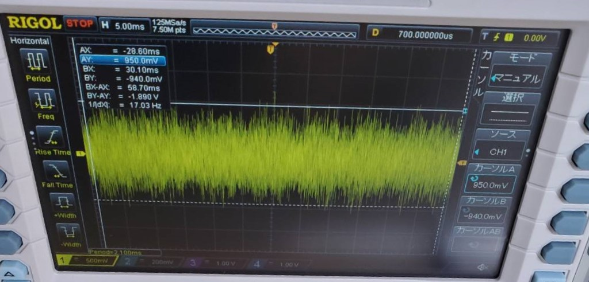
  - +-950mV程度
  - 巻き数比 100:100
  - 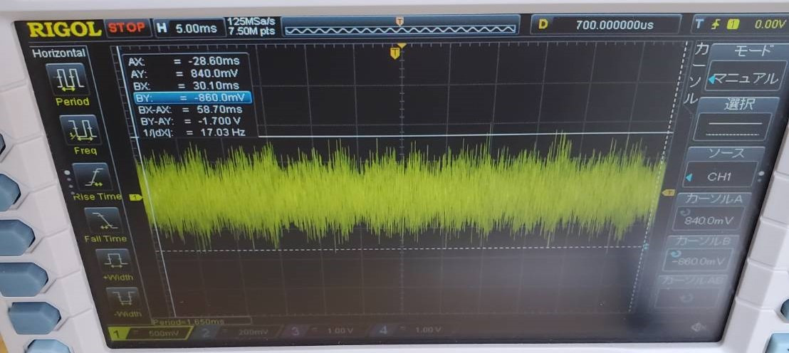
  - +-850mV程度
  - 巻き数比 100:50
  - 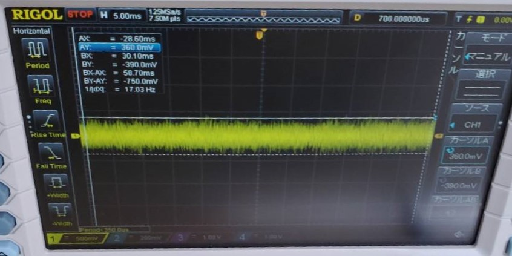
  - +-370mV程度
  - 巻き数比 100:1
  - 
  - +-28mV程度
  - 変圧回路のコイルも電波の影響を受けるのか、やや電圧がアンテナ単体の時より高くなっている。
  - 出力側の巻き数が少なくなれば電圧の減少することが確認された。
  - 未測定だが電流は上昇していると考えられる。
 

- 変圧した電気を整流した時の変化
  - 巻き数比 100:130
  - 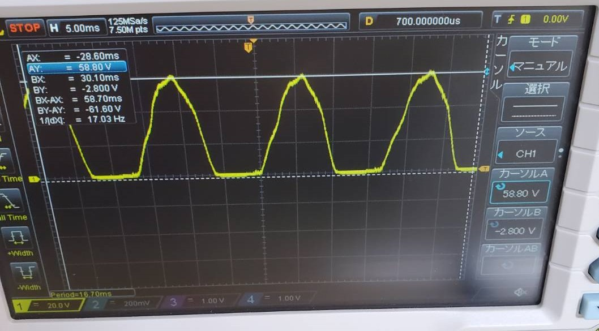
  - 最大値58.8V 最小値-2.8V
  - 巻き数比 100:100
  - 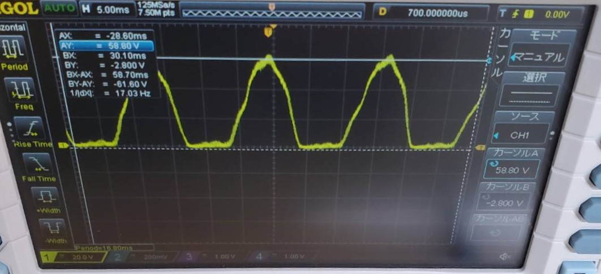
  - 最大値58.8V 最小値-2.8V
  - 巻き数比 100:50
  - 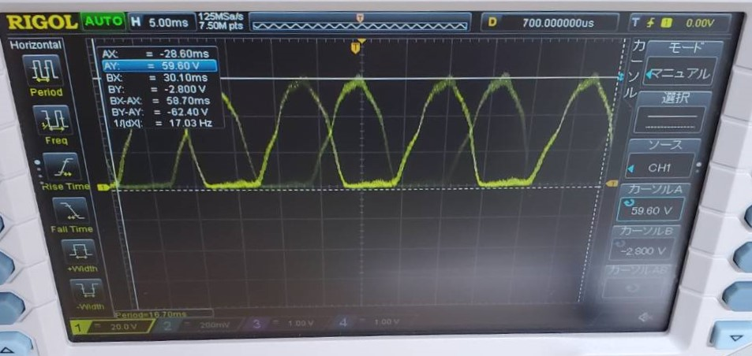
  - 最大値58.8V 最小値-2.8V
  - 巻き数比 100:1 
  - 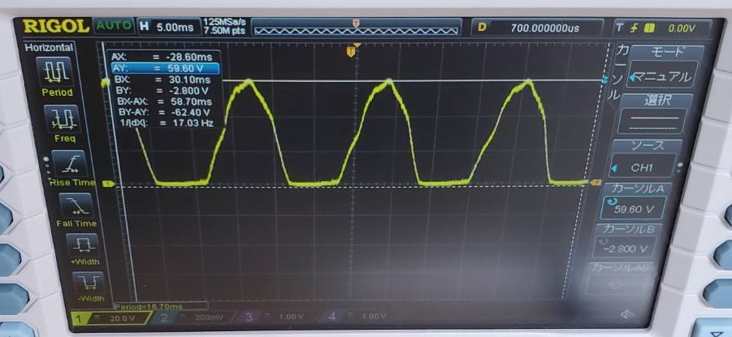
  - 最大値58.8V 最小値-2.8V
  - 整流後の電圧は巻き数比に関係なく一定だった。
  - また屋外での電圧の急激な上昇は整流回路で生じていると分かった。
  - 変圧回路、安定化回路を接続した場合でも、巻き数比によって電圧は変化しなかった。
 

### 屋外で生じる高電圧の調査
  - 変圧回路を用いた実験の途中で、屋外で生じる高電圧は整流回路を接続した際に生じると分かった。
  - しかしアンテナを除いた状態で電気を平滑化しても高い電圧は得られなかった。
  - 整流回路+平滑回路
  - 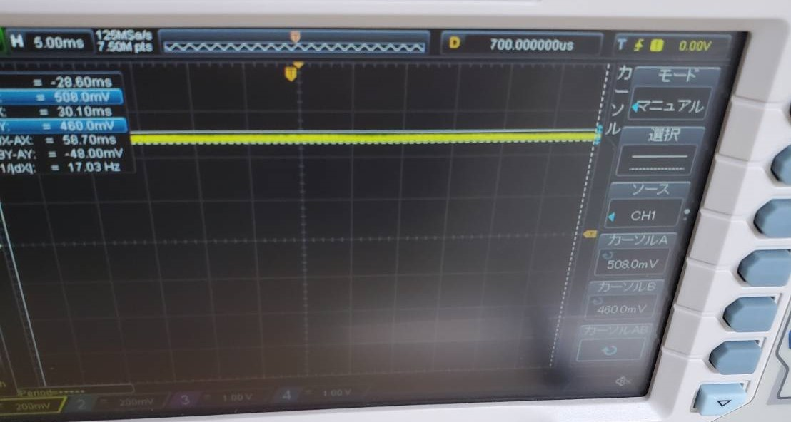
  - 約480mV
  - 変圧回路+整流回路+平滑回路
  - 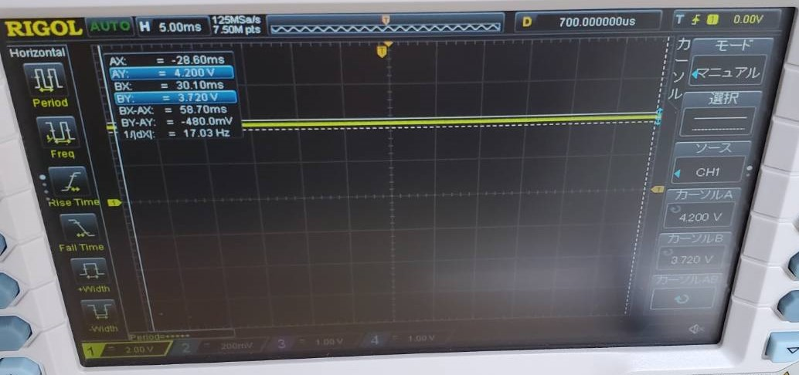
  - 約4V
  - アンテナ+変圧回路+整流回路+平滑回路
  - 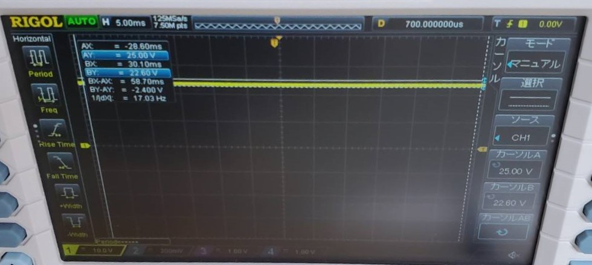
  - 約24V
  - この結果と変圧回路を用いた実験の結果をまとめると高い電圧を得るためには整流回路とアンテナの2つが必要だと分かった。
  - 未だに原因は不明だが、この高電圧を電源に用いるのは困難だと考えられる。
 

### アンテナの増築、改良
- アルミホイルによるアンテナ作成
  - 現在、アンテナには空き缶を使用しているが、効率を求めるのであれば銅線を巻いて作るループアンテナを用いるのが好ましい。
  - しかしループアンテナは巻き数や直径等設定する要素が多く、それに応じた銅線も必要なので、すぐには用意できない。
  - そのため簡易的なアンテナの改良版としてアルミホイルを巻いたものを採用した。
  - 従来の空き缶
  - 
  - 平滑後の出力
  - 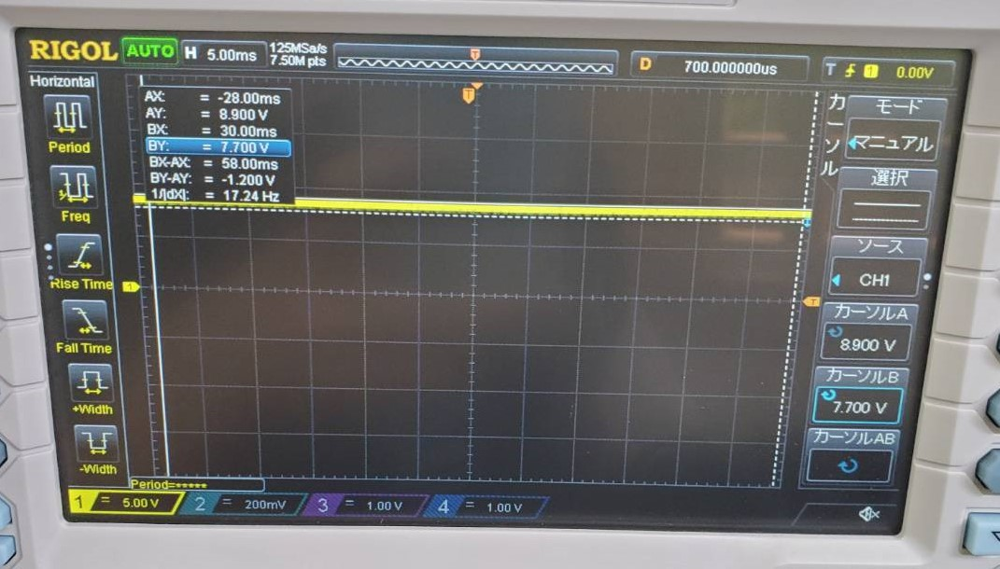
  - 約8V
  - アルミホイルを巻いたもの
  - 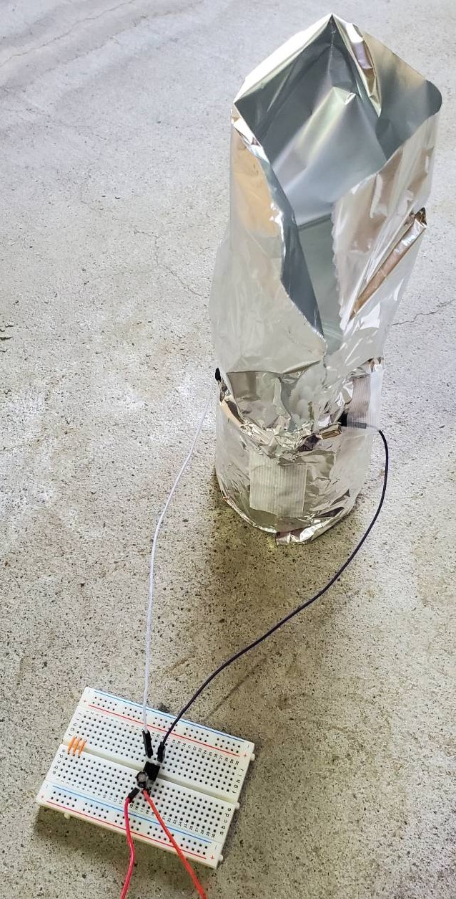
  - 平滑後の出力
  - 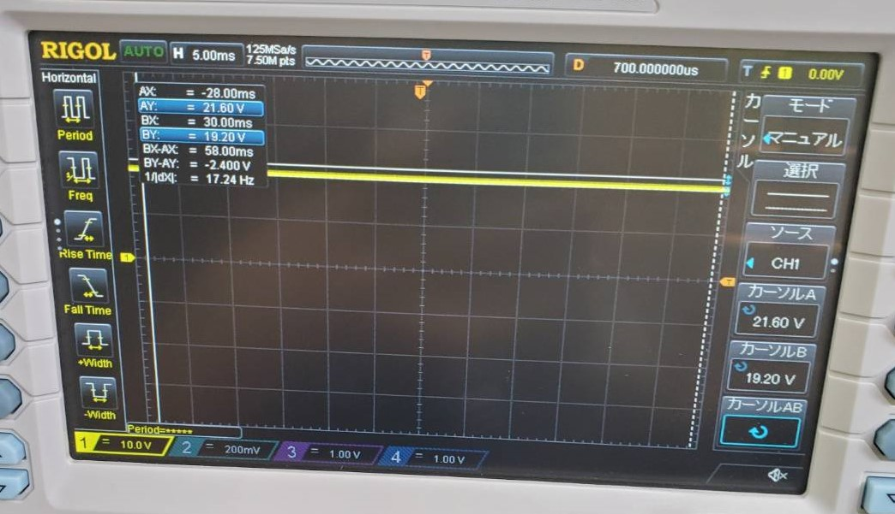
  - 約20V
  - 空き缶は塗装を剥いでから時間が経過していることや表面積が異なる等、完全に条件を揃えることはできなかったが、倍以上の出力の差があるので、採用する意味はあると考えられる。
　
- 雨天時の測定
  - 雨天時に屋外で測定すると電圧が低下した。
  - 以前の実験でも調べたが、整流回路は光の影響を受けていると考えられる。
  - 空き缶アンテナ
  - 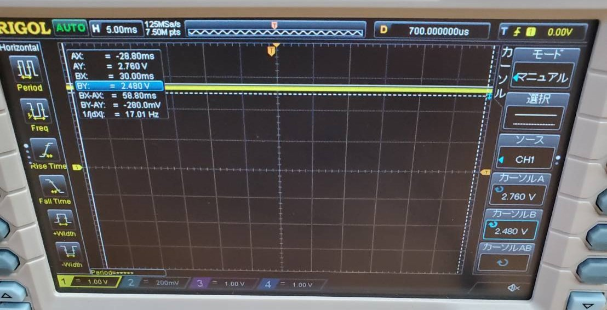
  - 約2.8V
  - アルミホイルアンテナ
  - 
  - 約3.2V

- ループアンテナの測定 
  - 太さ2mmの銅線で対角線30cm、巻き数8回のループアンテナを作成した。
  - 
  - アルミホイルアンテナ
  - 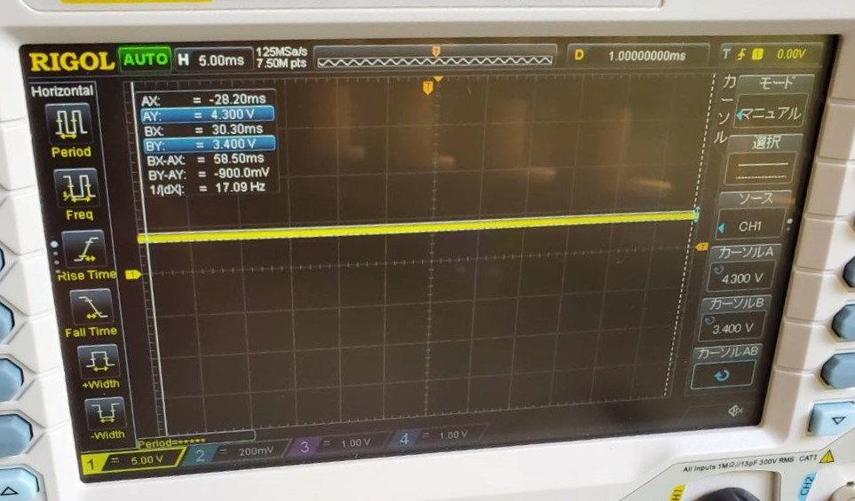
  - 約4.3V
  - ループアンテナ
  - 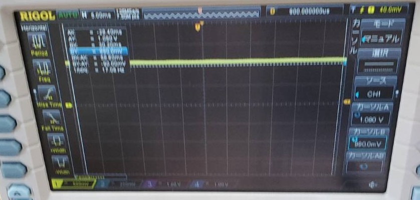
  - 約1.1V
  - ループアンテナからは思ったよりも高い電圧が得られなかった。
  - 色々と条件を変えて実験してみようと思う。

## 活動予定
- 現状の整理
  - 電波をマイコンの電源にしたい。
  - 5V1Aを安定して出力する電源を作成する。
  - 電流は置いておいて、まず一定の電圧を出力し続ける回路を作成する。
  - 電波を直流に変換できたが、電圧を安定させるための安定化回路が動作しない。(現状の課題)

- 課題への対策
  - 無駄な電圧を電流に変圧回路で変換する。(終了)
  - 整流回路を変える。
  - アンテナの数や種類を変える。
  - 直流の状態から再度交流に変換して変圧する。
  - 安定化回路を別のものを使用する。
  - ※課題には関係ないけど、特定の周波数帯に限定した発電

- 活動の方針
  - 学内で買える電子部品では用意できないものが出てきたので、マルツパーツで部品を買いたい。
  - 今回の変圧回路の実験のように実験してから、別の問題が見えてくることがあるので、一度に全ての部品を買わず、必要になり次第購入する。
  - 行いたいのは整流回路の変更

- 研究活動 
- 振り返り事項

## 研究室に来る日程と時間帯

月             | 火             | 水             | 木             | 金             | 土
------------- | ------------- | ------------- | ------------- | ------------- | -------------
10:00 ~ 12:00 | 10:00 ~ 12:00 | 10:00 ~ 12:00 | 10:00 ~ 12:00 | 10:00 ~ 12:00 | 10:00 ~ 12:00
