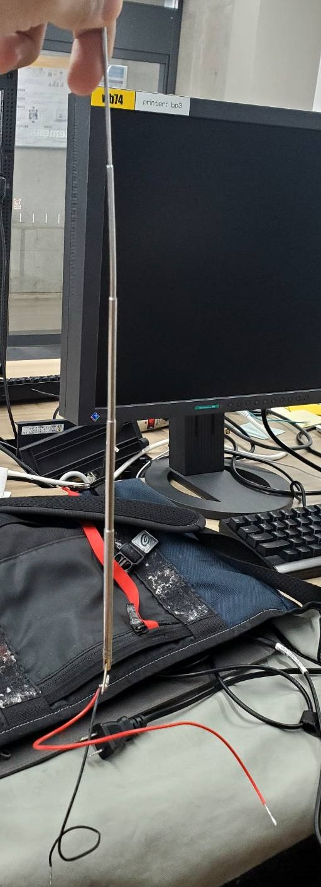

# 進捗報告書

報告書番号 | 氏名   | 期間         | 報告日
----- | ---- | ---------- | ---
12    | HosokawaAoi | 6/28 ~ 7/12 | 7/12

## 活動概要

- やったこと
  - 複数回巻きループアンテナの作成
  - ループアンテナの実験
  - ラジオ用アンテナの改造、ダイポールアンテナの増築
  
 

### 複数回巻きループアンテナとは
  - 銅線を巻いて作る点に関しては1回巻きループアンテナと同じだが、電波の受信の仕方が異なる、全く別の構造のアンテナである。
  - 1回巻きループアンテナは電波による電界の変化を取るのに対し、複数回巻きループアンテナは磁界の変化を取る。
  - 原理的にはコイルに近い。
  - ループの円周は波長(約4m)より十分小さい必要がある。

### アンテナの作成
  - 四角形の木枠の角に釘を打ち、そこに銅線を何度か巻くことでループアンテナを作成した。
  - 
  - この木枠は1辺の長さが25cm、50cm、75cmの3パターン作成した。(1回巻きは1m)
  - 1つの木枠につき5回巻きのループアンテナと10回巻きのループアンテナを用意し、それらを連結させることによって、15巻きのループアンテナを簡易的に実装した。
  - 
 
  

### ループアンテナの実験
  - 前回の実験と同様に地点を変えながらループアンテナの出力電圧を測定した。
  - 地点A、B、Cの場所は前回と同じだが、地点Cは高さを調整した時のみに限定している。
  - 今回の実験はループアンテナの大きさ*ループアンテナの巻き数*場所の種類=3x3x4=36通りで今までよりも測定した回数が多いので、波形の画像は省略する。
  - 25cmループアンテナの測定
  - 
  - グラフ
  - 
  - 50cmループアンテナの測定
  - 
  - グラフ
  - 
  - 75cmループアンテナの測定
  - 
  - グラフ
  - 
  - 全ての測定結果をまとめたグラフ
  - 
  - 巻き数の増加が電圧の大きさと比例するのは50cmの地点Bの場合くらいで、他は巻き数が少ない方が電圧が高い場合や巻き数を増やしても電圧は増えない場合が多く、巻き数は一定数以上増やしても意味はないと分かった。(恐らく5~10回前後で頭打ち)
  - 銅線の量あたりの電圧の大きさ
  - 
  - 巻き数を増やせば使用する銅線の量も増えるがそれに見合った電圧の増加は見込めないので、やはり巻き数は5~10回前後で十分だと考えられる。
  - アンテナの大きさごとの平均値の位置による変化
  - 
  - 25cmと50cmを比較すると出力電圧が増加していることが分かるが、50cmと75cmでは50cmの方が電圧が高かったり、そこまで差が無い場合があったので、50cm~75cmの間に出力電圧が頭打ちになるサイズがあると分かった。
  - 大きさあたりの電圧の大きさ
  - 尚アンテナの面積に対して、銅線の厚みは十分小さいので無視する。
  - 
  - 25cmのアンテナは50cmのものより出力電圧は低いが効率はよいので、複数個用意すれば高い出力を得られる可能性はある。(木枠の大きさを考慮しないなら25cmのアンテナは50cmの面積で4つ、75cmの面積で9つ設置できる)
  - 各アンテナを幾つかのグラフで比較したが、出力電圧に最も影響を与えているのは位置だと分かった。
  - 前回実験した1回巻きループアンテナとダイポールアンテナを追加した出力電圧、銅線の量あたりの電圧の大きさ、大きさあたりの電圧の大きさの比較
  - 
  - 
  - 
  - 出力電圧だけなら、複数巻きループアンテナと同じくらいだが、銅線の量や大きさあたりの電圧の大きさではダイポールアンテナが優れていると分かった。
  
  

### ラジオ用アンテナの改造、ダイポールアンテナの増築
  - ラジオ用アンテナを改造し、実験用回路に接続できるようにした。
  - 
  - ラジオ用アンテナでの実験はまだ研究室のベランダでしか行えていないが、他のアンテナと出力は大差がなかったので、現状作成したアンテナの中ではダイポールアンテナがサイズや銅線の量的な効率が最も良いと判断し、ダイポールアンテナを増築した。
  - 
  
 

## 活動予定
- 現状の整理
  - 電波をマイコンの電源にしたい。
  - 5V1Aを安定して出力する電源を作成する。
  - 電流は置いておいて、まず一定の電圧を出力し続ける回路を作成する。
  - 電波を直流に変換できたが、電圧を安定させるための安定化回路が動作しない。
  - 実はそれ以外の回路も正しく動いてなかった。(現状の課題)

- 課題への対策
  - 無駄な電圧を電流に変圧回路で変換する。(再度実験)
  - 整流回路を変える。(回路作成のみ終了)
  - アンテナの数や種類を変える。(実行中)
  - 測定場所を変える

- 使いたいアンテナ
  - 1回巻きループアンテナ(作成済み、実験終了)
  - 複数巻きループアンテナ(作成済み、実験終了)
  - ダイポールアンテナ (再実験予定)
  - ラジオのアンテナ(次回実験予定)
  - 既製品のアンテナ(買うものの選定中)

- 

- コンセントの使用許可について
  - 現在、屋外での実験を先生に許可を取ってもらって行っている。
  - しかし屋外での実験は天候によって左右されるので、思うように実験できないことが多い。
  - そこで屋外での実験及びコンセントの使用許可の内容を更新することを希望する。 
  - 希望する設置場所:LC周辺(画像は6号館の外)
  -  
  - 希望する日程:月火木金
  - 希望する時間:14:00~17:00(設置、片付け込み)
  - 使用する機器:リールコード、オシロスコープ
  - 消費電力の目安:50W

- 研究活動 
- 振り返り事項

## 研究室に来る日程と時間帯

月             | 火             | 水             | 木             | 金             | 土
------------- | ------------- | ------------- | ------------- | ------------- | -------------
10:00 ~ 12:00 | 10:00 ~ 12:00 | 10:00 ~ 12:00 | 10:00 ~ 12:00 | 10:00 ~ 12:00 | 10:00 ~ 12:00
