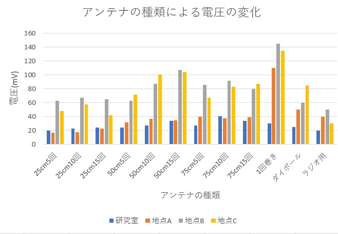

# 進捗報告書

報告書番号 | 氏名   | 期間         | 報告日
----- | ---- | ---------- | ---
13    | HosokawaAoi | 7/12 ~ 7/19 | 7/19

### 先行研究
  - 電波からエネルギーを取り出す研究(https://gakusyu.shizuoka-c.ed.jp/science/sonota/ronnbunshu/102017.pdf)

## 活動概要

- やったこと
  - ラジオ用アンテナの実験
  - 変圧回路の実験
  - 電波の発生元の変更
  - (前回紹介したダイポールアンテナを複数接続したものは実験途中に破損したので次回以降に報告する。)
  
 

### ラジオ用アンテナの概要
  - ディップアンテナと呼ばれるダイポールアンテナの一種である。
  - 
  - アンテナのサイズが波長とは一致しないが、FM波に関しては一通り帯域幅の範囲内である。

### ラジオ用アンテナの実験
  - 前回と同様に研究室内、地点A、B、Cで電圧の測定を行った。
  - 研究室内
  - 
  - +-20mV
  - 地点A
  - 
  - +-40mV
  - 地点B
  - 
  - +-50mV
  - 地点C
  - 
  - +-30mV
  - 各結果のまとめ
  - 
  - 今までの結果との比較
  - 
  - 他のアンテナの出力と比較すると出力はかなり低い。
  - FM波を受信できるだけで、目的の電波を受信した時に出力が最大になる設定をしていないからだと考えられる。

 
  

### 変圧回路の実験
  - 変圧回路はコイルの巻き数の変化で電圧と電流を変化させる回路である。
  -  
  - 空き缶アンテナで実験していた時に、変圧回路を用いて電圧を変化させる実験を行ったが現在の回路では行っていなかったので再度実験する。
  - 今回アンテナにはラジオ用アンテナを使用した。
  - 巻き数比100:10
  - 
  - +-15mV
  - 巻き数比100:50
  - 
  - +-20mV
  - 巻き数比100:100
  - 
  - +-25mV
  - 巻き数比100:130
  - 
  - +-30mV
  - 出力側の巻き数比が少ない順に並べたもの
  - 
  - なだらかだが、巻き数比の増加に比例して、電圧が上昇している。
  - 整流回路を動かす程の電圧が高くならなかったので、変圧回路の入力側と出力側の接続を入れ替えて更に電圧を上げようとした。
  - 巻き数比130:100(100:77)
  - 
  - +-30mV
  - 巻き数比50:100(100:200)
  - 
  - +-25mV
  - 巻き数比10:100(100:1000)
  - 
  - +-25mV
  - 出力側の巻き数比が少ない順に並べたもの
  - 
  - 接続を入れ替える前のデータだけの場合と異なり、巻き数比の増加に電圧が比例しなかった。
  - 入力側のコイルが少ないことで正しく動作しなくなったか変圧回路に逆流防止の仕組みがあるのかもしれない。

### 電波の発生元の変更
  - 現在利用しているの電波の発生元であるLC屋上にあるアンテナは20Wで動作しており、測定できた電圧の最大値は145mVである。
  - それに対して、先行研究では100Wのラジオ局から受信した電波で、1.8Vで10倍以上出力が異なる。(変圧回路は利用されていない)
  - これはアンテナの構造を最適化できていないことも原因だが、電波の発生元の違いが特に影響を及ぼしていると考えられる。
  - そこでLC屋上のアンテナの50倍の出力である1kwで動作するラジオ塔周辺で実験を行った。
  - 
  - 学外ではコンセントは勝手に使えないので、蓄電池でオシロスコープに電気を供給した。
  - 
  - アンテナの出力 
  - 
  - +-850mV
  - ダイオードの出力
  - 
  - +-550mV
  - アンテナの出力は17倍になったが、ダイオードを使用した場合でも逆方向に電圧が生じた。
  - 断線している可能性もあったので導通チェックを行ったが問題となる箇所は存在しなかった。
  - 詳しい原因は調査中だが、回路構成そのものがおかしいか夏の暑さがダイオードに影響を及ぼしていると予想している。
  - 仮にこちらで発電を行う場合にはこのラジオ塔と7号館にあるlorawanのゲートウェイの間(直線距離1.5km)をどうやって通信するのかも考える必要がある。
  - LC屋上の電波とは波長が近く、他のアンテナも使い回せると考えられるので、色々実験してみようと思う。
 

## 活動予定
- 現状の整理
  - 電波をマイコンの電源にしたい。
  - 5V1Aを安定して出力する電源を作成する。
  - 電流は置いておいて、まず一定の電圧を出力し続ける回路を作成する。
  - 電波を直流に変換できたが、電圧を安定させるための安定化回路が動作しない。
  - 実はそれ以外の回路も正しく動いてなかった。(現状の課題)

- 課題への対策
  - 無駄な電圧を電流に変圧回路で変換する。(再度実験)
  - 整流回路を変える。(回路作成のみ終了)
  - アンテナの数や種類を変える。(実行中)
  - 測定場所を変える

- 使いたいアンテナ
  - 1回巻きループアンテナ(実験終了)
  - 複数巻きループアンテナ(実験終了)
  - ダイポールアンテナ (再実験予定)
  - ラジオのアンテナ(実験終了)
  - 既製品のアンテナ(買うものの選定中)

- 

- 研究活動 
- 振り返り事項

## 研究室に来る日程と時間帯

月             | 火             | 水             | 木             | 金             | 土
------------- | ------------- | ------------- | ------------- | ------------- | -------------
10:00 ~ 12:00 | 10:00 ~ 12:00 | 10:00 ~ 12:00 | 10:00 ~ 12:00 | 10:00 ~ 12:00 | 10:00 ~ 12:00
