# 進捗報告書

報告書番号 | 氏名   | 期間         | 報告日
----- | ---- | ---------- | ---
14    | HosokawaAoi | 7/19 ~ 7/26 | 7/26

### 先行研究
  - 電波からエネルギーを取り出す研究(https://gakusyu.shizuoka-c.ed.jp/science/sonota/ronnbunshu/102017.pdf)

## 活動概要

- やったこと
  - 10連ダイポールアンテナの作成、実験
  - 1回巻きループアンテナの学外実験
  
 

### 10連ダイポールアンテナの作成、実験
  - 以前の実験でダイポールアンテナが発電効率が良いと分かったので、10個連結したものを用意して、発電量が増えるのかを実験した。
  - 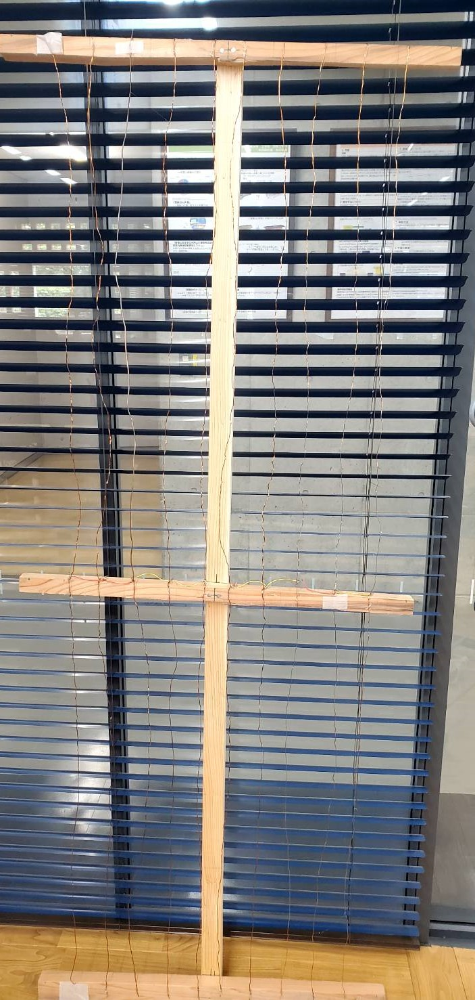
  - 実験室
  - 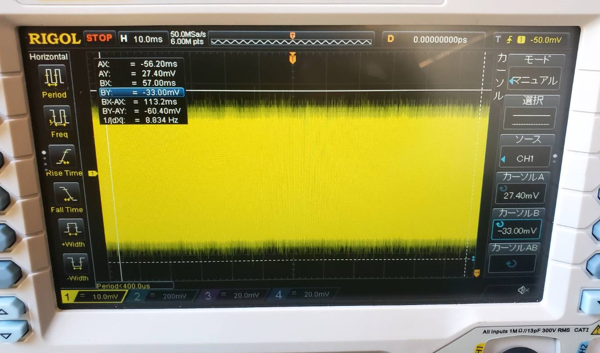
  - +-30mV
  - 地点A
  - 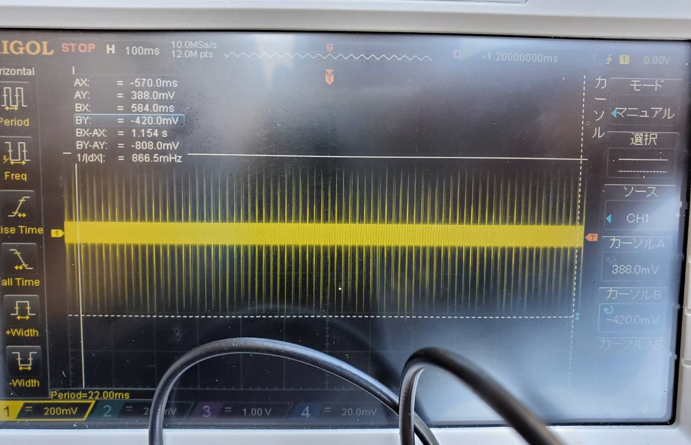
  - +-400mV
  - 地点B
  - 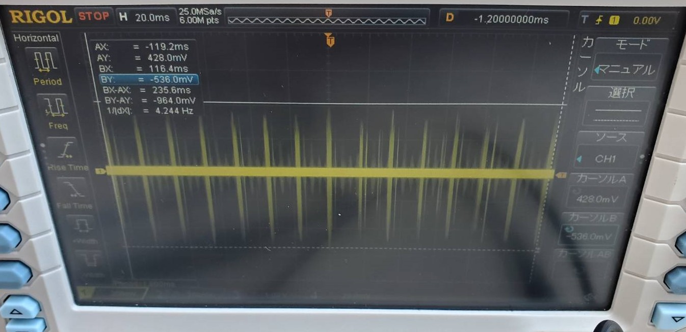
  - +-480mV
  - 地点C
  - 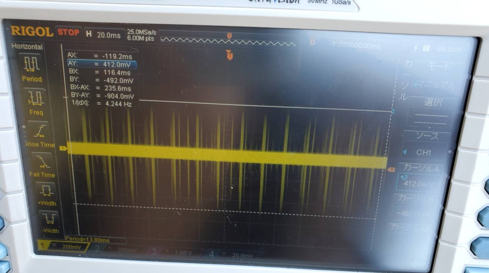
  - +-450mV
  - ショットキーバリアダイオード(動かすのに400mV必要)は前回と同様に正常な動作が確認できなかったので、整流用ダイオードに交換したがこちらの動作には600mV必要なので動作しなかった。
  - 結果のまとめ
  - 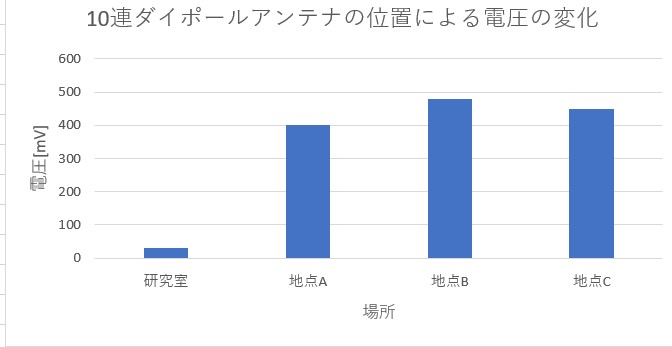
  - これまでの結果と比較
  - 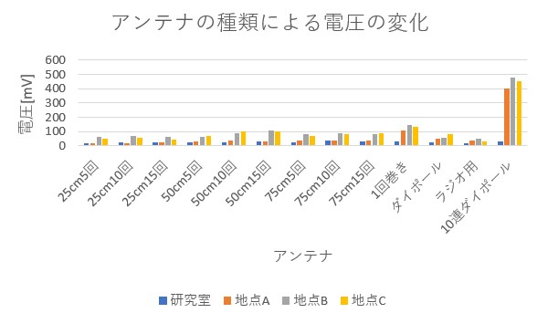
  - ダイポールアンテナ単体との比較
  - 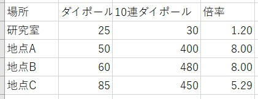
  - 10倍とまではいかなかったが、かなり電圧を増やすことに成功した。
  - 屋外での実験
  - 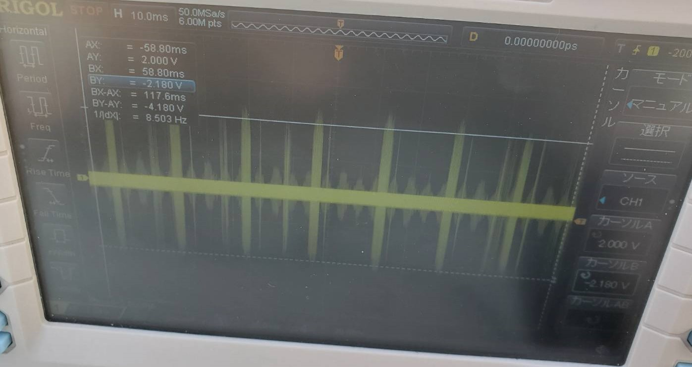
  - +-2.1V
  - 整流用ダイオードが利用できる電圧なので整流した。
  - 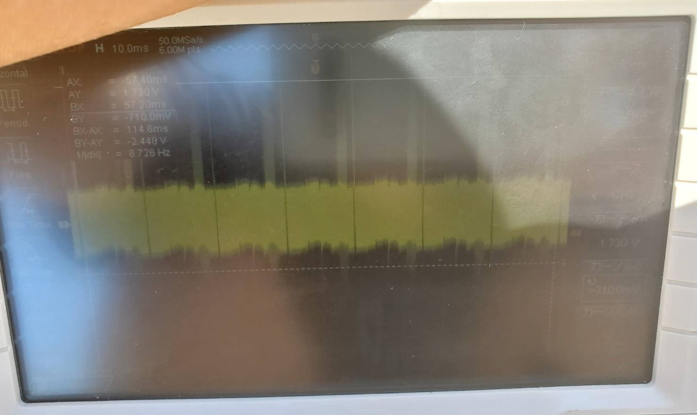
  - 最大値 1.7V 最小値710mV
  - 平滑した結果
  - 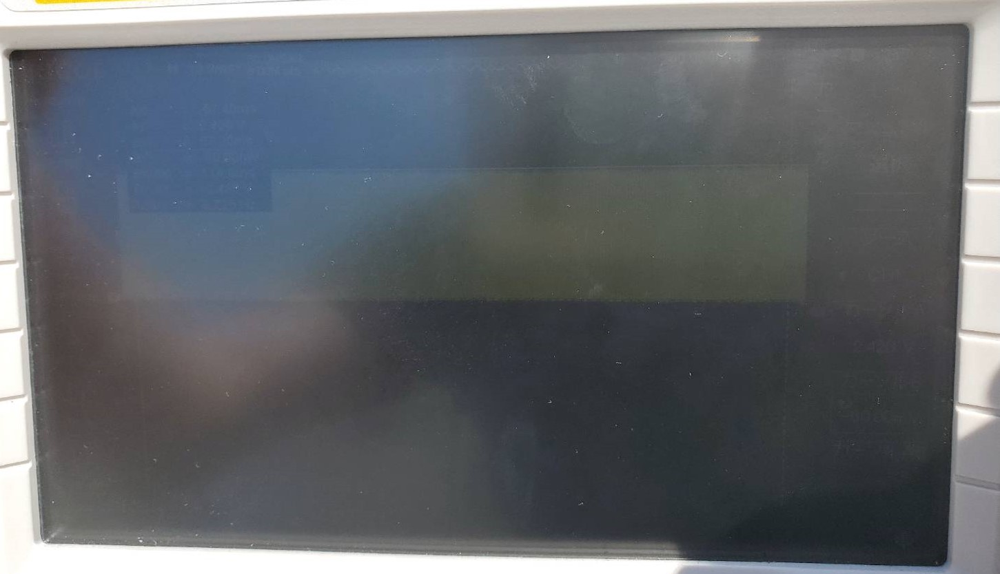
  - 最大値 1.4V 最小値-60mV
  - 変圧回路で電圧を変化させようと思ったが思うように変圧できなかった。運ぶ荷物は少ない方が良いので当面は学外の実験で変圧回路の使用は控えることにする。
 
  

### 1回巻きループアンテナの学外実験
  - 前回の実験で利用する電波の発生元を変更したら発電量が増えたので、10連ダイポールアンテナの次に発電量が多かった1回巻きループアンテナで実験することにした。
  - 運びやすさと精度向上のために若干アンテナの形状を変更した。
  - 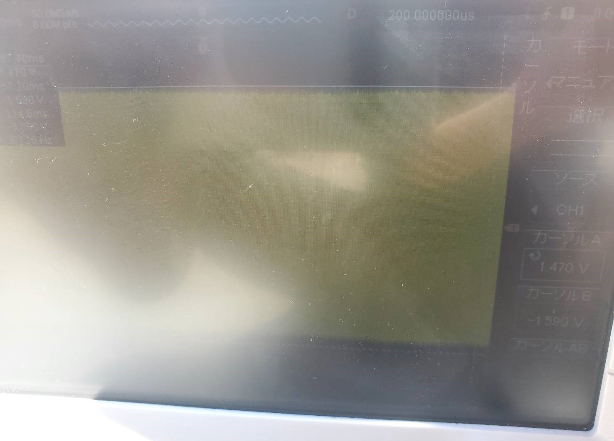
  - +-1.4V
  - 発電量から整流が可能だと考え、整流回路と接続した。
  - 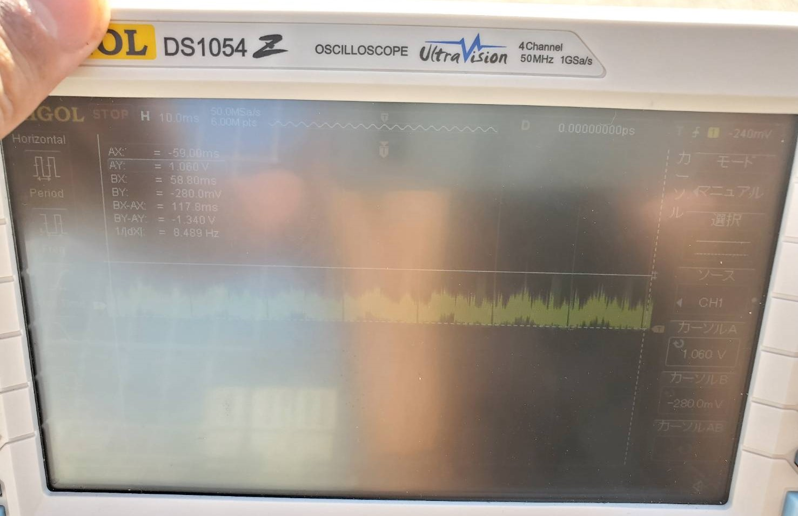
  - 最大値 1.06V 最小値-280mV
  - 平滑回路にも接続した。
  - 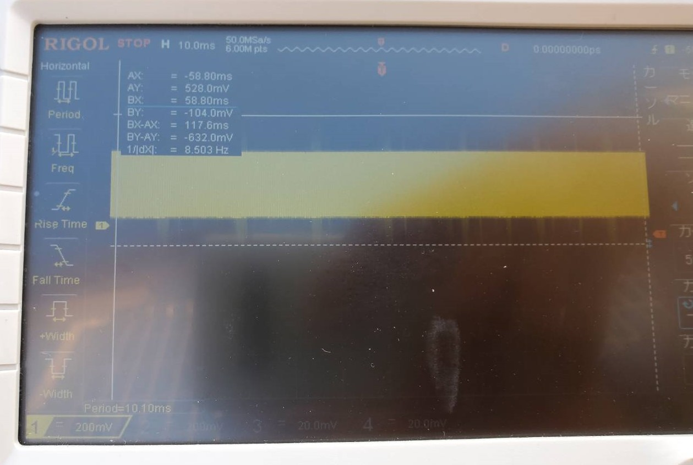
  - 最大値 520mV 最小値-100mV
  
 
 

### 実験結果のまとめ
  - これまでの学外での実験結果と学内の実験結果の比較
  - 
  - 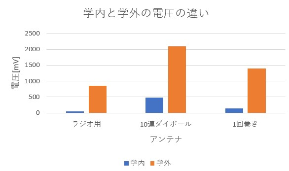
  - 利用する電波の発生元を変更することで電圧の上昇が確認されたが、電波の発生元の電力が50倍なのに対し、受信した電力はそこまで増えなかった。道路の関係で自由に実験器具を設置できる場所は限定されるが、何回か位置を変えて実験しようと思う。
  - 波形を見ると急激な電圧の上昇が確認された。これの周波数を調べたところ60hZだったので、オシロスコープ側から流れる電気だと分かる。こうした電気が回路に影響を及ぼさないように回路の測定部には抵抗を接続しているがそれでも影響が出ている。抵抗の抵抗値を何パターンか変更したが、オシロスコープの影響は除去できなかった。恐らく10連ダイポールアンテナの方は測定値より出力が少ない。
  - 結局LEDは発光しなかった。まだアンテナと整流回路に改良が必要。
  - 1回巻きループアンテナよりは10連ダイポールアンテナの方が性能はよいが自転車で運べないので、学外では1回巻きループアンテナでの実験を中心にしたい。

## 活動予定
- 現状の整理
  - 電波をマイコンの電源にしたい。
  - 5V1Aを安定して出力する電源を作成する。
  - 電流は置いておいて、まず一定の電圧を出力し続ける回路を作成する。
  - 電波を直流に変換できたが、電圧を安定させるための安定化回路が動作しない。
  - 実はそれ以外の回路も正しく動いてなかった。(現状の課題)

- 課題への対策
  - 無駄な電圧を電流に変圧回路で変換する。(再度実験)
  - 整流回路を変える。(回路作成のみ終了)
  - アンテナの数や種類を変える。(実行中)
  - 測定場所を変える(実行中)

- 使いたいアンテナ
  - 1回巻きループアンテナ(再実験)
  - 複数巻きループアンテナ(実験終了)
  - ダイポールアンテナ (再実験)
  - ラジオのアンテナ(実験終了)
  - 既製品のアンテナ(買うものの選定中)

### 夏休みと今後の予定
  - 9月16日には確実に帰省する。
  - 既製品のアンテナとマルツでは売っていないダイオードを買う。
  - 何らかのバッテリーを購入して充電できるかの実験をしたい。
  - lora系の機器の通信実験

- 研究活動 
- 振り返り事項

## 研究室に来る日程と時間帯

月             | 火             | 水             | 木             | 金             | 土
------------- | ------------- | ------------- | ------------- | ------------- | -------------
10:00 ~ 12:00 | 10:00 ~ 12:00 | 10:00 ~ 12:00 | 10:00 ~ 12:00 | 10:00 ~ 12:00 | 10:00 ~ 12:00
