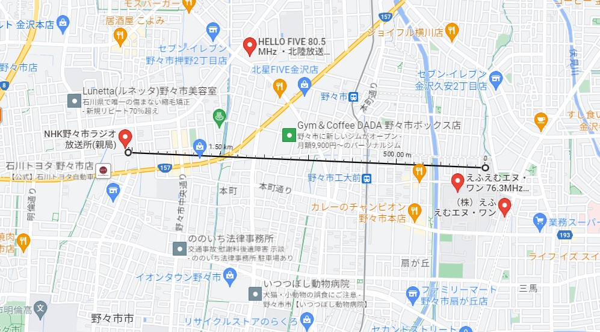
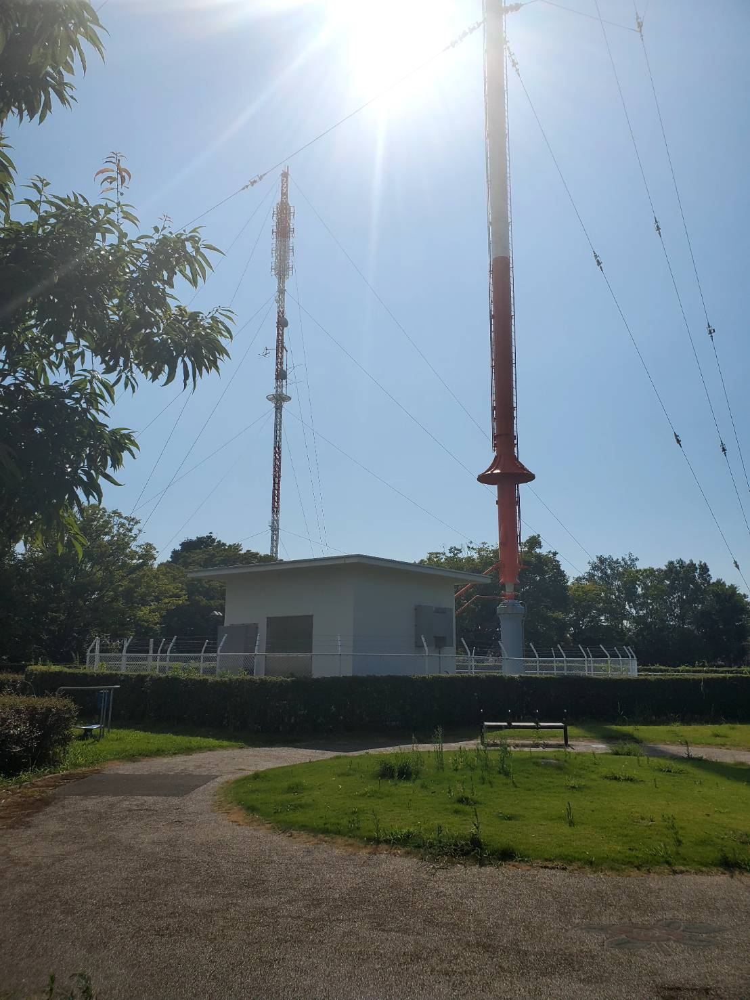
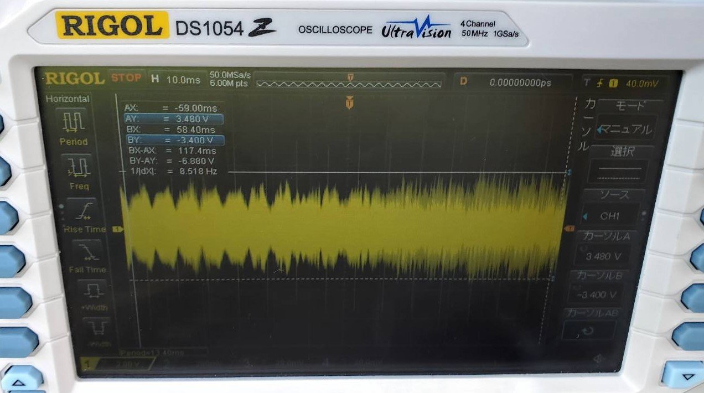
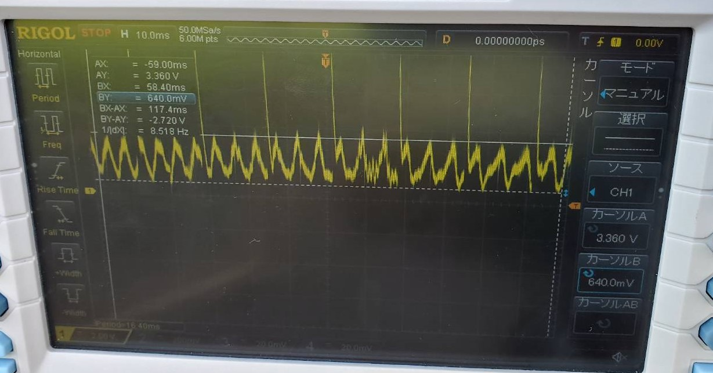
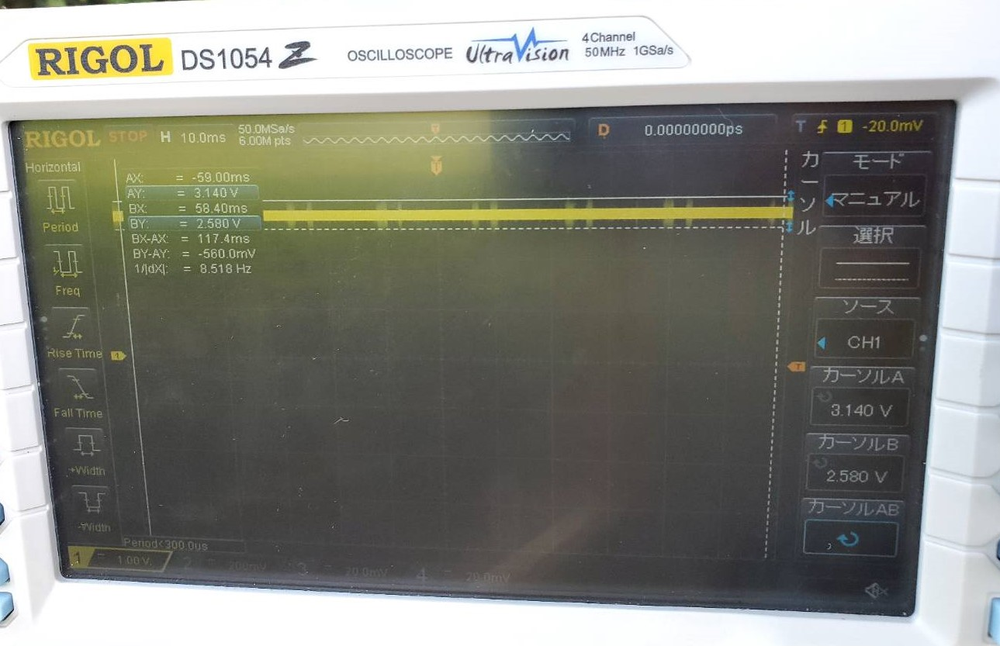
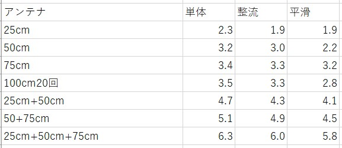
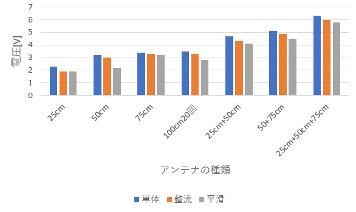
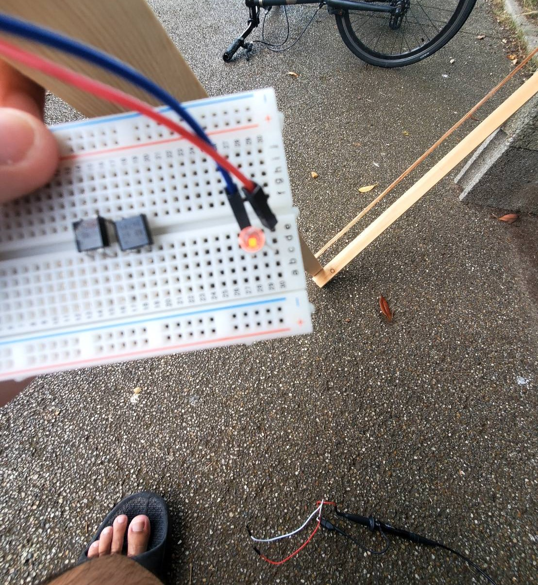
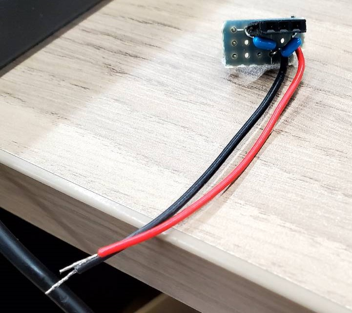
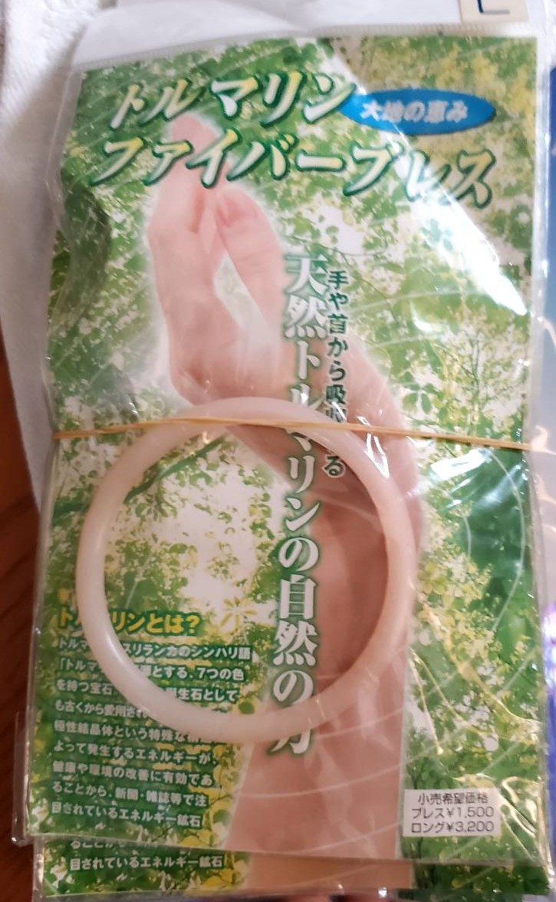

# 進捗報告書

報告書番号 | 氏名   | 期間         | 報告日
----- | ---- | ---------- | ---
15    | HosokawaAoi | 7/26 ~ 8/30 | 8/30

### 先行研究
  - 電波からエネルギーを取り出す研究(https://gakusyu.shizuoka-c.ed.jp/science/sonota/ronnbunshu/102017.pdf)

## 活動概要

- やったこと
  - アンテナの設置場所の変更(2回目)
  - 充電用回路の設計
  
 

### アンテナの設置場所の変更(2回目)
  - 以前の実験では1kwのFMラジオ塔から電波を得ていたが、出力不足だと感じたので、10kWのAMラジオ塔から電波を取ることにした。
  - 場所
  - 
  - 
  - 75cm15回巻きループアンテナ
  - 
  - +-3.4V
  - 整流時
  - 
  - 最大値3.3V 最小値0.64V
  - 平滑時
  - 
  - 最大値3.2V 最小値2.6V
  - アンテナごとの電圧の比較(表記がない場合は15回巻き)
  - 
  - 
  - 複数回巻きループアンテナをLEDに接続すると、今まで作成した全ての複数回巻きループアンテナでLEDの発光が確認された。
  - 
  - 電流計にも接続したが、10mAから600mAの範囲で安定しなかった。
  - アンテナへの直接接続と整流回路接続時は発光したが、平滑回路接続時は発光しなかった。。
  - 10kwのラジオ波で発光したことから20wの学内のラジオでは複数回巻きループアンテナの500倍の効率のアンテナでないとLEDを発光できないと考えられる。
  - しかしそのようなアンテナを製作するのは予算の都合から現実的ではないので、AMラジオ塔で実験を行うことにする。
  - 現在、平滑回路までの実験は終了しているので、次回は安定化回路をまとめた基板を使って回路が正しく動作するのか実験する。
  - 
  - 前回のFMラジオ塔よりも距離が離れているので、長距離通信の方法を模索する必要がある。
 
  

### 充電用回路の設計 
  - 発電した電気を貯めておくために充電池を使用する。
  - 充電池は使い切りの電池と異なり、電池切れになっても充電することで再度利用可能になる電池である。
  - しかし充電するときにかける電圧と電流は一定の値でなければならない。
  - そのため充電用の回路では発電した電気の電圧と電流を充電池で使えるように調節する必要がある。
  - 充電池と出来合いの充電用回路はマルツパーツで販売されているので、安定化回路の実験が終わり次第購入する。
 
  
 
 

## 活動予定
- 現状の整理
  - 電波をマイコンの電源にしたい。
  - 5V1Aを安定して出力する電源を作成する。
  - 電流は置いておいて、まず一定の電圧を出力し続ける回路を作成する。
  - 電波を直流に変換できたが、電圧を安定させるための安定化回路が動作しない。
  - 実はそれ以外の回路も正しく動いてなかった。(設置場所の変更で解決)

- これからやること
  - 安定化回路の実験
  - 充電用回路の作成、実験
  - マイコンによる長距離通信の実験
  - オカルト商品の実験(購買でマイコンを買った時の時間潰し)
  - 

- 研究活動 
- 振り返り事項

## 研究室に来る日程と時間帯

月             | 火             | 水             | 木             | 金             | 土
------------- | ------------- | ------------- | ------------- | ------------- | -------------
10:00 ~ 12:00 | 10:00 ~ 12:00 | 10:00 ~ 12:00 | 10:00 ~ 12:00 | 10:00 ~ 12:00 | 10:00 ~ 12:00
