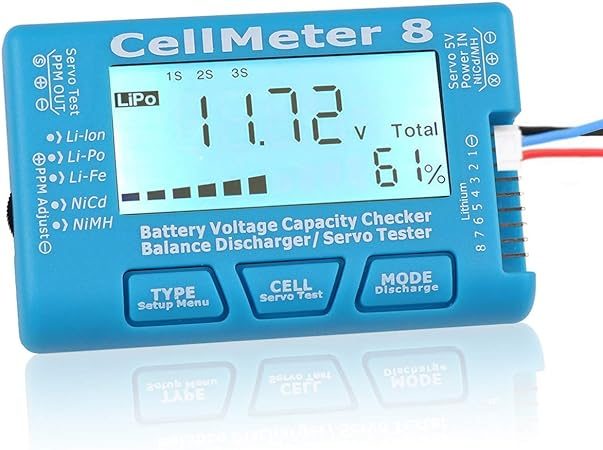
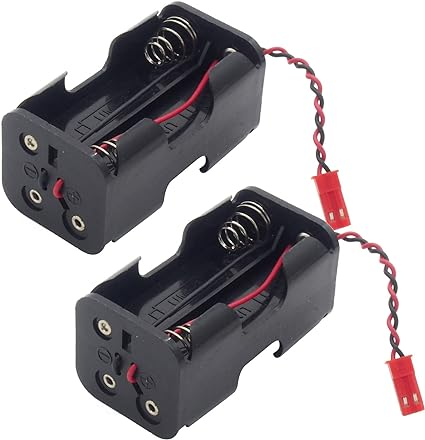
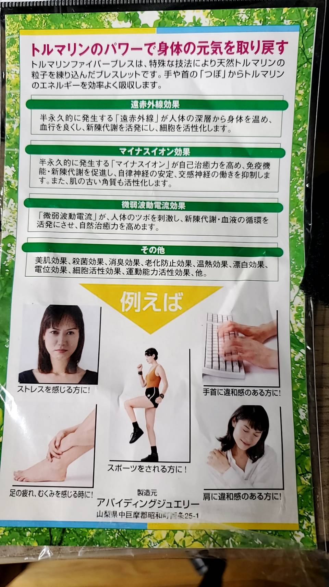
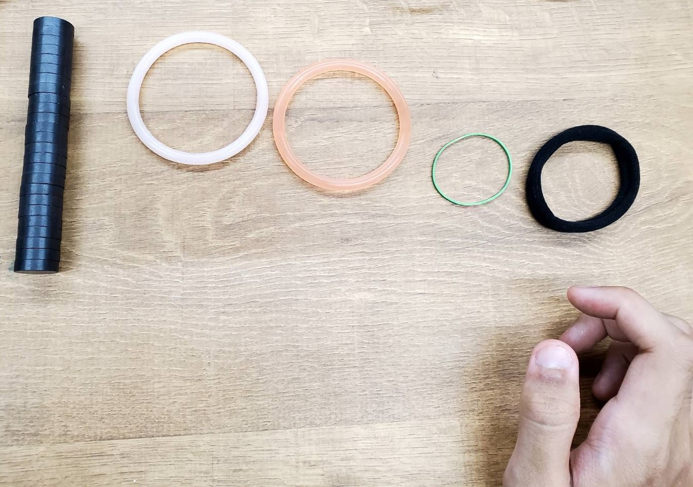
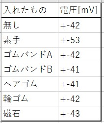
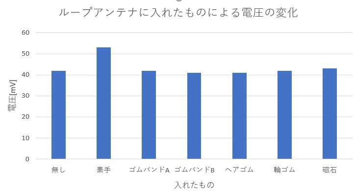
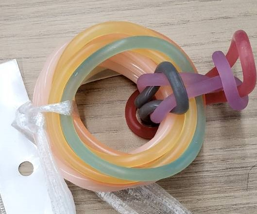
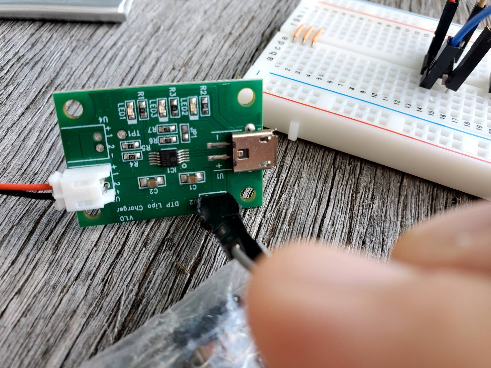

# 進捗報告書

報告書番号 | 氏名   | 期間         | 報告日
----- | ---- | ---------- | ---
17    | HosokawaAoi | 9/28 ~ 10/04 | 9/27

### 先行研究
  - 電波からエネルギーを取り出す研究(https://gakusyu.shizuoka-c.ed.jp/science/sonota/ronnbunshu/102017.pdf)

## 活動概要

- やったこと
  - 機材の注文
  - 暇つぶしの実験
  - 電波で充電回路を動かす実験
  
 

### 機材の注文
  - マルツパーツでは買えなかったものがあったので通販を利用した。
  - バッテリチェッカ:電池残量の確認
  - 
  - 電池ボックス:バッテリチェッカの電源
  - 

 
  
### 暇つぶしの実験
 - 注文したものが届くまで暇なので電波に関連した実験を行うことにした。
 - 実家の蔵にあったオカルト商品に電磁波を出し続けるゴムバンドがあったので、実際に電磁波を出しているのか調べた。
 - 

- 実験内容
  - ループアンテナの内側に幾つかのものを入れたり、抜き差ししてどのような波形になるのかを調べた。
  - 実験対象は素手、オカルト商品(ゴムバンドA)、別のメーカーのオカルト商品(ゴムバンドB)、ヘアゴム、輪ゴム、磁石の6種類である。
  - 

- 実験結果
  - 各物体を近づけた時の電圧のまとめ
  - 
  - 
  - 素手の場合のみ、やや電圧が増加した。
  - 各物体を抜き差しした場合の映像
  - 素手
  - 
  - ゴムバンドA
  - 
  - ゴムバンドB
  -  
  - ヘアゴム
  - 
  - 輪ゴム
  - 
  - 磁石
  - 
  - 磁石以外の場合では抜き差しに合わせて電圧の増減が生じているが、これは各物体を持っている手が近づいたことが影響しており、物体そのものの影響はない。
  - 磁石の場合は抜き差しに合わせて波形全体が上下しており、僅かに+方向と-方向へ交互に電気が流れていると分かる。
  - 余談だがゴムバンドA、Bと同じ商品を合計15個組み合わせたもので実験を行っても、ゴムバンド単体での実験結果と特に差はなかった。
  - 

- まとめ
  - オカルト商品からは全く電磁波が放出されていなかった。
  - 更に細かく調べれば電磁波が出ているかもしれないが少なくとも磁石を抜き差しする時よりは出力が低いので電源として活用することは不可能である。 
  - そもそもこの商品において電波の発生元とされているトルマリンの含有量が色や質感から明らかに少く、トルマリン自体も熱や圧力を加えないと電気を発生させないので多分電磁波は一切出ていない。

 

### 電波で充電回路を動かす実験
- AMラジオ塔で充電回路の電源としてアンテナを接続したところ、電源接続中のLEDが点灯したが、充電中のLEDは発光しなかった。
- 
- 電力が足りていないと考え、持って来ていた3つのアンテナを連結しようとしたが、2つのアンテナがそれぞれ単体で整流回路に接続した状態でLEDを発光させることができなくなっていたので実験を中断した。。
- 原因は運搬時や実験時の衝撃でアンテナとしての精度が落ちていたためだと考えられる。
- アンテナを修理してから再度同じ実験を行うことにする。

 
 

## 活動予定
- 現状の整理
  - 電波をマイコンの電源にしたい。
  - 電流は不安定だが電圧は安定した値の出る電源ができた。
  - 発電した電気を充電できる回路を作成する

- これからやること
  
  - バッテリの残量を確認できるものとバッテリをすぐに空にできるものを購入する。
  - 太陽光発電でバッテリを充電する。
  - 電波による発電でバッテリを充電を充電する。
  - 作る電子機器の内容を考える。

- 研究活動 
- 振り返り事項

## 研究室に来る日程と時間帯

月             | 火             | 水             | 木             | 金             | 土
------------- | ------------- | ------------- | ------------- | ------------- | -------------
10:00 ~ 12:00 | 10:00 ~ 12:00 | 10:00 ~ 12:00 | 10:00 ~ 12:00 | 10:00 ~ 12:00 | 10:00 ~ 12:00
