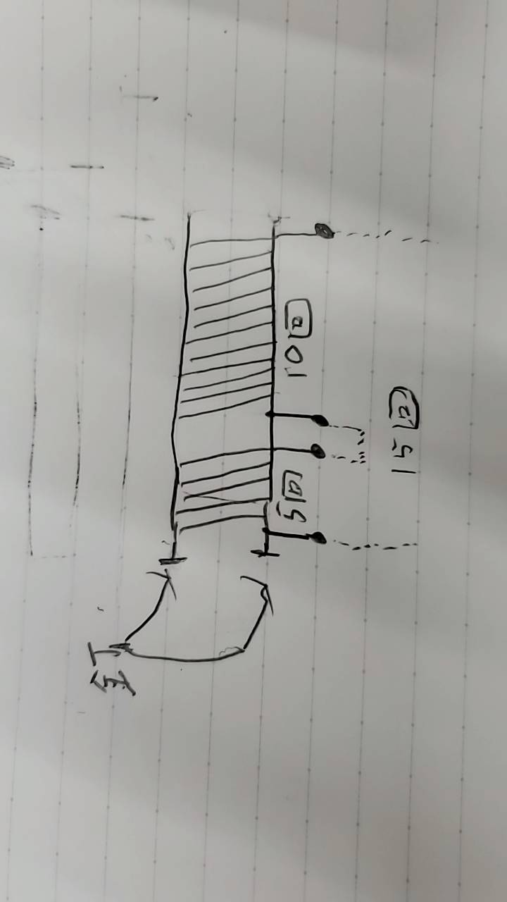
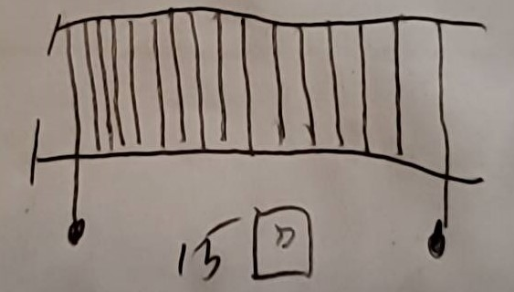
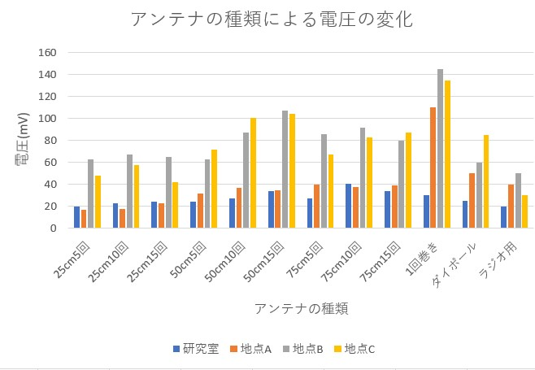
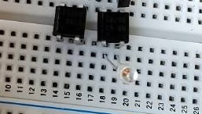
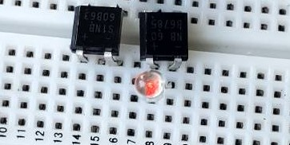
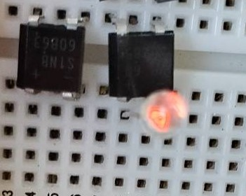
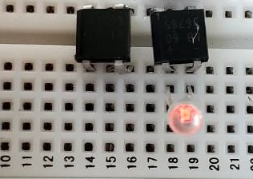
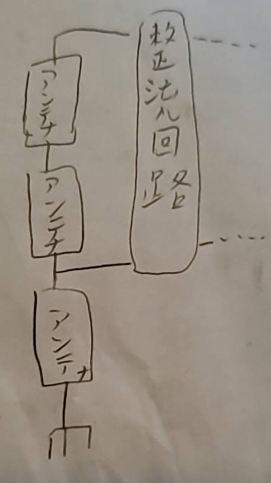
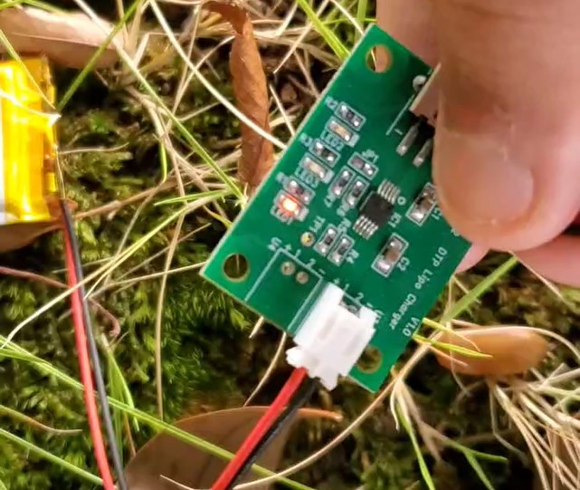

# 進捗報告書

報告書番号 | 氏名   | 期間         | 報告日
----- | ---- | ---------- | ---
18    | HosokawaAoi | 10/04 ~ 10/11 | 9/11

### 先行研究
  - 電波からエネルギーを取り出す研究(https://gakusyu.shizuoka-c.ed.jp/science/sonota/ronnbunshu/102017.pdf)

## 活動概要

- やったこと
  - アンテナの修理
  - 電波で充電回路を動かす実験(再実験)
  
 

### アンテナの修理
  - 前回の実験でアンテナが上手く機能しなかったので、ループアンテナを巻き直した。
  - その過程で、以前までは1つの木枠に5回巻きと10回巻きをループアンテナを巻いていたが、これらを接続して常時15回巻きになるようにした。
  - これまでの構造
  - 
  - 改良版
  - 
  - 

 
  
### 電波で充電回路を動かす実験(再実験)
  - 巻き直したアンテナで再度実験を行った。
  - 今回は2回に分けて実験を行い、1回目は100cmのアンテナ1つ、2回目は25cmと50cmと75cmのアンテナの3つを持ち込んだ。
  - 全てのアンテナでLEDの発光を確認できたが、25cmのアンテナだけ光が弱かった。
  - 25cm
  - 
  - 50cm
  - 
  - 75cm
  - 
  - 100cm
  - 
  - 2回目の実験にて3つのアンテナを直列に連結したところ、僅かに充電中(黄色)のLEDが発光した。
  - 
  - 1箇所だけ手でつまんで接地状態にすると出力が上がった。
  - 
  

  

- まとめ
  - 一応充電中のLEDは発光した。
  - しかし光はかなり小さく充電スピードは遅いと考えられる。
  - 今のままだと充電しながら電子機器を動作させることは難しい(最低でも待機電力は供給できるようにしたい)
  - まだバッテリチェッカは届いていないので、別のアンテナも作ってみる。
  - 既存のアンテナも運搬時にとても疲れるので、取っ手を付けたい。

 

 
 

## 活動予定
- 現状の整理
  - 電波をマイコンの電源にしたい。
  - 電流は不安定だが電圧は安定した値の出る電源ができた。
  - 発電した電気を充電できる回路を作成する

- これからやること
  - バッテリの残量を確認できるものとバッテリをすぐに空にできるものを購入する。
  - 太陽光発電でバッテリを充電する。
  - 電波による発電でバッテリを充電を充電する。
  - 作る電子機器の内容を考える。

- 研究活動 
- 振り返り事項

## 研究室に来る日程と時間帯

月             | 火             | 水             | 木             | 金             | 土
------------- | ------------- | ------------- | ------------- | ------------- | -------------
10:00 ~ 12:00 | 10:00 ~ 12:00 | 10:00 ~ 12:00 | 10:00 ~ 12:00 | 10:00 ~ 12:00 | 10:00 ~ 12:00
