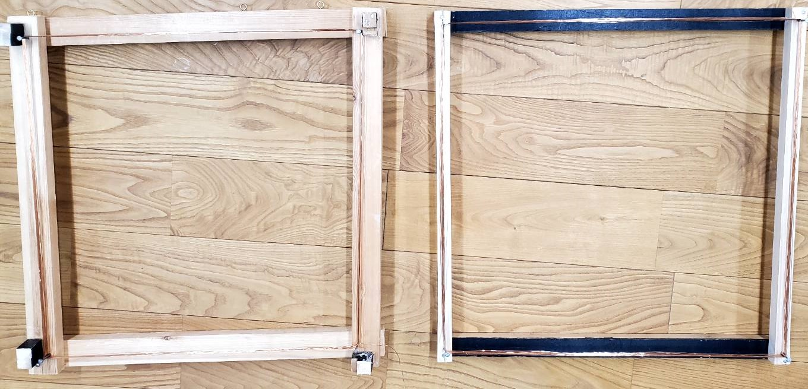
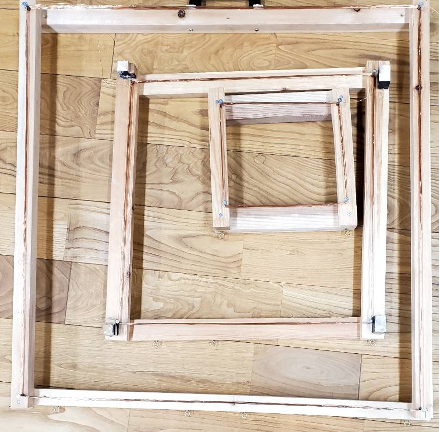
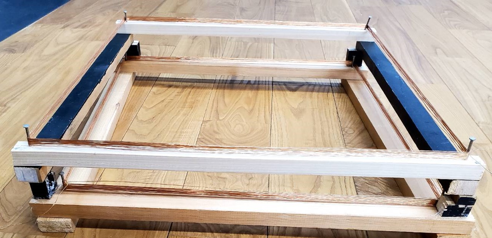
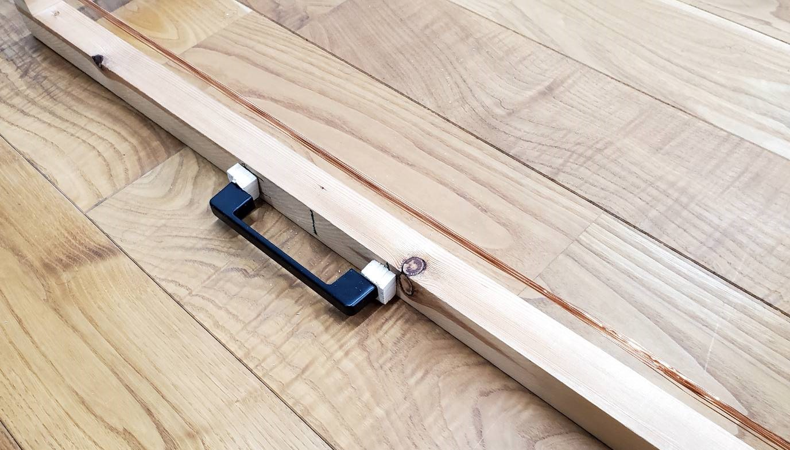

# 進捗報告書

報告書番号 | 氏名   | 期間         | 報告日
----- | ---- | ---------- | ---
19    | HosokawaAoi | 10/11 ~ 10/18 | 10/18

### 先行研究
  - 電波からエネルギーを取り出す研究(https://gakusyu.shizuoka-c.ed.jp/science/sonota/ronnbunshu/102017.pdf)

## 活動概要

- やったこと
  - アンテナの作成、改良
  - 電波で充電回路を動かす実験(3度目)
  
 

### アンテナの作成、改良
  - 前回一辺25cmのアンテナの出力が悪かったので、代用品として50cmのアンテナを作成した。(左が古い、右が新しい)
  - 
  - 丁度良い端材が見つからなかったことが原因だが、細めの角材で枠を作成したので以前よりも軽量化できた。
  - 古い方の50cmのアンテナには木のブロックを追加した。
  - これは以前は3つのアンテナをマトリョーシカのようにしていたが、50cmのアンテナが2つになってそれができなくなったので、重ねて運べるようにするために追加した。
  - 
  - 
  - 結局これは運搬時の振動でばらけることが多くかったので、50cmのアンテナを1つ袈裟掛けにして運ぶことにした。
  - 75cmと100cmのアンテナに取っ手を追加して運びやすくした。
  - 

 
  
### 電波で充電回路を動かす実験(3度目)
  - 以前の実験からの変更点として25cmのアンテナの代わりに使用している50cmのアンテナを中心に実験していた。
  - 新しい50cmのアンテナは古い50cmのアンテナよりも出力が低く、LEDと接続した際にも25cmと同じくらいの明るさにしかならなかった。
  - 一緒に持ってきた75cmのアンテナと新旧50cmのアンテナの3つを接続すると充電中のLEDが以前と同じくらいの明るさで光った。
  - 
  - 恐らく新しい50cmのアンテナは25cmのアンテナと同じ程度の出力しか出せていない。
  - 巻き数もサイズも同じで、巻き方も新しい方が丁寧なのに出力が低い。
  - 空いた時間に細かい部分を改良しておく。
  - 運びやすさは向上しているので、当分は75cmのアンテナと50cmのアンテナ2つで実験していく。

  

 

 
 

## 活動予定
- 現状の整理
  - 電波をマイコンの電源にしたい。
  - 電流は不安定だが電圧は安定した値の出る電源ができた。
  - 発電した電気を充電できる回路を作成する

- これからやること
  - バッテリの残量を確認できるものとバッテリをすぐに空にできるものを購入する。
  - 太陽光発電でバッテリを充電する。
  - 電波による発電でバッテリを充電を充電する。
  - 作る電子機器の内容を考える。

- 研究活動 
- 振り返り事項

## 研究室に来る日程と時間帯

月             | 火             | 水             | 木             | 金             | 土
------------- | ------------- | ------------- | ------------- | ------------- | -------------
10:00 ~ 12:00 | 10:00 ~ 12:00 | 10:00 ~ 12:00 | 10:00 ~ 12:00 | 10:00 ~ 12:00 | 10:00 ~ 12:00
