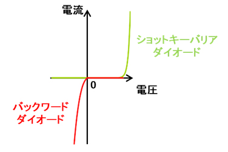

# 進捗報告書

報告書番号 | 氏名   | 期間         | 報告日
----- | ---- | ---------- | ---
24    | HosokawaAoi | 11/22 ~ 12/13 | 12/13

### 先行研究
  - 電波からエネルギーを取り出す研究(https://gakusyu.shizuoka-c.ed.jp/science/sonota/ronnbunshu/102017.pdf)

## 活動概要

- やったこと
  - プログラムの一部修正
  - 電子機器の動作実験
  - 改善できそうなところを考える
  - 予稿書く
 

### プログラムの一部修正
  - ディープスリープモードがBLE通信によって解除されている可能性があったので、一部割込みを無効化した。
  - サーボモータから異音が鳴り続けることがあったので、サーボモータ動作時のみマイコンにサーボモータ制御用のピンを割り当てることにした。
  - データ保存ができるようになったので、過去の温度データを記録して表示できるようにした。(-99.0とかは初期のデータで再起動時には最後に表示したときのデータから変更される)
  - 
 
  
### 電子機器の動作実験

- 実験内容
  - 電子機器を30分間動作させ、バッテリーがどれだけ消費されたかを調べる。
  - 実験開始から16分後に1度だけBLE通信とサーボモータによる温度表示を行う。

- 実験結果
  - BLE通信とサーボモータの両方は正常に動作し、バッテリーは6%消費された。
  - 以前に電波で30分間充電した時には平均2.5%充電されていたので(6/2.5)*30=72分に1度のペースであれば常時動作が可能であると予想される。
  - メモリの書き込み回数の限界が10000とされているので、10000/(24*60/72)=500日がこの電子機器の寿命となる。
  - これまで何度もプログラムを書き込んだり、メモリへのデータ保存を行ったので1年くらいが限界。
 
 

### 改善できそうなところを考える
  - 諸々の都合でやらなかったことやれなかったことがあったので、メモ程度に残しておく。

- 電源
  - ループアンテナは運びやすい形状を意識して作成したが、発電効率を重視した構造にする。
  - 整流回路に整流時の消費電力が少ないバックワードダイオードを用いる。(画像URL:https://pr.fujitsu.com/jp/news/2019/09/24.html)
  - 

- マイコン
  - マイコン自体をより低消費電力のものを探す。
  - メモリを長寿命なものにする。
  - 温度の表示方法をより省電力化できるものにする。
  - IoT化できるような通信システムを構築する。

 

### 予稿書く
  - 2ページ分かけたので、先生に見せながら修正していく。 
  - 内容が大体同じなので本稿も書いている。
 

## 活動予定
- 現状の整理
  - とりあえずやりたい実験はすべて終えることができた。

- これからやること
  - 予稿、論文作成
  - 電子機器の挙動が怪しい時があるので修正(ディープスリープモードの中断、通信しても文字データが送られてこない)
  - eink

- 研究活動 
- 振り返り事項

## 研究室に来る日程と時間帯

月             | 火             | 水             | 木             | 金             | 土
------------- | ------------- | ------------- | ------------- | ------------- | -------------
10:00 ~ 12:00 | 10:00 ~ 12:00 | 10:00 ~ 12:00 | 10:00 ~ 12:00 | 10:00 ~ 12:00 | 10:00 ~ 12:00
